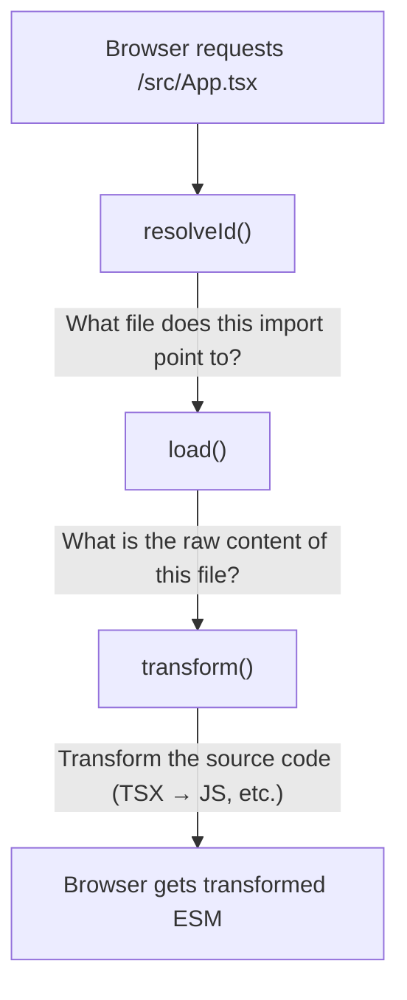

*This is the first installment in a series where we build a toy version of Next.js on top of Vite. The goal isn't to create a production framework — it's to deeply understand Vite's internals and the architecture decisions that underpin modern React meta-frameworks like Next.js, TanStack Start, and Remix.*

---

## Series overview

Over the course of this series, we'll build a framework called **Eigen** — a simplified Next.js powered entirely by Vite plugins. By the end, you'll have built file-based routing, server-side rendering, typed data loaders, client hydration, production builds, and HMR — all from scratch. Each installment introduces new Vite concepts by making them solve real problems.

The framework is written entirely in TypeScript, and a central design goal is providing end-to-end type safety to application developers. When someone creates `src/pages/posts/[id].tsx`, Eigen's router will know that `/posts/:id` is a valid path, that `params.id` is a string, and that the loader's return type flows through to the component's `data` prop — all enforced at compile time.

**Prerequisites:** Solid React and TypeScript knowledge, comfort with Node.js and ESM. Familiarity with what Next.js does at a high level.

<Callout type="info">
This series targets **Vite 7.x** (current stable). The key APIs we use — the Environment API, `buildApp`, `applyToEnvironment` — were introduced across Vite 6 and 7, and are stable in both. Vite 8 (currently in beta) replaces Rollup with **Rolldown**, a Rust-based bundler that's explicitly Rollup-compatible. Everything in this series — plugin hooks, virtual modules, the Environment API — works identically in Vite 8. The plugin API is unchanged: `resolveId`, `load`, `transform`, `generateBundle`, and every other hook we use are the same in both bundlers. Two minor naming differences in Vite 8: when we say "Rollup" as the production bundler, substitute "Rolldown"; and `build.rollupOptions` in config examples is renamed to `build.rolldownOptions` (the old name still works but is deprecated).
</Callout>

Before we write any code, we need to build a precise mental model of what Vite is. This matters because every decision a framework author makes — how to handle SSR, where to run loaders, how to split server and client code — flows from understanding Vite's architecture.

---

## Vite is two completely different things

<Callout type="info" title="The key mental model">
Vite isn't one tool — it's two tools that share a configuration surface.
</Callout>

**In development**, Vite is an on-demand module transformer sitting on top of an HTTP server. When the browser requests a module, Vite intercepts the request, transforms the source (TypeScript → JavaScript, TSX → JS, CSS → injected JS, etc.), and serves it as a native ES module. There is no bundling step. The browser's native `import` statements drive the entire dependency graph. Vite only processes a module when the browser actually asks for it.

This is fundamentally different from webpack, which eagerly bundles your entire app before serving anything. Vite's approach means startup is near-instant regardless of project size — it only does work proportional to the page you're looking at, not the entire application.

**In production**, Vite is a pre-configured Rollup build. It bundles everything into optimized chunks with tree-shaking, code-splitting, and minification. The dev server doesn't exist. Rollup takes over entirely, and the output is a set of static files (JavaScript bundles, CSS, assets) ready to be served by any HTTP server. (Vite 8 replaces Rollup with Rolldown, a faster Rust-based bundler. The plugin API is identical — `resolveId`, `load`, `transform`, and all other hooks work the same way. When this series says "Rollup," the concepts apply equally to Rolldown.)

This duality is the central tension of framework development with Vite. Your framework plugin has to work in both modes, and behavior that works in dev (lazy, on-demand transformation) may need completely different handling in production (eager, ahead-of-time bundling). A virtual module that dynamically discovers routes by scanning the filesystem works identically in both modes — but a dev server middleware that handles API routes has no production equivalent at all. The framework has to bridge that gap.

---

## How the dev server actually works

When you run `npx vite`, here's what happens under the hood:

<Steps>
<Step>
### Configuration

Vite reads `vite.config.ts` and resolves the full configuration, merging user config with defaults. Each plugin's `config()` hook runs during this phase, allowing plugins to modify the config before it's finalized.
</Step>
<Step>
### Server startup

Vite starts an HTTP server (using Node's `http` module and the `connect` middleware framework) and a WebSocket server (for HMR communication with the browser). Each plugin's `configureServer()` hook runs, giving plugins a chance to add custom middleware.
</Step>
<Step>
### Dependency pre-bundling

Vite scans your source code for `import` statements pointing at `node_modules` and runs esbuild to convert those packages from CommonJS to ESM, combining many internal files into single modules. This happens once and is cached in `node_modules/.vite`.

The reason for pre-bundling is network efficiency. A package like `react-dom` internally consists of dozens of modules that import each other. Without pre-bundling, the browser would make dozens of individual HTTP requests for what is conceptually a single dependency. esbuild collapses those into one request. Your own source files are *not* pre-bundled — they're served individually, which is what makes HMR fast.
</Step>
<Step>
### Waiting

Unlike webpack, Vite doesn't process your source code upfront. It just sits there, ready to handle requests. This is why `npx vite` starts instantly even in large projects.
</Step>
<Step>
### On-demand transformation

When the browser requests a module (say, `/src/main.tsx`), Vite's middleware intercepts the request and runs the module through the plugin pipeline: `resolveId` → `load` → `transform`. The result is valid JavaScript that the browser can execute as an ES module.
</Step>
<Step>
### Recursive resolution

The browser executes the module, encounters more `import` statements, and sends more requests. Vite handles each one the same way. The browser and Vite collaboratively walk the module graph on demand.
</Step>
</Steps>

This lazy, pull-based architecture is why Vite feels instant in development. It never does more work than what's needed to render the current page.

---

## The plugin pipeline in depth

Vite's plugin system is Rollup's plugin system, extended with a handful of Vite-specific hooks. This is a deliberate design choice — it means the large ecosystem of Rollup plugins works in Vite out of the box, and plugin authors only need to learn one API.

### The three core hooks

Every module request flows through three hooks:



**`resolveId(source, importer)`** takes an import specifier (like `'./App'` or `'react'`) and the module that imported it. It returns the absolute path or ID of the resolved module. Most of the time, Vite's default resolution handles this (it follows Node's resolution algorithm for bare specifiers and standard path resolution for relative imports). But a plugin can intercept this to redirect imports — to different files, to virtual modules, or to externalized packages.

**`load(id)`** takes the resolved ID and returns the raw source code. For real files, Vite's default behavior reads from disk. But a plugin can intercept this to return *generated* source code — this is how virtual modules work. The `load` hook is your opportunity to make a module contain *whatever you want*, regardless of what's on disk (or whether anything is on disk at all).

**`transform(code, id)`** takes the loaded source code and returns transformed source code. This is where TypeScript gets stripped, JSX gets compiled, CSS gets processed, and framework-specific transformations happen. The `@vitejs/plugin-react` plugin uses this hook to compile JSX and inject HMR boundary code. A framework plugin uses it to strip server-only exports from client bundles.

These three hooks form a pipeline. Multiple plugins can participate — each plugin's `transform` output becomes the next plugin's input. The `enforce` property controls ordering: `'pre'` plugins run first, then normal plugins, then `'post'` plugins. This matters when multiple plugins need to transform the same file. For example, a framework plugin that strips loader exports should run before the React plugin compiles JSX — otherwise it would need to parse compiled output instead of source TSX.

### Plugin hook ordering during dev

During development, the full hook sequence for the dev server lifecycle is:

```
Server start:
  options()        →  Rollup compatibility hook, rarely used directly
  buildStart()     →  Called once when the server starts

Per-module request:
  resolveId()      →  Resolve import specifier to module ID
  load()           →  Load the module's source code
  transform()      →  Transform the source code

Server shutdown:
  buildEnd()       →  Called when the server stops
  closeBundle()    →  Final cleanup
```

Note that `moduleParsed` (a Rollup hook) is *not* called during dev. Vite skips full AST parsing for performance. Output generation hooks like `renderChunk` and `generateBundle` are also not called during dev — they only run during `vite build`. This is the "you can think of Vite's dev server as only calling `rollup.rollup()` without calling `bundle.generate()`" mental model from Vite's docs.

### Vite-specific hooks

Beyond the Rollup hooks, Vite adds hooks that are specific to the dev server:

**`config(userConfig, env)`** — Modify the Vite configuration before it's resolved. The `env` parameter tells you whether this is a `'serve'` (dev) or `'build'` (production) invocation. This is where a framework plugin sets defaults: entry points, build output directories, environment configurations.

**`configResolved(resolvedConfig)`** — Read the final, fully-resolved configuration after all `config()` hooks have run and Vite has applied its own defaults. Useful for storing a reference to the config for use in other hooks. The resolved config is frozen — you can read it but not modify it.

**`configureServer(server)`** — Add custom middleware to the dev server. The `server` parameter gives you access to the HTTP server, the WebSocket server, the module graph, and the file watcher. The return value controls middleware ordering (more on this in a later installment).

**`transformIndexHtml(html, ctx)`** — Modify the HTML entry point before it's sent to the browser. Vite uses this internally to inject the HMR client script (`/@vite/client`). Frameworks use it to inject SSR-rendered markup, serialized data, and asset preload hints.

**`handleHotUpdate(ctx)`** — Customize what happens when a file changes. By default, Vite traces the module graph to find HMR boundaries and sends updates via WebSocket. A framework plugin can intercept this to trigger custom behavior — like regenerating a route manifest when a page file is added or deleted.

### Hook availability: dev vs. build

This is a common source of confusion. Some hooks run in both dev and build. Others are exclusive to one mode. Knowing which is which prevents you from writing code that silently does nothing in production (or in development).

| Hook | Dev (serve) | Build (vite build) | Notes |
|---|---|---|---|
| `config` | ✓ | ✓ | Runs first in both modes |
| `configResolved` | ✓ | ✓ | |
| `resolveId` | ✓ | ✓ | Per-module in dev, full graph in build |
| `load` | ✓ | ✓ | Same — this is where virtual modules work |
| `transform` | ✓ | ✓ | Same — your transforms apply in both modes |
| `buildStart` | ✓ | ✓ | Once on server start / once per build |
| `buildEnd` | ✓ | ✓ | |
| `configureServer` | ✓ | ✗ | Dev only — no server in production |
| `transformIndexHtml` | ✓ | ✓ | Dev: per-request. Build: once during HTML emit |
| `handleHotUpdate` | ✓ | ✗ | Dev only — no file watching in build |
| `renderChunk` | ✗ | ✓ | Build only — Rollup output generation |
| `generateBundle` | ✗ | ✓ | Build only — access to final output before write |
| `writeBundle` | ✗ | ✓ | Build only — after files are written to disk |
| `closeBundle` | ✓ | ✓ | Dev: on server close. Build: after write |
| `buildApp` | ✗ | ✓ | Build only — Vite 6+ multi-environment orchestration |
| `applyToEnvironment` | ✓ | ✓ | Vite 6+ — controls which environments see the plugin |

The key insight: `resolveId`, `load`, and `transform` work identically in both modes. This is why your virtual module generates the same route table whether Vite is serving it on-demand to a browser or bundling it with Rollup. The plugin code doesn't need to know which mode it's running in (though it can check `config.command === 'serve'` or `config.command === 'build'` if needed).

The hooks that only run in build — `renderChunk`, `generateBundle`, `writeBundle` — are Rollup's output generation hooks. We'll use `closeBundle` for SSG (pre-rendering pages after the build is complete) and `generateBundle` for emitting additional assets.

---

## Virtual modules — the framework author's most important tool

A virtual module is a module that doesn't exist on disk. It exists only as generated source code produced by a plugin. Your plugin intercepts the import via `resolveId`, then generates the module's source code on the fly via `load`:

```typescript
// In your plugin:
resolveId(id) {
  if (id === 'eigen/routes') return '\0eigen:routes'
},
load(id) {
  if (id === '\0eigen:routes') {
    return `export const routes = ${JSON.stringify(discoveredRoutes)}`
  }
}

// In your app code:
import { routes } from 'eigen/routes'
```

The `\0` prefix on the *resolved* ID is a Rollup convention. It signals to other plugins that this is a virtual module and shouldn't be resolved to a path on disk. Developers never see it — it's internal to the plugin pipeline.

### Friendly imports vs. `virtual:` prefix

Many Vite plugins use a `virtual:` prefix for virtual modules (`virtual:my-plugin/config`). This is a community convention that makes it obvious the import doesn't point to a real file. But production frameworks like Next.js, TanStack Start, and Remix don't use this convention — they use normal-looking package imports: `next/navigation`, `@tanstack/react-start`, `react-router`.

They achieve this through the same `resolveId` hook. When you write `import { Link } from 'eigen/navigation'`, the plugin intercepts it and resolves it to generated or internal code. The npm package ships a real `navigation.js` file (for TypeScript resolution and as a fallback), but the plugin replaces it at build time.

Throughout this series, **Eigen uses the friendly import style**: `eigen/routes`, `eigen/navigation`, `eigen/server`, `eigen/image`. Under the hood, the `resolveId` hook intercepts these imports exactly like `virtual:` modules. The difference is purely cosmetic — but it makes application code feel like it's importing from a normal package rather than a build-system artifact.

### Why virtual modules matter for frameworks

Virtual modules are the primary mechanism frameworks use to bridge **build-time knowledge** with **runtime code**. The plugin knows things at plugin-execution time that can't be expressed as static source files:

- Which files exist in `src/pages/` and what routes they represent
- What the resolved configuration looks like
- What environment (client vs. SSR) the code will run in
- What platform-specific adapters are configured

The plugin encodes this knowledge into generated JavaScript that your app imports like any other module. From the browser's perspective, a virtual module is indistinguishable from a real file.

This is fundamentally different from webpack's loader model or `require.context`. There's no special syntax, no magic comments, no custom module resolution rules. It's just ESM imports resolved to generated code. This means virtual modules compose naturally with TypeScript, with tree-shaking, with code splitting — everything that works with normal imports works with virtual modules.

### Virtual modules and TypeScript

There's a catch: TypeScript doesn't know about virtual modules. When you write `import { routes } from 'eigen/routes'`, the TypeScript language server reports "Cannot find module 'eigen/routes'." It has no declaration file for this module.

Framework authors solve this by **generating `.d.ts` declaration files** alongside the virtual module. The plugin writes a declaration file that tells TypeScript the shape of the virtual module's exports. So there are actually two parallel code generation outputs:

1. **JavaScript** (the virtual module's `load` hook output) — consumed by the browser and the SSR runtime
2. **TypeScript declarations** (a `.d.ts` file written to disk) — consumed by the IDE and type checker

Both are generated from the same source of truth: the filesystem scan, the resolved config, the discovered routes. We'll implement this pattern in Part 2.

---

## The two module graphs

In a server-rendered application, Vite maintains two separate module graphs simultaneously:

**The client module graph** serves modules to the browser. It uses browser-targeted resolve conditions (so `import 'react-dom'` resolves to the browser build), supports code splitting via dynamic `import()`, and connects to the HMR WebSocket for hot updates.

**The SSR module graph** serves modules to Node.js (or another server runtime). It uses Node-targeted resolve conditions (so `import 'react-dom/server'` resolves correctly), doesn't do code splitting (server code runs synchronously in a single process), and executes modules via `server.ssrLoadModule()` instead of serving them over HTTP.

When your plugin's hooks run, the same plugin instance handles both graphs. A single `resolveId` or `transform` call needs to know which environment it's operating in, because it may need to generate different code for each. For example, a route plugin might generate `React.lazy(() => import('./Page'))` for the client (enabling code splitting) but `import Page from './Page'` for the server (synchronous import, no Suspense boundary needed).

This "same plugin, different output" pattern is central to everything we'll build. The plugin is the single source of truth. It generates the right code for the right environment.

### The Environment API

Until Vite 5, these two environments were implicit. The `ssr` boolean was threaded through various hook parameters, and plugins had to check it manually — often with awkward patterns like checking `options?.ssr` or `this.environment?.name === 'ssr'`.

Vite 6 formalized the concept with the **Environment API**. Environments are now first-class configuration objects. The default setup creates two — `client` and `ssr` — but framework authors can define additional environments. An `edge` environment targeting Cloudflare Workers, for instance, or an `rsc` environment for React Server Components. Each environment has its own module graph, resolve conditions, and build configuration.

Inside plugin hooks, `this.environment` gives you the current environment instance. The `applyToEnvironment(environment)` hook lets a plugin declare which environments it should be active in — so a plugin that strips loader exports can run only in the `client` environment.

During production builds, the `buildApp` hook lets a framework orchestrate building all environments in a coordinated sequence. This replaced the old pattern of running `vite build` and `vite build --ssr` as two separate commands.

This is exactly what happened when TanStack Start migrated from Vinxi to native Vite at version 1.121.0. Vinxi's "router" concept — which managed multiple Vite instances for client, server, and API environments — was replaced by Vite's built-in environment support. The config file moved from `app.config.ts` to a standard `vite.config.ts`, and `vinxi build` became `vite build`. The abstraction layer Vinxi provided was absorbed into Vite itself.

For this tutorial, we'll use the two default environments. But the mental model matters: **your plugin is one piece of code generating different outputs for different target runtimes.** The Environment API makes this explicit rather than ad hoc.

---

## How production builds work

When you run `vite build`, the dev server doesn't start. Instead, Vite creates a Rollup build with your plugins, processes the entire module graph eagerly, and outputs optimized bundles.

For a server-rendered framework, you need **two builds**:

1. **Client build** — Rollup bundles the client entry into hashed, code-split chunks. It produces a `manifest.json` that maps source filenames (like `src/entry-client.tsx`) to their hashed output filenames (like `assets/entry-client-a1b2c3d4.js`). It also produces CSS files, images, and other assets with content-hashed filenames for cache busting.

2. **Server build** — Rollup bundles the server entry into a single Node-compatible module. No code splitting, no hashing — it's designed to be `import()`-ed by a Node process. Dependencies from `node_modules` are typically externalized (not bundled) since they're available on the server at runtime.

The manifest file is the bridge between the two builds. The production server reads the manifest to know which `<script>` and `<link>` tags to inject into the HTML it serves. Without the manifest, the server wouldn't know that `src/entry-client.tsx` compiled to `assets/entry-client-a1b2c3d4.js`.

The `buildApp` hook (available as a plugin hook since Vite 7) lets a framework plugin orchestrate both builds in a single `vite build` command:

```typescript
buildApp: {
  order: 'pre',
  async handler(builder) {
    await builder.build(builder.environments.client)  // client first
    await builder.build(builder.environments.ssr)      // then server
  },
}
```

The order matters — building the client first generates the manifest that the server build may need to reference.

---

## The architecture of a framework plugin

Putting it all together, a Vite-based framework plugin is responsible for:

1. **Route discovery** — Scanning the filesystem and generating a virtual module with the route table (`resolveId`/`load`).

2. **Type generation** — Writing `.d.ts` declaration files so TypeScript knows about generated routes, their params, and their loader types.

3. **Environment-aware code generation** — Producing different virtual module code for client (lazy imports, no loaders) and server (static imports, loaders included).

4. **Server/client boundary enforcement** — Using the `transform` hook to strip server-only code (loaders, database imports) from client bundles.

5. **Dev server middleware** — Using `configureServer` to handle SSR, API routes, and data fetching during development.

6. **HMR integration** — Using `handleHotUpdate` to regenerate routes and declarations when files change.

7. **Build orchestration** — Using `buildApp` to coordinate client and server production builds.

8. **HTML injection** — Using `transformIndexHtml` to inject SSR-rendered markup, serialized data, and asset preload hints.

In practice, frameworks decompose this into multiple coordinated plugins returned as an array from a single factory function — `eigen()` returns `[routePlugin, stripPlugin, apiPlugin, configPlugin]`. But from the user's perspective, it's one line:

```typescript title="vite.config.ts"
import { defineConfig } from 'vite'
import react from '@vitejs/plugin-react'
import eigen from 'eigen/plugin'

export default defineConfig({
  plugins: [eigen(), react()],
})
```

Compare this to TanStack Start's `tanstackStart()` or Remix's `remix()` — the shape is identical. A single function call that returns an array of coordinated plugins. The framework hides the complexity.

---

## What's next

In Part 1, we'll set up the project — TypeScript configuration, Vite config, and a bare SPA — and observe how the dev server handles module requests. We'll explore the network waterfall, dependency pre-bundling, and HMR to build intuition for what Vite does before we start extending it.
