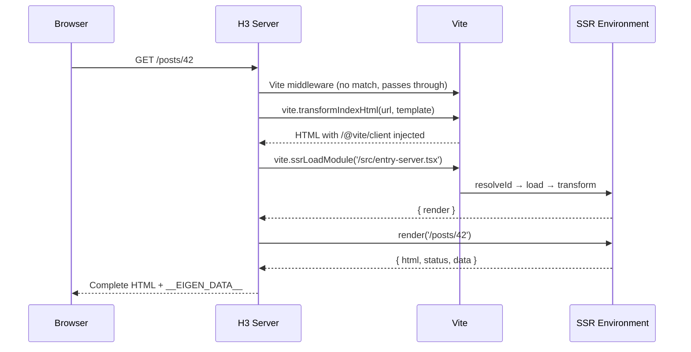

*This is the fourth installment in a series where we build a toy Next.js on top of Vite. In [Part 2](/02-route-discovery-plugin), we built a route discovery plugin with type-safe virtual modules. Now we'll add server-side rendering — the feature that transforms a Vite SPA into a full-stack framework.*

---

## What SSR means for a Vite plugin

Server-side rendering requires Vite to do two things simultaneously: serve the client app to the browser (with HMR, code splitting, and lazy loading) *and* run our React components on the server to produce HTML strings.

This is where the ["two module graphs" concept from Part 0](/00-the-mental-model#the-two-module-graphs) becomes concrete. The client module graph resolves imports for the browser. The SSR module graph resolves imports for Node. The same virtual module — `eigen/routes` — generates different code in each graph, because the server needs static imports and loaders while the client needs lazy imports and no loaders.



---

## New dependencies

Install [H3](https://h3.dev) (the HTTP framework) and [tsx](https://tsx.is) (to run TypeScript directly):

```bash
pnpm add h3
pnpm add -D tsx
```

We're using H3 instead of Express for the HTTP layer. H3 is a lightweight server framework from the [UnJS ecosystem](https://unjs.io) built on web-standard [`Request`](https://developer.mozilla.org/en-US/docs/Web/API/Request)/[`Response`](https://developer.mozilla.org/en-US/docs/Web/API/Response) — the same foundation that [TanStack Start](https://tanstack.com/start) and [Nuxt](https://nuxt.com) use under the hood (via [Nitro](https://nitro.build), which builds on H3). We'll cover why this matters at the end of this section.

---

## Route matching

Before writing the server entry, we need a route matcher. This logic will eventually be shared between the server (for SSR) and the client (for [hydration in Part 4](/04-hydration)), so we'll put it in the framework package from the start:

```typescript title="packages/eigen/match-route.ts"
import type { RouteDefinition } from "./types";

export interface RouteMatch {
	route: RouteDefinition;
	params: Record<string, string>;
}

export function matchRoute(
	pathname: string,
	routes: RouteDefinition[],
): RouteMatch | null {
	for (const route of routes) {
		if (route.path === pathname) return { route, params: {} };

		const routeParts = route.path.split("/");
		const pathParts = pathname.split("/");
		if (routeParts.length !== pathParts.length) continue;

		const params: Record<string, string> = {};
		const match = routeParts.every((part, i) => {
			if (part.startsWith(":")) {
				params[part.slice(1)] = pathParts[i];
				return true;
			}
			return part === pathParts[i];
		});

		if (match) return { route, params };
	}
	return null;
}
```

This is a new file in `packages/eigen/`, so we need to register it in both TypeScript and Vite's resolution before any file can import it. Add the `eigen/match-route` path to the existing `paths` object in `tsconfig.json`:

```json title="tsconfig.json"
{
  "compilerOptions": {
    "paths": {
      "eigen/types": ["./packages/eigen/types.ts"],
      "eigen/match-route": ["./packages/eigen/match-route.ts"]
    }
  }
}
```

And update `vite.config.ts`:

```typescript title="vite.config.ts"
import { resolve } from 'node:path'
import react from '@vitejs/plugin-react'
import inspect from 'vite-plugin-inspect'
import { defineConfig } from 'vite'
import eigenRoutes from './plugins/eigen-routes'

export default defineConfig({
  plugins: [react(), eigenRoutes(), inspect()],
  resolve: {
    alias: {
      'eigen/types': resolve(__dirname, 'packages/eigen/types.ts'),
      'eigen/match-route': resolve(__dirname, 'packages/eigen/match-route.ts'),
    },
  },
})
```

As the framework grows, we'll accumulate more `eigen/*` aliases here. In [Part 11](/11-framework-plugin), when we consolidate into a single framework plugin, the plugin's [`resolveId` hook](/00-the-mental-model#the-three-core-hooks) will handle all `eigen/*` imports and these manual aliases will go away.

---

## The server entry point

We need a module that Vite can load in the SSR environment to render pages. Create `src/entry-server.tsx`:

```tsx title="src/entry-server.tsx"
import { renderToString } from "react-dom/server";
import { matchRoute } from "eigen/match-route";
import { routes } from "eigen/routes";

export interface RenderResult {
	html: string;
	status: number;
	data: unknown;
}

export async function render(pathname: string): Promise<RenderResult> {
	const match = matchRoute(pathname, routes);
	if (!match) return { html: "<h1>404</h1>", status: 404, data: null };

	const { route, params } = match;
	const Component = route.component;

	// Call the loader if it exists
	let data: unknown = null;
	if (route.loader) {
		data = await route.loader({ params });
	}

	const html = renderToString(<Component params={params} data={data} />);
	return { html, status: 200, data };
}
```

When Vite loads this module through the SSR environment, the `import { routes } from 'eigen/routes'` statement triggers the route plugin's [`load` hook](/00-the-mental-model#the-three-core-hooks). Because `this.environment.name === 'ssr'`, the plugin generates server-side code with static imports and loader references. The `render` function receives a URL pathname, matches it to a route, calls the loader (if present), renders the component to an HTML string via [`renderToString`](https://react.dev/reference/react-dom/server/renderToString), and returns the result alongside the serialized data.

---

## Updating the HTML template

The server needs to inject rendered HTML into `index.html`. Add an SSR outlet marker, and change the script entry from `main.tsx` to `entry-client.tsx` (which we'll create in Part 4):

```html title="index.html"
<!DOCTYPE html>
<html lang="en">
<head><title>Eigen Framework</title></head>
<body>
  <div id="root"><!--ssr-outlet--></div>
  <script type="module" src="/src/entry-client.tsx"></script>
</body>
</html>
```

The `<!--ssr-outlet-->` comment is a placeholder that the server replaces with rendered HTML. The `entry-client.tsx` script will handle hydration — taking over the server-rendered HTML and making it interactive. Until we create that file in Part 4, the page will render server-side HTML but won't be interactive.

---

## The custom dev server

We replace `npx vite` with a custom server that uses Vite in [**middleware mode**](https://vite.dev/guide/ssr#setting-up-the-dev-server). Create `server.ts` in the project root (alongside `vite.config.ts` and `index.html`):

```typescript title="server.ts"
import { readFileSync } from "node:fs";
import { H3, serve, fromNodeHandler } from "h3/node";
import {
	createServer as createViteServer,
	type ViteDevServer,
} from "vite";

interface RenderResult {
	html: string;
	status: number;
	data: unknown;
}

async function start() {
	// Create Vite server in middleware mode — it won't serve
	// index.html automatically or listen on a port
	const vite: ViteDevServer = await createViteServer({
		server: { middlewareMode: true },
		appType: "custom",
	});

	const app = new H3();

	// Mount Vite's connect middleware into H3 — this handles
	// HMR websocket, static files, and on-demand module transforms
	app.use(
		fromNodeHandler(
			vite.middlewares as Parameters<typeof fromNodeHandler>[0],
		),
	);

	// Handle all remaining routes with SSR
	app.all("/**", async (event) => {
		const url = event.url.pathname;

		try {
			// 1. Read the HTML template from disk
			let template = readFileSync("index.html", "utf-8");

			// 2. Apply Vite's HTML transforms — this injects /@vite/client
			//    for HMR and rewrites asset URLs
			template = await vite.transformIndexHtml(url, template);

			// 3. Load the server entry module through Vite's SSR pipeline
			const { render } = (await vite.ssrLoadModule(
				"/src/entry-server.tsx",
			)) as {
				render: (pathname: string) => Promise<RenderResult>;
			};

			// 4. Render the app to HTML
			const { html: appHtml, status, data } = await render(url);

			// 5. Inject rendered HTML and serialized data into the template
			const finalHtml = template
				.replace("<!--ssr-outlet-->", appHtml)
				.replace(
					"</head>",
					`<script>window.__EIGEN_DATA__ = ${JSON.stringify(data)}</script></head>`,
				);

			return new Response(finalHtml, {
				status,
				headers: { "Content-Type": "text/html" },
			});
		} catch (e) {
			if (e instanceof Error) {
				vite.ssrFixStacktrace(e);
				console.error(e.stack);
				return new Response(e.message, { status: 500 });
			}
		}
	});

	serve(app, { port: 3000 });
	console.log("http://localhost:3000");
}

start();
```

### Why `h3/node`?

We import from [`h3/node`](https://h3.dev/guide/api/h3#node-compatibility) rather than `h3`. H3 is a web-standard framework — its core API uses [`Request`](https://developer.mozilla.org/en-US/docs/Web/API/Request), [`Response`](https://developer.mozilla.org/en-US/docs/Web/API/Response), and [`URL`](https://developer.mozilla.org/en-US/docs/Web/API/URL) — but the dev server is inherently Node-bound because Vite runs on Node. The `h3/node` entry point loads H3's Node.js compatibility layer, which includes `fromNodeHandler` for mounting Vite's [Connect](https://github.com/senchalabs/connect)-based middleware into H3.

This is a dev-server concern only. The SSR handler we're writing — the `app.all('/**', ...)` function that returns a `new Response(...)` — is pure web-standard code. It doesn't use any Node APIs. In [Part 17](/17-deployment-adapters), when we introduce [Nitro](https://nitro.build) for production builds, this same handler runs unchanged on Cloudflare Workers, Deno, or any edge runtime. The Node-specific glue (`fromNodeHandler`, `readFileSync`) stays in the dev server and doesn't ship to production.

### Vite middleware integration

The server registers two layers in order:

1. **Vite's connect middleware** (`vite.middlewares`), mounted via `fromNodeHandler`, handles HMR WebSocket connections, serves static files from your project, and transforms modules on demand.

2. **The SSR handler** (`app.all('/**', ...)`) catches everything Vite doesn't handle — page navigations like `/about` or `/posts/42` — and renders them server-side.

This ordering is important: Vite must see requests *first* so it can intercept `/@vite/client`, `/src/entry-client.tsx`, and other module requests. Only requests that Vite passes through reach the SSR handler.

<Callout type="info" title="Why H3 instead of Express?">

Express is the traditional choice for Vite SSR examples, but it locks you into Node's callback-based API everywhere — not just the dev server glue. H3 keeps the Node-specific parts isolated to middleware adapters while your application code uses web standards.

- **Your SSR handler is portable.** The `app.all('/**', ...)` handler uses `new Response()` — the same interface that Cloudflare Workers, Deno, and Bun use natively. With Express, the `res.status(200).send(html)` pattern doesn't transfer.
- **No `@types` needed.** H3 is written in TypeScript. Express requires a separate `@types/express` package that frequently drifts from the implementation.
- **Same ecosystem as production frameworks.** [TanStack Start](https://tanstack.com/start), [Nuxt](https://nuxt.com), and [Analog](https://analogjs.org) all use H3/Nitro. Learning H3 here transfers directly to [Part 17](/17-deployment-adapters) when we add deployment adapters.

</Callout>

---

## Understanding `ssrLoadModule`

[`vite.ssrLoadModule`](https://vite.dev/guide/api-javascript#vitedevserver-ssrloadmodule)`('/src/entry-server.tsx')` is the core SSR API. It does several things:

1. Resolves the module path through the SSR environment's `resolveId` hooks.
2. Loads the source code through the `load` hooks (this is where our route plugin generates server-specific code for `eigen/routes`).
3. Transforms the code through the `transform` hooks (TypeScript stripping, JSX compilation, etc.).
4. Executes the transformed code in the current Node process and returns the module's exports.

The critical difference from client-side module loading: `ssrLoadModule` runs the code in Node, not in the browser. This means it has access to Node APIs (`fs`, `path`, `process`), can use Node-only packages (database drivers, file system access), and resolves imports using Node's resolution algorithm.

### Typing `ssrLoadModule`

`ssrLoadModule` returns `Record<string, any>`. Vite can't know the shape of an arbitrary module at compile time — the module could export anything. This is a common friction point when building typed frameworks. There are three approaches:

**Type assertion at the call site** (what we're doing above):
```typescript
const { render } = await vite.ssrLoadModule('/src/entry-server.tsx') as {
  render: (pathname: string) => Promise<RenderResult>
}
```

This is simple and local. The framework controls both the server entry and the call site, so the assertion is safe.

**A typed wrapper function:**
```typescript title="packages/eigen/server.ts"
import type { ViteDevServer } from 'vite'

export async function loadServerEntry(vite: ViteDevServer) {
  const mod = await vite.ssrLoadModule('/src/entry-server.tsx')
  return mod as { render: (pathname: string) => Promise<RenderResult> }
}
```

This encapsulates the assertion in a reusable function that the framework exports.

**Code generation:** Generate a typed server entry that re-exports with proper types. [TanStack Start](https://tanstack.com/start) takes this approach — the build tool generates intermediate files with the correct type signatures, so the assertion is baked into generated code rather than hand-written.

The `ssrLoadModule` type gap is representative of a broader challenge in framework development: the boundary between build-time code (the plugin, which knows everything) and runtime code (the server, which receives `any`) requires deliberate type bridging. The plugin generates both the JavaScript and the declarations — the runtime trusts the generated types.

---

## `transformIndexHtml` in depth

The call to [`vite.transformIndexHtml(url, template)`](https://vite.dev/guide/api-javascript#vitedevserver-transformindexhtml) is doing crucial work:

- **Injecting `/@vite/client`** — The script that establishes the WebSocket connection for HMR. Without this, hot module replacement won't work in dev mode.
- **Rewriting module URLs** — If the HTML references modules with relative paths, Vite rewrites them to absolute paths that its middleware can intercept.
- **Running plugin [`transformIndexHtml` hooks](https://vite.dev/guide/api-plugin#transformindexhtml)** — Any plugin that defines this hook gets a chance to modify the HTML. Our framework could use this hook to inject preload hints for route-specific chunks.

In production, `transformIndexHtml` isn't called (there's no dev server). Instead, the HTML is pre-built by `vite build`, and the production server reads the static HTML file. Asset URLs are already rewritten to their hashed production paths.

---

## What to observe

1. Run the server with `npx tsx server.ts`. Open `http://localhost:3000`.

2. **View source** in the browser. You'll see server-rendered HTML inside `<div id="root">` — actual page content, not an empty div. You'll also see the `/@vite/client` script injected by `transformIndexHtml`.

3. **Check the terminal.** The `ssrLoadModule` call triggers the SSR plugin pipeline. If you're using `vite-plugin-inspect`, you can see the SSR-specific output of your route virtual module — it will have static `import` statements instead of `React.lazy`.

4. **Compare environments.** Visit `/__inspect/` and you can see both the client and SSR versions of `eigen/routes`. The client version has `React.lazy(() => import(...))`. The SSR version has plain `import Page0 from '...'` with `loader` references.

5. **[`ssrFixStacktrace`](https://vite.dev/guide/api-javascript#vitedevserver-ssrfixstacktrace)** — Try introducing an error in a page component and observe the error output. Without `ssrFixStacktrace`, the stack trace would reference Vite's transformed code (which doesn't match your source). With it, the stack trace points to the original TypeScript source lines.

---

## Key insight

This is the fundamental architecture of every Vite-based SSR framework. The dev server simultaneously handles two module graphs: one for the browser (ESM, code splitting, HMR) and one for the server (Node, synchronous imports, `ssrLoadModule`). Your plugin generates different code for each. This is what [Vinxi](https://vinxi.vercel.app) abstracted with its "router" concept, and what Vite formalizes with the [Environment API](https://vite.dev/guide/api-environment).

The custom server (`server.ts`) is the framework's development runtime. It creates a Vite instance, layers it with H3 for SSR, and serves both module transforms and rendered pages. In production, this entire file is replaced by a [Nitro](https://nitro.build)-built server that imports pre-built bundles. The gap between dev and prod is where deployment adapters (Netlify, Vercel, Cloudflare) live — we'll build those in [Part 17](/17-deployment-adapters).

---

<TestSection title="Testing: route matching">

The `matchRoute` function is shared between server and client — and it determines whether users see the right page. Since it lives in `packages/eigen/match-route.ts`, tests import it directly:

```typescript title="packages/eigen/__tests__/match-route.test.ts"
import { describe, it, expect } from "vitest";
import { matchRoute } from "../match-route";

const routes = [
	{ path: "/", component: () => null },
	{ path: "/about", component: () => null },
	{ path: "/posts/:id", component: () => null },
	{ path: "/users/:userId/posts/:postId", component: () => null },
];

describe("matchRoute", () => {
	it("matches static routes exactly", () => {
		const result = matchRoute("/about", routes);
		expect(result?.route.path).toBe("/about");
		expect(result?.params).toEqual({});
	});

	it("extracts params from dynamic segments", () => {
		const result = matchRoute("/posts/42", routes);
		expect(result?.route.path).toBe("/posts/:id");
		expect(result?.params).toEqual({ id: "42" });
	});

	it("handles multiple dynamic segments", () => {
		const result = matchRoute("/users/7/posts/99", routes);
		expect(result?.params).toEqual({ userId: "7", postId: "99" });
	});

	it("returns null for unmatched paths", () => {
		expect(matchRoute("/nonexistent", routes)).toBeNull();
	});

	it("does not match when segment count differs", () => {
		expect(matchRoute("/posts/42/comments", routes)).toBeNull();
	});

	it("matches the root path", () => {
		const result = matchRoute("/", routes);
		expect(result?.route.path).toBe("/");
	});
});
```

Notice the test for segment count mismatch — without that guard, `/posts/42/comments` would partially match `/posts/:id` and produce wrong results. This is the kind of edge case that tests catch before users do.

Run with `pnpm vitest run packages/`.

</TestSection>

## Further reading

- [Vite SSR Guide](https://vite.dev/guide/ssr) — The official guide to server-side rendering with Vite, including middleware mode, `ssrLoadModule`, and production builds.
- [H3 Documentation](https://h3.dev/guide) — H3's guide covering routing, middleware, the event API, and runtime adapters.
- [React `renderToString`](https://react.dev/reference/react-dom/server/renderToString) — React's server rendering API. Note that React recommends streaming APIs (`renderToPipeableStream`) for production — we'll migrate to streaming in [Part 12](/12-streaming-ssr).
- [Nitro Documentation](https://nitro.build/guide) — The production server toolkit built on H3 that we'll use for deployment adapters in [Part 17](/17-deployment-adapters).
- [Vite JavaScript API](https://vite.dev/guide/api-javascript) — Full reference for `createServer`, `ssrLoadModule`, `transformIndexHtml`, and other programmatic APIs used in custom dev servers.

---

## What's next

In [Part 4](/04-hydration), we'll add client-side hydration — the process where the browser takes over the server-rendered HTML and makes it interactive. This involves creating `entry-client.tsx`, using `hydrateRoot` instead of `createRoot`, typing the serialized data on `window.__EIGEN_DATA__`, and understanding the hydration contract between server and client.
