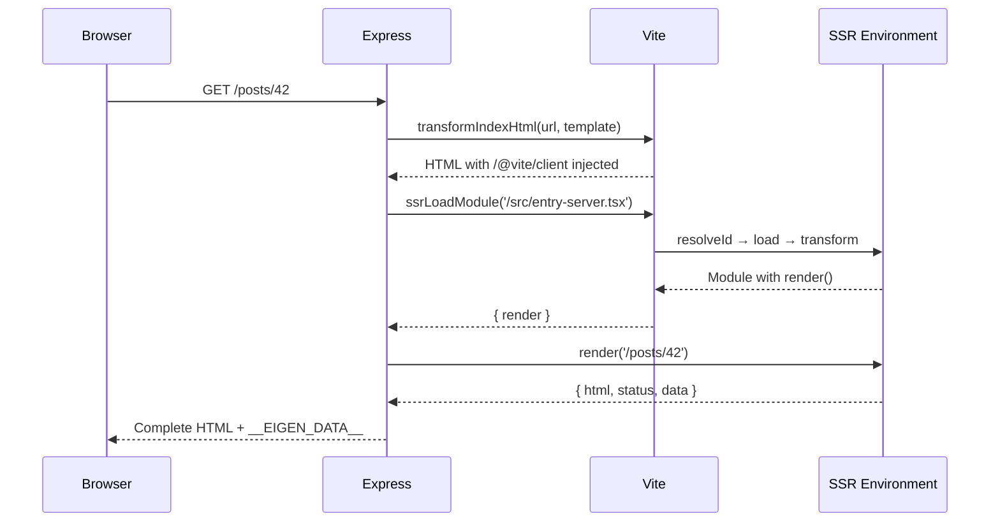

*This is the fourth installment in a series where we build a toy Next.js on top of Vite. In [Part 2](/02-route-discovery-plugin), we built a route discovery plugin with type-safe virtual modules. Now we'll add server-side rendering — the feature that transforms a Vite SPA into a full-stack framework.*

---

## What SSR means for a Vite plugin

Server-side rendering requires Vite to do two things simultaneously: serve the client app to the browser (with HMR, code splitting, and lazy loading) *and* run our React components on the server to produce HTML strings.

This is where the "two module graphs" concept from Part 0 becomes concrete. The client module graph resolves imports for the browser. The SSR module graph resolves imports for Node. The same virtual module — `eigen/routes` — generates different code in each graph, because the server needs static imports and loaders while the client needs lazy imports and no loaders.



---

## The server entry point

We need a module that Vite can load in the SSR environment to render pages. Create `src/entry-server.tsx`:

```tsx title="src/entry-server.tsx"
import React from 'react'
import { renderToString } from 'react-dom/server'
import { routes } from 'eigen/routes'
import type { RouteDefinition } from 'eigen/types'

interface RouteMatch {
  route: RouteDefinition
  params: Record<string, string>
}

function matchRoute(pathname: string): RouteMatch | null {
  for (const route of routes) {
    if (route.path === pathname) return { route, params: {} }

    const routeParts = route.path.split('/')
    const pathParts = pathname.split('/')
    if (routeParts.length !== pathParts.length) continue

    const params: Record<string, string> = {}
    const match = routeParts.every((part, i) => {
      if (part.startsWith(':')) {
        params[part.slice(1)] = pathParts[i]
        return true
      }
      return part === pathParts[i]
    })

    if (match) return { route, params }
  }
  return null
}

export interface RenderResult {
  html: string
  status: number
  data: unknown
}

export async function render(pathname: string): Promise<RenderResult> {
  const match = matchRoute(pathname)
  if (!match) return { html: '<h1>404</h1>', status: 404, data: null }

  const { route, params } = match
  const Component = route.component

  // Call the loader if it exists
  let data: unknown = null
  if (route.loader) {
    data = await route.loader({ params })
  }

  const html = renderToString(<Component params={params} data={data} />)
  return { html, status: 200, data }
}
```

When Vite loads this module through the SSR environment, the `import { routes } from 'eigen/routes'` statement triggers the route plugin's `load` hook. Because `this.environment.name === 'ssr'`, the plugin generates server-side code with static imports and loader references. The `render` function receives a URL pathname, matches it to a route, calls the loader (if present), renders the component to an HTML string, and returns the result alongside the serialized data.

Notice the `matchRoute` function appears in both the server and client entries. The route matching logic must be identical on both sides to ensure hydration consistency. Extract it into a shared module that both entries import:

```typescript title="packages/eigen/match-route.ts"
import type { RouteDefinition } from './types'

export interface RouteMatch {
  route: RouteDefinition
  params: Record<string, string>
}

export function matchRoute(pathname: string, routes: RouteDefinition[]): RouteMatch | null {
  for (const route of routes) {
    if (route.path === pathname) return { route, params: {} }

    const routeParts = route.path.split('/')
    const pathParts = pathname.split('/')
    if (routeParts.length !== pathParts.length) continue

    const params: Record<string, string> = {}
    const match = routeParts.every((part, i) => {
      if (part.startsWith(':')) {
        params[part.slice(1)] = pathParts[i]
        return true
      }
      return part === pathParts[i]
    })

    if (match) return { route, params }
  }
  return null
}
```

Both `entry-server.tsx` and `entry-client.tsx` now import `matchRoute` from `eigen/match-route` instead of defining their own copy. Single source of truth, no duplication.

---

## The custom dev server

We replace `npx vite` with a custom Express server that uses Vite in **middleware mode**. Create `server.ts`:

```typescript title="server.ts"
import express from 'express'
import { createServer as createViteServer, type ViteDevServer } from 'vite'
import { readFileSync } from 'fs'

async function start() {
  const app = express()

  // Create Vite server in middleware mode — it won't serve
  // index.html automatically or listen on a port
  const vite: ViteDevServer = await createViteServer({
    server: { middlewareMode: true },
    appType: 'custom',
  })

  // Use Vite's connect middleware for HMR websocket,
  // static file serving, and on-demand module transforms
  app.use(vite.middlewares)

  // Handle all routes with SSR
  app.get('*', async (req, res) => {
    const url = req.originalUrl

    try {
      // 1. Read the HTML template from disk
      let template = readFileSync('index.html', 'utf-8')

      // 2. Apply Vite's HTML transforms — this injects /@vite/client
      //    for HMR and rewrites asset URLs
      template = await vite.transformIndexHtml(url, template)

      // 3. Load the server entry module through Vite's SSR pipeline
      const { render } = await vite.ssrLoadModule(
        '/src/entry-server.tsx',
      ) as {
        render: (pathname: string) => Promise<RenderResult>
      }

      // 4. Render the app to HTML
      const { html: appHtml, status, data } = await render(url)

      // 5. Inject rendered HTML and serialized data into the template
      const finalHtml = template
        .replace('<!--ssr-outlet-->', appHtml)
        .replace(
          '</head>',
          `<script>window.__EIGEN_DATA__ = ${JSON.stringify(data)}</script></head>`,
        )

      res.status(status).set({ 'Content-Type': 'text/html' }).end(finalHtml)
    } catch (e) {
      if (e instanceof Error) {
        vite.ssrFixStacktrace(e)
        console.error(e.stack)
        res.status(500).end(e.message)
      }
    }
  })

  app.listen(3000, () => console.log('http://localhost:3000'))
}

interface RenderResult {
  html: string
  status: number
  data: unknown
}

start()
```

Install express: `npm install express && npm install -D @types/express`

Update `index.html` to add the SSR outlet marker:

```html title="index.html"
<!DOCTYPE html>
<html>
<head><title>Eigen Framework</title></head>
<body>
  <div id="root"><!--ssr-outlet--></div>
  <script type="module" src="/src/entry-client.tsx"></script>
</body>
</html>
```

### Understanding `ssrLoadModule`

`vite.ssrLoadModule('/src/entry-server.tsx')` is the core SSR API. It does several things:

1. Resolves the module path through the SSR environment's `resolveId` hooks.
2. Loads the source code through the `load` hooks (this is where our route plugin generates server-specific code for `eigen/routes`).
3. Transforms the code through the `transform` hooks (TypeScript stripping, JSX compilation, etc.).
4. Executes the transformed code in the current Node process and returns the module's exports.

The critical difference from client-side module loading: `ssrLoadModule` runs the code in Node, not in the browser. This means it has access to Node APIs (`fs`, `path`, `process`), can use Node-only packages (database drivers, file system access), and resolves imports using Node's resolution algorithm.

### Typing `ssrLoadModule`

`ssrLoadModule` returns `Record<string, any>`. Vite can't know the shape of an arbitrary module at compile time — the module could export anything. This is a common friction point when building typed frameworks. There are three approaches:

**Type assertion at the call site** (what we're doing above):
```typescript
const { render } = await vite.ssrLoadModule('/src/entry-server.tsx') as {
  render: (pathname: string) => Promise<RenderResult>
}
```

This is simple and local. The framework controls both the server entry and the call site, so the assertion is safe.

**A typed wrapper function:**
```typescript title="packages/eigen/server.ts"
import type { ViteDevServer } from 'vite'

export async function loadServerEntry(vite: ViteDevServer) {
  const mod = await vite.ssrLoadModule('/src/entry-server.tsx')
  return mod as { render: (pathname: string) => Promise<RenderResult> }
}
```

This encapsulates the assertion in a reusable function that the framework exports.

**Code generation:** Generate a typed server entry that re-exports with proper types. TanStack Start takes this approach — the build tool generates intermediate files with the correct type signatures, so the assertion is baked into generated code rather than hand-written.

The `ssrLoadModule` type gap is representative of a broader challenge in framework development: the boundary between build-time code (the plugin, which knows everything) and runtime code (the server, which receives `any`) requires deliberate type bridging. The plugin generates both the JavaScript and the declarations — the runtime trusts the generated types.

---

## `transformIndexHtml` in depth

The call to `vite.transformIndexHtml(url, template)` is doing crucial work:

- **Injecting `/@vite/client`** — The script that establishes the WebSocket connection for HMR. Without this, hot module replacement won't work in dev mode.
- **Rewriting module URLs** — If the HTML references modules with relative paths, Vite rewrites them to absolute paths that its middleware can intercept.
- **Running plugin `transformIndexHtml` hooks** — Any plugin that defines this hook gets a chance to modify the HTML. Our framework could use this hook to inject preload hints for route-specific chunks.

In production, `transformIndexHtml` isn't called (there's no dev server). Instead, the HTML is pre-built by `vite build`, and the production server reads the static HTML file. Asset URLs are already rewritten to their hashed production paths.

---

## What to observe

1. Run the server with `npx tsx server.ts` (install tsx: `npm i -D tsx`). Open `http://localhost:3000`.

2. **View source** in the browser. You'll see server-rendered HTML inside `<div id="root">` — actual page content, not an empty div. You'll also see the `/@vite/client` script injected by `transformIndexHtml`.

3. **Check the terminal.** The `ssrLoadModule` call triggers the SSR plugin pipeline. If you're using `vite-plugin-inspect`, you can see the SSR-specific output of your route virtual module — it will have static `import` statements instead of `React.lazy`.

4. **Compare environments.** If you install `vite-plugin-inspect` and visit `/__inspect/`, you can see both the client and SSR versions of `eigen/routes`. The client version has `React.lazy(() => import(...))`. The SSR version has plain `import Page0 from '...'` with `loader` references.

5. **`ssrFixStacktrace`** — Try introducing an error in a page component and observe the error output. Without `ssrFixStacktrace`, the stack trace would reference Vite's transformed code (which doesn't match your source). With it, the stack trace points to the original TypeScript source lines.

---

## Key insight

This is the fundamental architecture of every Vite-based SSR framework. The dev server simultaneously handles two module graphs: one for the browser (ESM, code splitting, HMR) and one for the server (Node, synchronous imports, `ssrLoadModule`). Your plugin generates different code for each. This is what Vinxi abstracted with its "router" concept, and what Vite formalizes with the Environment API.

The custom server (`server.ts`) is the framework's development runtime. It creates a Vite instance, uses it as middleware, and wraps it with SSR handling. In production, this entire file is replaced by a simpler server that imports pre-built bundles. The gap between dev and prod is where deployment adapters (Netlify, Vercel, Cloudflare) live.

---

<TestSection title="Testing: route matching">

The `matchRoute` function is shared between server and client — and it determines whether users see the right page. Since we extracted it into `eigen/match-route` above, tests import it directly:

```typescript title="src/__tests__/match-route.test.ts"
import { describe, it, expect } from 'vitest'
import { matchRoute } from 'eigen/match-route'

const routes = [
  { path: '/', component: () => null },
  { path: '/about', component: () => null },
  { path: '/posts/:id', component: () => null },
  { path: '/users/:userId/posts/:postId', component: () => null },
]

describe('matchRoute', () => {
  it('matches static routes exactly', () => {
    const result = matchRoute('/about', routes)
    expect(result?.route.path).toBe('/about')
    expect(result?.params).toEqual({})
  })

  it('extracts params from dynamic segments', () => {
    const result = matchRoute('/posts/42', routes)
    expect(result?.route.path).toBe('/posts/:id')
    expect(result?.params).toEqual({ id: '42' })
  })

  it('handles multiple dynamic segments', () => {
    const result = matchRoute('/users/7/posts/99', routes)
    expect(result?.params).toEqual({ userId: '7', postId: '99' })
  })

  it('returns null for unmatched paths', () => {
    expect(matchRoute('/nonexistent', routes)).toBeNull()
  })

  it('does not match when segment count differs', () => {
    expect(matchRoute('/posts/42/comments', routes)).toBeNull()
  })

  it('matches the root path', () => {
    const result = matchRoute('/', routes)
    expect(result?.route.path).toBe('/')
  })
})
```

Notice the test for segment count mismatch — without that guard, `/posts/42/comments` would partially match `/posts/:id` and produce wrong results. This is the kind of edge case that tests catch before users do.

</TestSection>

## What's next

In Part 4, we'll add client-side hydration — the process where the browser takes over the server-rendered HTML and makes it interactive. This involves creating a client entry point, using `hydrateRoot` instead of `createRoot`, typing the serialized data on `window.__EIGEN_DATA__`, and understanding the hydration contract between server and client.
