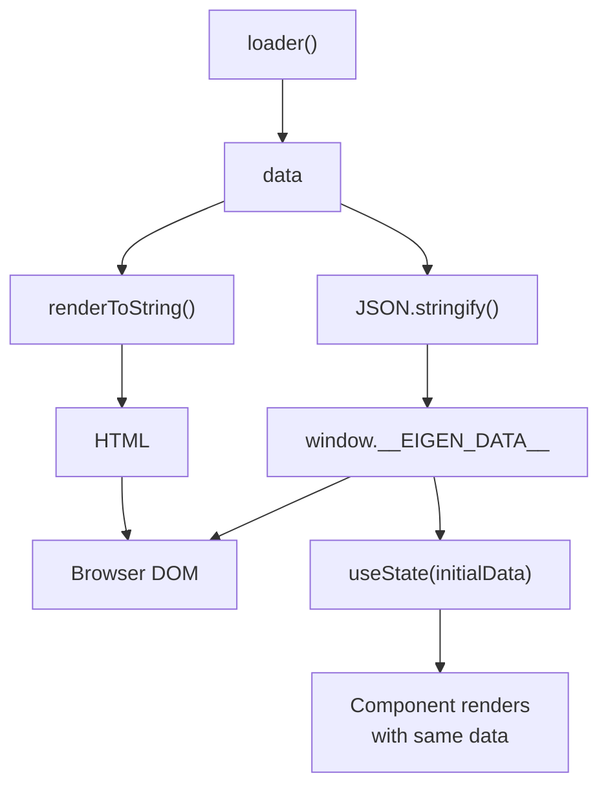

*This is the fifth installment in a series where we build a toy Next.js on top of Vite. In [Part 3](/03-server-side-rendering), we added SSR with `ssrLoadModule` and a custom H3 server. Now we'll connect the server-rendered HTML to a live React application through hydration.*

---

## What hydration is

Server-side rendering produces HTML. That HTML is static — it has no event listeners, no state, no interactivity. **Hydration** is the process where React takes that server-rendered HTML, attaches event listeners, initializes state, and makes everything interactive — without re-rendering the DOM from scratch.

<Callout type="warn">
The key constraint: the server and client must render the **exact same component tree** for the same URL. If the server renders `<h1>Hello</h1>` but the client's initial render produces `<h1>Hi</h1>`, React detects the mismatch and logs a hydration error. In development, React will warn you. In production, it will attempt to patch the DOM, but the result may be visually broken.

This constraint is why frameworks are so careful about separating server-only code from universal code. If a loader function uses `process.env.DATABASE_URL` on the server but that variable doesn't exist in the browser, the component might render differently. The server/client boundary must be enforced architecturally, not just by convention.
</Callout>

---

## Typing the serialized data

In [Part 3](/03-server-side-rendering), the dev server injects `window.__EIGEN_DATA__` into the HTML so the client can access loader data without making an additional network request. TypeScript doesn't know about this property, so we declare it:

```typescript title="packages/eigen/global.d.ts"
declare global {
	interface Window {
		__EIGEN_DATA__: unknown;
	}
}

export {};
```

We type it as `unknown` deliberately. The serialized data crosses a trust boundary: it's generated by the server, serialized to JSON, embedded in HTML, and parsed by the client. The client doesn't have compile-time knowledge of which loader produced this data. Each page component should narrow the type using its own `PageProps` generic.

<TypeDeepDive title="TypeScript: `unknown` vs `any` at serialization boundaries">

`unknown` and `any` both accept any value, but they differ in what you can *do* with the value afterward. With `any`, TypeScript lets you access properties, call methods, and pass the value anywhere — no questions asked. With `unknown`, TypeScript requires you to narrow the type first (via a type guard, assertion, or generic constraint) before you can use it. This makes `unknown` the correct choice anywhere data enters your program from outside the type system: JSON parsing, `postMessage`, `localStorage`, and — as here — serialized server data embedded in HTML. The type system can't verify that the server actually produced the shape you expect, so `unknown` forces you to prove it at the point of use rather than silently assuming it.

</TypeDeepDive>

This is a real design tension in frameworks. The server *knows* the loader's return type at the point where it serializes the data. But that type information is lost during serialization (JSON doesn't carry TypeScript types). Bridging this gap requires either runtime validation ([zod](https://zod.dev), [valibot](https://valibot.dev)) or code generation that produces per-route typed hydration helpers. [TanStack Start](https://tanstack.com/start) takes the code generation path. [Remix](https://remix.run) takes the `useLoaderData<typeof loader>()` pattern, which uses `ReturnType` inference. We'll explore these patterns in [Part 5](/05-typed-loaders).

---

## The client entry point

Now we can replace the placeholder in `src/entry-client.tsx` with the full hydration implementation:

```tsx title="src/entry-client.tsx"
import React, { Suspense, useEffect, useState } from "react";
import { hydrateRoot } from "react-dom/client";
import { routes } from "eigen/routes";
import { matchRoute } from "eigen/match-route";
import type { RoutePaths, RouteParamsMap } from "eigen/route-types";

function Router() {
	const [pathname, setPathname] = useState(window.location.pathname);
	const data = window.__EIGEN_DATA__;

	useEffect(() => {
		const handler = () => setPathname(window.location.pathname);
		window.addEventListener("popstate", handler);
		return () => window.removeEventListener("popstate", handler);
	}, []);

	const match = matchRoute(pathname, routes);
	if (!match) return <h1>404</h1>;
	const Component = match.route.component;

	return (
		<Suspense fallback={<div>Loading...</div>}>
			<Component params={match.params} data={data} />
		</Suspense>
	);
}

interface LinkProps<T extends RoutePaths> {
	to: T;
	params?: RouteParamsMap[T];
	children: React.ReactNode;
}

function Link<T extends RoutePaths>({ to, params, children }: LinkProps<T>) {
	let href: string = to;
	if (params) {
		href = to.replace(/:(\w+)/g, (_, key: string) => {
			return (params as Record<string, string>)[key] ?? `:${key}`;
		});
	}

	return (
		<a
			href={href}
			onClick={(e) => {
				e.preventDefault();
				window.history.pushState({}, "", href);
				window.dispatchEvent(new PopStateEvent("popstate"));
			}}
		>
			{children}
		</a>
	);
}

function App() {
	return (
		<div>
			<nav>
				<Link to="/">Home</Link> | <Link to="/about">About</Link> |{" "}
					<Link to="/posts/:id" params={{ id: "1" }}>Post 1</Link> |{" "}
					<Link to="/posts/:id" params={{ id: "2" }}>Post 2</Link>
			</nav>
			<Router />
		</div>
	);
}

hydrateRoot(document.getElementById("root")!, <App />);
```

The `Router` component initializes state from `window.__EIGEN_DATA__` and matches the current URL to a route — the same `matchRoute` function from [Part 3](/03-server-side-rendering), now running in the browser. The `Link` component is the same type-safe implementation from [Part 2](/02-route-discovery-plugin). It renders a plain `<a>` tag, so its HTML output matches the server's `<a href="...">` elements — satisfying the hydration contract.

### `hydrateRoot` vs `createRoot`

The crucial difference from [Part 1](/01-bare-vite-spa): we use [`hydrateRoot`](https://react.dev/reference/react-dom/client/hydrateRoot) instead of [`createRoot`](https://react.dev/reference/react-dom/client/createRoot). With `createRoot`, React creates the DOM from scratch. With `hydrateRoot`, React walks the existing server-rendered DOM, attaches event listeners, and initializes state without modifying the HTML structure. The DOM isn't re-created — it's "adopted."

<Callout type="warn" title="Hydration mismatch">
The HTML the server rendered must match what the client would render. If they differ, React logs a warning and attempts to reconcile, but the page may flash or render incorrectly.
</Callout>

The client wraps the route component in `<Suspense>` (because the virtual module uses `React.lazy` for code splitting). The server must include the same `<Suspense>` boundary so the component trees match — otherwise React detects a structural mismatch during hydration. Since the server uses static imports (not `React.lazy`), the component never suspends, and `renderToString` renders straight through the `<Suspense>` boundary as if it weren't there. The boundary produces no extra DOM, but its presence in the React tree keeps hydration happy.

With streaming SSR ([`renderToPipeableStream`](https://react.dev/reference/react-dom/server/renderToPipeableStream), which we'll adopt in [Part 12](/12-streaming-ssr)), Suspense boundaries unlock [selective hydration](https://react.dev/reference/react-dom/client/hydrateRoot#hydrating-an-entire-document) — React can hydrate components independently as their code loads, without blocking the rest of the page. But with `renderToString`, Suspense is purely structural.

### The initial data flow

On the first page load, the data flows through this pipeline:



The server renders the component with the loader data *and* serializes the data into a `<script>` tag. The client reads the serialized data and initializes its state with it, so the component renders with the same data on both sides. No hydration mismatch. No redundant data fetch.

---

## Updating the server entry

The server entry from Part 3 renders the matched component directly. Now that the client has an `App` shell with navigation, the server needs to render the same shell so the HTML matches during hydration:

```tsx title="src/entry-server.tsx"
import { Suspense } from "react"; // [!code ++]
import { renderToString } from "react-dom/server";
import { matchRoute } from "eigen/match-route"; // [!code --]
import { matchRoute, type RouteMatch } from "eigen/match-route"; // [!code ++]
import { routes } from "eigen/routes";

function App({ match, data }: { match: RouteMatch; data: unknown }) { // [!code ++]
	const Component = match.route.component; // [!code ++]
	return ( // [!code ++]
		<div> // [!code ++]
			<nav> // [!code ++]
				<a href="/">Home</a> | <a href="/about">About</a> |{" "} // [!code ++]
					<a href="/posts/1">Post 1</a> |{" "} // [!code ++]
					<a href="/posts/2">Post 2</a> // [!code ++]
			</nav> // [!code ++]
			<Suspense fallback={<div>Loading...</div>}> // [!code ++]
				<Component params={match.params} data={data} /> // [!code ++]
			</Suspense> // [!code ++]
		</div> // [!code ++]
	); // [!code ++]
} // [!code ++]
// [!code ++]
export interface RenderResult {
	html: string;
	status: number;
	data: unknown;
}

export async function render(pathname: string): Promise<RenderResult> {
	const match = matchRoute(pathname, routes);
	if (!match) return { html: "<h1>404</h1>", status: 404, data: null };

	const { route, params } = match;
	const Component = route.component; // [!code --]

	let data: unknown = null;
	if (route.loader) {
		data = await route.loader({ params });
	}

	const html = renderToString(<Component params={params} data={data} />); // [!code --]
	const html = renderToString(<App match={match} data={data} />); // [!code ++]
	return { html, status: 200, data };
}
```

The `App` component receives the already-resolved `match` from `render`, so route matching happens once per request. Notice the server uses `<a href="/">` instead of `<Link to="/">`. The `Link` component uses browser APIs ([`pushState`](https://developer.mozilla.org/en-US/docs/Web/API/History/pushState), `addEventListener`) that don't exist during server rendering. A production framework would make `Link` isomorphic — rendering a plain `<a>` on the server and attaching client-side navigation behavior after hydration. For now, the nav structure just needs to produce the same HTML on both sides.

---

## What to observe

Start the dev server with `npx tsx server.ts` (the custom server from [Part 3](/03-server-side-rendering) — `pnpm dev` still runs vanilla Vite, which doesn't do SSR). If you'd like `pnpm dev` to use the custom server, update the script in `package.json`:

```json title="package.json (scripts)"
{
  "scripts": {
    "dev": "vite", // [!code --]
    "dev": "tsx server.ts", // [!code ++]
  }
}
```

1. **View source.** The HTML arriving from the server contains fully rendered content inside `<div id="root">`. It also contains `<script>window.__EIGEN_DATA__ = ...</script>` with the serialized loader data. The client receives everything it needs in a single response.

2. **Hydration errors.** Try making the server render different content than the client — for example, using `new Date()` in a component. The server and client will produce different timestamps, and React will warn about the mismatch in the console. This demonstrates why the hydration contract matters.

3. **Client-side navigation.** After hydration, clicking `Link` components uses [`pushState`](https://developer.mozilla.org/en-US/docs/Web/API/History/pushState) — no server roundtrip. The component for the new route renders instantly. But notice that nobody calls the loader on the client side — `data` is always `window.__EIGEN_DATA__`, which was baked into the HTML for the *initial* page load. Start on `http://localhost:3000/posts/1`, then click "Post 2" in the nav. The URL changes to `/posts/2`, but the title and body still show Post 1's content — the loader wasn't re-invoked. We'll fix this in [Part 5](/05-typed-loaders) by adding a client-side data fetching endpoint.

4. **The `Link` component constraints.** In your editor, try `<Link to="/invalid">` — TypeScript reports an error. Try `<Link to="/posts/:id">` without a `params` prop — TypeScript requires `{ id: string }`.

---

## Key insight

Hydration is the moment where the server's work and the client's work must agree perfectly. The server renders HTML and serializes data. The client reads the serialized data and re-renders with it, producing identical HTML. React then "hydrates" by attaching interactivity to the existing DOM.

The type system helps enforce this contract: both server and client import the same `RouteDefinition` type, use the same `PageProps` generic, and render the same component. But the *data* crossing the server-client boundary (via `window.__EIGEN_DATA__`) is typed as `unknown` on the client side. Narrowing that type safely — so `data.title` works without a cast — is the subject of [Part 5](/05-typed-loaders).

<TestSection title="Testing: Link href generation">

Most of the hydration code is inherently browser-coupled, but the `Link` component's href generation — substituting `:param` placeholders with actual values — is a pure string transformation. Extract the logic into a testable helper in the framework package:

```typescript title="packages/eigen/build-href.ts"
export function buildHref(
	pattern: string,
	params?: Record<string, string>,
): string {
	if (!params) return pattern;
	return pattern.replace(/:(\w+)/g, (_, key: string) => {
		return params[key] ?? `:${key}`;
	});
}
```

```typescript title="packages/eigen/__tests__/build-href.test.ts"
import { describe, it, expect } from "vitest";
import { buildHref } from "../build-href";

describe("buildHref", () => {
	it("returns static paths unchanged", () => {
		expect(buildHref("/about")).toBe("/about");
	});

	it("substitutes a single param", () => {
		expect(buildHref("/posts/:id", { id: "42" })).toBe("/posts/42");
	});

	it("substitutes multiple params", () => {
		expect(
			buildHref("/users/:userId/posts/:postId", {
				userId: "7",
				postId: "99",
			}),
		).toBe("/users/7/posts/99");
	});

	it("preserves unmatched placeholders", () => {
		expect(buildHref("/posts/:id/:slug", { id: "42" })).toBe(
			"/posts/42/:slug",
		);
	});

	it("returns the pattern when params is undefined", () => {
		expect(buildHref("/posts/:id")).toBe("/posts/:id");
	});
});
```

Once `buildHref` is extracted, the `Link` component in `entry-client.tsx` can import it instead of inlining the same logic. This also prepares for [Part 11](/11-framework-plugin), where `Link` moves into the framework package.

Run with `pnpm vitest run packages/`.

</TestSection>

## Further reading

- [React `hydrateRoot`](https://react.dev/reference/react-dom/client/hydrateRoot) — React's API for hydrating server-rendered HTML, including guidance on handling hydration mismatches.
- [React `renderToString`](https://react.dev/reference/react-dom/server/renderToString) — The synchronous server rendering API used in this part. React recommends streaming APIs for production — we'll migrate in [Part 12](/12-streaming-ssr).
- [History API (MDN)](https://developer.mozilla.org/en-US/docs/Web/API/History_API) — The browser API behind client-side navigation, including `pushState` and the `popstate` event.
- [Hydration Errors in React](https://react.dev/link/hydration-mismatch) — React's guide to diagnosing and fixing hydration mismatches between server and client rendering.
- [Vite SSR Guide](https://vite.dev/guide/ssr) — Covers the `ssrLoadModule` and `transformIndexHtml` APIs that power the dev server SSR pipeline.

---

## What's next

In Part 5, we'll build typed data loaders. We'll create the `defineLoader` helper that ties loader params to route paths, explore three levels of type inference sophistication (manual annotation, `satisfies` + `ReturnType`, and generated per-route types), and add a client-side data fetching endpoint so navigations after hydration get fresh loader data from the server.
