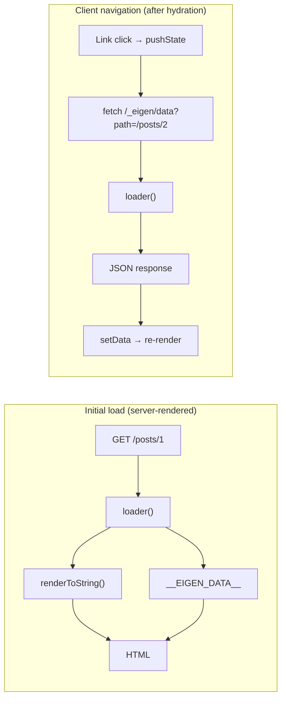

*This is the sixth installment in a series where we build a toy Next.js on top of Vite. In [Part 4](/04-hydration), we connected server and client with hydration — but ended with a bug: client-side navigations don't refetch loader data, so visiting `/posts/2` after `/posts/1` shows stale content. We'll fix that here, alongside building the type machinery that lets a loader's return type flow through to the component's `data` prop. Frameworks like [Next.js](https://nextjs.org) (with `getServerSideProps`) and [Remix](https://remix.run) (with `loader`) solve the same two problems.*

---

## The design goal

When a developer writes a loader, the return type should flow through to the component's `data` prop. Ideally with zero manual type annotations:

```tsx
// Dream DX:
export const loader = defineLoader("/posts/:id", async ({ params }) => {
	// params.id is typed as string — inferred from the route path
	const post = await fetchPost(params.id);
	return post; // { title: string; body: string }
});

export default function PostPage({ params, data }) {
	// data.title: string  ← inferred from the loader return type
	// params.id: string   ← inferred from the route path
}
```

Getting here requires progressively more sophisticated type machinery. Let's build through three levels.

---

## Level 1: Manual annotation

The simplest approach — the developer explicitly writes the types. This is the baseline pattern in early versions of frameworks like [Remix](https://remix.run) and [TanStack Start](https://tanstack.com/start) before they invested in deeper type inference:

```tsx title="src/pages/posts/[id].tsx"
import type { PageProps } from "eigen/types";

type Post = { id: number; title: string; body: string };
type Props = PageProps<"/posts/:id", Post>;

export async function loader({ params }: { params: { id: string } }) {
	const res = await fetch(
		`https://jsonplaceholder.typicode.com/posts/${params.id}`,
	);
	return (await res.json()) as Post;
}

export default function PostPage({ params, data }: Props) {
	return (
		<article>
			<h1>{data.title}</h1>
			<p>Post #{params.id}</p>
			<p>{data.body}</p>
		</article>
	);
}
```

This works. `PageProps<'/posts/:id', Post>` expands to `{ params: { id: string }; data: Post }`, and `RouteParams<'/posts/:id'>` (from [Part 2](/02-route-discovery-plugin)) extracts the `id` param from the path string.

But the developer wrote two type annotations the framework could in principle derive: the loader's `params` argument (already known from the route path) and the `Post` shape (already known from the loader's return value). And nothing forces them to stay in sync — if the loader gains a `userId` field but the `Post` alias doesn't update, the component still type-checks against the stale shape and access to `data.userId` is a compile error even though it exists at runtime. The type system is providing safety, but it isn't DRY.

---

## Level 2: `satisfies` and `ReturnType`

TypeScript's [`satisfies`](https://www.typescriptlang.org/docs/handbook/release-notes/typescript-4-9.html#the-satisfies-operator) operator (introduced in 4.9) solves the "constrain without widening" problem. We can constrain the loader's shape — it must accept the right params and return a value or Promise — without losing the narrow return type:

```tsx title="src/pages/posts/[id].tsx"
import type { LoaderFn, PageProps } from "eigen/types";

export const loader = (async ({ params }) => {
	const res = await fetch(
		`https://jsonplaceholder.typicode.com/posts/${params.id}`,
	);
	return (await res.json()) as { id: number; title: string; body: string };
}) satisfies LoaderFn<"/posts/:id">;

// Extract the return type automatically
type LoaderData = Awaited<ReturnType<typeof loader>>;

export default function PostPage({
	params,
	data,
}: PageProps<"/posts/:id", LoaderData>) {
	// data.id: number       ← inferred from the loader
	// data.title: string    ← inferred from the loader
	// data.body: string     ← inferred from the loader
	// params.id: string     ← inferred from the route path
	return (
		<article>
			<h1>{data.title}</h1>
			<p>Post #{params.id}</p>
			<p>{data.body}</p>
		</article>
	);
}
```

`LoaderFn` is the type alias from [Part 2](/02-route-discovery-plugin): `(context: { params: RouteParams<TPath> }) => Promise<TData> | TData`. By writing `satisfies LoaderFn<'/posts/:id'>`, we ask TypeScript to verify three things:

- The loader's `params` argument matches the route's dynamic segments — here `{ id: string }`, derived from the path string by [`RouteParams`](/02-route-discovery-plugin#understanding-routeparams).
- The return type is a value or a `Promise<value>`.
- The function signature otherwise conforms to `LoaderFn`.

The check also flows the parameter type *into* the arrow function — that's why `params.id` is typed as `string` inside the body without an explicit annotation. This is contextual typing through `satisfies`, the same mechanism that types object literals against a target type.

Crucially, `satisfies` does *not* widen the return type to `unknown` (which is what `LoaderFn`'s default `TData` would produce). The `typeof loader` retains the narrow type `(ctx: ...) => Promise<{ id: number; title: string; body: string }>`, which `Awaited<ReturnType<...>>` extracts.

<TypeDeepDive title="TypeScript: The `satisfies` operator">

`satisfies` (added in TS 4.9) checks that an expression matches a type *without widening it*. Compare two approaches: `const x: Type = value` widens `x` to `Type`, losing any narrower type information. `const x = value satisfies Type` checks compatibility but preserves the narrow, specific type. This distinction matters here because `ReturnType<typeof loader>` needs the narrow type. With `: LoaderFn`, the return type widens to `unknown` and `ReturnType` gives you nothing useful. With `satisfies`, TypeScript retains the exact `{ id: number; title: string; body: string }` shape while still enforcing that the function conforms to the `LoaderFn` contract.

</TypeDeepDive>

The data type is now written once — in the loader. The component derives it via `ReturnType`. If the loader changes, the component's types update automatically.

<TypeDeepDive title="TypeScript: `ReturnType` and `Awaited` utility types">

`ReturnType<typeof fn>` extracts a function's return type — it's a built-in utility type that uses `infer` under the hood. Since loaders are async, the return type is `Promise<{ id: number; title: string; body: string }>`, not the inner object. `Awaited<T>` unwraps the Promise (recursively, handling nested Promises) to get the resolved type. Chained together, `Awaited<ReturnType<typeof loader>>` gives you the data shape that `data` will actually be at runtime after the `await` — which is exactly what the component needs for its props.

</TypeDeepDive>

The trade-off: the developer still has to write `Awaited<ReturnType<typeof loader>>` and thread it through `PageProps`. It's a boilerplate tax.

---

## Level 3: The `defineLoader` helper

We can reduce the boilerplate further with a helper that validates the route path against the known routes and preserves the return type:

```typescript title="packages/eigen/helpers.ts"
import type { RouteParamsMap } from "eigen/route-types";

/**
 * Define a type-safe loader for a specific route.
 * - Validates the path against known routes at compile time
 * - Types the params based on the route's dynamic segments
 * - Preserves the narrow return type for inference
 */
export function defineLoader<TPath extends keyof RouteParamsMap, TData>(
	_path: TPath,
	fn: (ctx: { params: RouteParamsMap[TPath] }) => Promise<TData> | TData,
): (ctx: { params: RouteParamsMap[TPath] }) => Promise<TData> | TData {
	return fn;
}
```

The first generic parameter `TPath` is constrained to `keyof RouteParamsMap` — the union of all valid route paths from the declarations our plugin generates in [Part 2](/02-route-discovery-plugin#type-declarations). TypeScript validates that the path string is a known route. The second generic parameter `TData` is inferred from the function's return type.

`defineLoader` does nothing at runtime — it returns `fn` unchanged. The `_path` argument is consumed only by the type system, hence the underscore prefix (a [TypeScript convention](https://www.typescriptlang.org/docs/handbook/variable-declarations.html#destructuring) for "intentionally unused"). All of the safety lives in the call signature.

<TypeDeepDive title="TypeScript: Generic constraints with `extends keyof`">

`TPath extends keyof RouteParamsMap` constrains the type parameter `TPath` to only keys that exist in `RouteParamsMap` (the interface generated from your filesystem routes). The `keyof` operator produces a union of all the map's keys — your valid route paths, like `'/' | '/about' | '/posts/:id'`. When you call `defineLoader('/posts/:id', ...)`, TypeScript infers `TPath` as the literal `'/posts/:id'`, then uses it to look up `RouteParamsMap['/posts/:id']` to get `{ id: string }` for the params type. If you pass a path that isn't a key in the map, it's a compile error — no runtime check needed.

</TypeDeepDive>

We also need to register `eigen/helpers` so application code can import it — same pattern we used for `eigen/match-route` in [Part 3](/03-server-side-rendering#route-matching):

```json title="tsconfig.json"
{
  "compilerOptions": {
    "paths": {
      "eigen/types": ["./packages/eigen/types.ts"],
      "eigen/match-route": ["./packages/eigen/match-route.ts"],
      "eigen/helpers": ["./packages/eigen/helpers.ts"] // [!code ++]
    }
  }
}
```

```typescript title="vite.config.ts"
resolve: {
  alias: {
    'eigen/types': resolve(__dirname, 'packages/eigen/types.ts'),
    'eigen/match-route': resolve(__dirname, 'packages/eigen/match-route.ts'),
    'eigen/helpers': resolve(__dirname, 'packages/eigen/helpers.ts'), // [!code ++]
  },
},
```

(In [Part 11](/11-framework-plugin) we'll consolidate these aliases into a single `resolveId` hook on the framework plugin and stop adding entries by hand.)

Usage:

```tsx title="src/pages/posts/[id].tsx"
import { defineLoader } from "eigen/helpers";
import type { PageProps } from "eigen/types";

export const loader = defineLoader("/posts/:id", async ({ params }) => {
	// params.id is typed as string — guaranteed by the route path
	const res = await fetch(
		`https://jsonplaceholder.typicode.com/posts/${params.id}`,
	);
	return (await res.json()) as { id: number; title: string; body: string };
});

type LoaderData = Awaited<ReturnType<typeof loader>>;

export default function PostPage({
	params,
	data,
}: PageProps<"/posts/:id", LoaderData>) {
	return (
		<article>
			<h1>{data.title}</h1>
			<p>Post #{params.id}</p>
			<p>{data.body}</p>
		</article>
	);
}
```

Now the path string is validated at compile time. If you write `defineLoader('/posts/:id', ...)` but the file is at `src/pages/users/[name].tsx`, the path won't match any entry in `RouteParamsMap` and TypeScript reports an error. The loader's params are correctly typed as `{ id: string }` without any annotation.

You still need `Awaited<ReturnType<typeof loader>>` to bridge the loader return type to the component props. Eliminating that last piece of boilerplate requires per-route code generation.

---

## Level 4 (conceptual): Generated per-route types

To eliminate all manual type annotations, the plugin can generate per-route helper modules:

```typescript
// Generated by the plugin into node_modules/.eigen/route-helpers.d.ts
declare module "eigen/page/posts/[id]" {
	import type { PageProps } from "eigen/types";

	/** Pre-typed props for this page */
	export type Props = PageProps<"/posts/:id">;

	/** Hook that returns this route's loader data with full types */
	export function useLoaderData(): Awaited<
		ReturnType<typeof import("/src/pages/posts/[id].tsx").loader>
	>;
}
```

With this, the developer writes:

```tsx
import { useLoaderData } from "eigen/page/posts/[id]";

export default function PostPage() {
	const data = useLoaderData();
	// data.title: string — fully inferred, zero annotations
}
```

This is essentially what [TanStack Router](https://tanstack.com/router)'s [code generation](https://tanstack.com/router/latest/docs/framework/react/guide/code-generation) produces. The plugin scans each route file, extracts the loader's type signature, and generates a `.d.ts` with pre-connected types. The complexity is in the plugin, not in the developer's code.

We won't implement this in the tutorial — it requires the plugin to parse TypeScript ASTs and extract type information, which is a significant investment. But understanding that it's possible (and how it works) is important for understanding the tradeoffs real frameworks make.

---

## The spectrum of framework type inference

| Level | Developer writes | Framework generates | Real-world equivalent |
|---|---|---|---|
| Manual | `PageProps<'/path', DataType>` | Route path union | Early Remix, hand-written types |
| `satisfies` | `satisfies LoaderFn<'/path'>` + `ReturnType` | Route path union + param map | Modern Remix (`useLoaderData<typeof loader>()`) |
| `defineLoader` | `defineLoader('/path', fn)` + `ReturnType` | Path validation + typed params | Eigen (this part) |
| Full codegen | Nothing — types flow automatically | Per-route typed hooks + props | TanStack Router (`routeTree.gen.ts`) |

Each row builds on the one above it. Eigen ships both Levels 2 and 3 — `LoaderFn` for developers who don't want to import a helper, `defineLoader` for the slightly stronger guarantee that the path string matches a real route. Frameworks at the bottom of the table eliminate even those few lines of glue, at the cost of a code-generation step in the build pipeline.

<Callout type="info" title="React Server Components sidesteps the spectrum">

[Next.js App Router with Server Components](https://nextjs.org/docs/app/building-your-application/rendering/server-components) takes a different approach to the same problem. Components *are* the data fetching layer, so there's no loader/component type bridge to build — data is fetched inline with `await`, and TypeScript infers the types naturally because the fetch and the render live in one function. This is an architectural trade-off, not a strict win: RSC eliminates the loader abstraction entirely, while the loader pattern keeps a clean separation between data fetching (server-only) and rendering (universal). We'll build our own RSC layer in [Part 21](/21-react-server-components).

</Callout>

---

## Client-side data fetching

[Part 4](/04-hydration#what-to-observe) ended with a deliberate bug: navigating from `/posts/1` to `/posts/2` updated the URL but not the data. The component re-rendered with the new `params.id`, but `data` was always `window.__EIGEN_DATA__` — the value baked into the HTML for the *initial* page load. The client never asked the server for fresh data, because the server endpoint that would answer that question doesn't exist yet.

The standard framework solution is to mirror the loader pipeline as a JSON endpoint. The first page load gets data through HTML (one round-trip, no extra request); subsequent navigations get it through `fetch`. [Next.js](https://nextjs.org) wires this up at `/_next/data/...`. [Remix](https://remix.run) reuses the route URL with a `?_data=` query parameter. We'll use `/_eigen/data?path=...`.



### A loader runner

Right now `entry-server.tsx` exposes one function — `render` — that runs the loader *and* renders HTML. The data endpoint only needs the loader half. Rather than render HTML and throw it away, we extract the loader-running logic into the framework package:

```typescript title="packages/eigen/run-loader.ts"
import { matchRoute } from "./match-route";
import type { RouteDefinition } from "./types";

export async function runLoader(
	pathname: string,
	routes: RouteDefinition[],
): Promise<unknown> {
	const match = matchRoute(pathname, routes);
	if (!match || !match.route.loader) return null;
	return match.route.loader({ params: match.params });
}
```

Register it the same way as the other framework modules:

```json title="tsconfig.json"
{
  "compilerOptions": {
    "paths": {
      "eigen/types": ["./packages/eigen/types.ts"],
      "eigen/match-route": ["./packages/eigen/match-route.ts"],
      "eigen/helpers": ["./packages/eigen/helpers.ts"],
      "eigen/run-loader": ["./packages/eigen/run-loader.ts"] // [!code ++]
    }
  }
}
```

```typescript title="vite.config.ts"
resolve: {
  alias: {
    'eigen/types': resolve(__dirname, 'packages/eigen/types.ts'),
    'eigen/match-route': resolve(__dirname, 'packages/eigen/match-route.ts'),
    'eigen/helpers': resolve(__dirname, 'packages/eigen/helpers.ts'),
    'eigen/run-loader': resolve(__dirname, 'packages/eigen/run-loader.ts'), // [!code ++]
  },
},
```

### The data endpoint

We add a middleware to the `eigen-routes` plugin from [Part 2](/02-route-discovery-plugin). The middleware uses [`ssrLoadModule`](https://vite.dev/guide/api-javascript#vitedevserver-ssrloadmodule) to load the routes through the SSR module graph (so loaders are included), then calls `runLoader`:

```typescript title="plugins/eigen-routes.ts"
import type { RouteDefinition } from "../packages/eigen/types"; // [!code ++]
import { runLoader } from "../packages/eigen/run-loader"; // [!code ++]

// ... inside the plugin's configureServer hook ...
configureServer(server) {
	// ... existing watcher code ...

	return () => {
		server.middlewares.use(async (req, res, next) => {
			if (!req.url?.startsWith("/_eigen/data")) return next();

			const url = new URL(req.url, "http://localhost");
			const pathname = url.searchParams.get("path") ?? "/";

			try {
				const { routes } = (await server.ssrLoadModule(
					"eigen/routes",
				)) as { routes: RouteDefinition[] };
				const data = await runLoader(pathname, routes);

				res.setHeader("Content-Type", "application/json");
				res.end(JSON.stringify(data));
			} catch (e) {
				server.ssrFixStacktrace(e as Error);
				console.error(e);
				res.writeHead(500);
				res.end("Internal server error");
			}
		});
	};
}
```

A few details worth calling out:

- **The middleware uses Node-style `req`/`res`.** Vite's [`configureServer`](https://vite.dev/guide/api-plugin#configureserver) hook takes [Connect](https://github.com/senchalabs/connect)-style middleware, not H3 handlers. The HTTP layer here is Node-bound by design — same reason we used `fromNodeHandler` in [Part 3](/03-server-side-rendering#why-h3node).
- **Loaders only exist in the SSR graph.** `ssrLoadModule('eigen/routes')` triggers the [`load` hook from Part 2](/02-route-discovery-plugin#plugin-hooks) with `this.environment.name === 'ssr'`, which is the branch that emits static imports plus loader references. Loading through the client graph would give us route components without their loaders.
- **`ssrFixStacktrace`** rewrites stack traces back to source-mapped TypeScript locations, the same way the SSR handler does it in [Part 3](/03-server-side-rendering#the-custom-dev-server). Without it, errors in a loader point at Vite's transformed output.
- **No production equivalent yet.** `configureServer` is dev-only ([Part 0](/00-the-mental-model#hook-availability-dev-vs-build)). When we move to a production server in [Part 6](/06-production-builds), we'll need an equivalent route mounted directly on H3 — `runLoader` itself ports across unchanged because it has no Node-specific dependencies.

### Updating the client

Now the client can fetch fresh data on navigation. We re-introduce `data` as state (it was a `const` after [Part 4](/04-hydration#the-client-entry-point)) and add a `loading` flag:

```tsx title="src/entry-client.tsx"
function Router() {
	const [pathname, setPathname] = useState(window.location.pathname);
	const data = window.__EIGEN_DATA__; // [!code --]
	const [data, setData] = useState<unknown>(window.__EIGEN_DATA__); // [!code ++]
	const [loading, setLoading] = useState(false); // [!code ++]

	useEffect(() => {
		const handler = () => { // [!code --]
			setPathname(window.location.pathname); // [!code --]
		}; // [!code --]
		const handler = async () => { // [!code ++]
			const newPath = window.location.pathname; // [!code ++]
			setPathname(newPath); // [!code ++]
			setLoading(true); // [!code ++]
			try { // [!code ++]
				const res = await fetch( // [!code ++]
					`/_eigen/data?path=${encodeURIComponent(newPath)}`, // [!code ++]
				); // [!code ++]
				setData(await res.json()); // [!code ++]
			} finally { // [!code ++]
				setLoading(false); // [!code ++]
			} // [!code ++]
		}; // [!code ++]
		window.addEventListener("popstate", handler);
		return () => window.removeEventListener("popstate", handler);
	}, []);

	const match = matchRoute(pathname, routes);
	if (!match) return <h1>404</h1>;
	const Component = match.route.component;

	return (
		<Suspense fallback={<div>Loading...</div>}>
			{loading ? ( // [!code ++]
				<div>Loading...</div> // [!code ++]
			) : ( // [!code ++]
				<Component params={match.params} data={data} /> // [!code ++]
			)} // [!code ++]
			<Component params={match.params} data={data} /> // [!code --]
		</Suspense>
	);
}
```

The `try`/`finally` ensures `loading` always resets, even if the fetch throws — without it, a network error would leave the page stuck on "Loading…". `Link` already dispatches a `popstate` event on click ([Part 4](/04-hydration#the-client-entry-point)), so the same handler covers both back/forward navigation and Link clicks.

This is the standard framework data flow: the first page load gets data through serialized HTML; subsequent navigations fetch from an endpoint that calls the same loader functions on the server. The loader runs once per request in both cases — the client never executes loader code directly.

---

## What to observe

1. **The Part 4 bug is fixed.** Start on `http://localhost:3000/posts/1` (with the dev server running via `npx tsx server.ts`), then click "Post 2" in the nav. The title and body update to Post 2's content — the same scenario that left stale Post 1 content in [Part 4](/04-hydration#what-to-observe). Open the Network tab and you'll see a `GET /_eigen/data?path=%2Fposts%2F2` request returning the Post 2 JSON.

2. **View source.** The HTML still contains a `<script>` tag with `window.__EIGEN_DATA__` for the initial load — same pattern as [Next.js](https://nextjs.org)'s `__NEXT_DATA__`. Subsequent navigations don't need this; they hit the data endpoint.

3. **The loader never appears in the client bundle.** Because the client branch of [`eigen/routes`](/02-route-discovery-plugin#plugin-hooks) doesn't import loaders, Vite's tree-shaking eliminates them entirely. Visit `/__inspect/` (from [Part 2](/02-route-discovery-plugin#what-to-observe)) and inspect the client version of the virtual module — the `loader` references are gone. The full production check comes in [Part 6](/06-production-builds).

4. **The `defineLoader` path is type-checked.** Try `defineLoader('/nonexistent', ...)` in your editor — TypeScript reports an error because `/nonexistent` isn't a key of the generated `RouteParamsMap`. Now try `defineLoader('/posts/:id', async ({ params }) => ...)` and hover over `params` — TypeScript shows `{ id: string }`, derived entirely from the path string.

---

## Key insight

The loader type inference story is really a question about where the type information lives and how it flows. At the simplest level, the developer writes the types manually. At the most sophisticated level, the framework's plugin extracts type information from source files and generates declarations that connect everything automatically.

The `satisfies` operator is the key TypeScript feature that makes Level 2 and Level 3 work. Without it, the loader's return type would widen to `unknown` (matching the `LoaderFn` signature), and `ReturnType` would be useless. `satisfies` constrains the shape while preserving the narrow type — exactly what framework type inference needs.

---

<TestSection title="Testing: runLoader">

`defineLoader` is a no-op at runtime — its safety lives in the type system, which `tsc` already verifies. The interesting runtime addition is `runLoader`: it owns the "match a URL, run the matched route's loader, return the data" pipeline that both the SSR handler and the client-side data endpoint depend on.

```typescript title="packages/eigen/__tests__/run-loader.test.ts"
import { describe, expect, it } from "vitest";
import { runLoader } from "../run-loader";
import type { RouteDefinition } from "../types";

const routes: RouteDefinition[] = [
	{ path: "/", component: () => null },
	{ path: "/about", component: () => null },
	{
		path: "/posts/:id",
		component: () => null,
		loader: async ({ params }) => ({
			id: params.id,
			title: `Post ${params.id}`,
		}),
	},
];

describe("runLoader", () => {
	it("invokes the matched route's loader with extracted params", async () => {
		const data = await runLoader("/posts/42", routes);
		expect(data).toEqual({ id: "42", title: "Post 42" });
	});

	it("returns null when the matched route has no loader", async () => {
		expect(await runLoader("/about", routes)).toBeNull();
	});

	it("returns null when no route matches", async () => {
		expect(await runLoader("/nonexistent", routes)).toBeNull();
	});

	it("propagates loader errors to the caller", async () => {
		const failing: RouteDefinition[] = [
			{
				path: "/boom",
				component: () => null,
				loader: async () => {
					throw new Error("loader failed");
				},
			},
		];
		await expect(runLoader("/boom", failing)).rejects.toThrow("loader failed");
	});
});
```

The error-propagation test matters more than it looks: the data endpoint relies on errors bubbling up so its `try`/`catch` can return a 500 response and `ssrFixStacktrace` can rewrite the trace. If `runLoader` ever swallowed errors silently, the endpoint would respond with `null` and the client would render an empty page with no clue why.

Run with `pnpm vitest run packages/`.

</TestSection>

## Further reading

- [TypeScript `satisfies` Operator](https://www.typescriptlang.org/docs/handbook/release-notes/typescript-4-9.html#the-satisfies-operator) — The TypeScript 4.9 feature that enables constrained type inference without widening.
- [TypeScript Utility Types](https://www.typescriptlang.org/docs/handbook/utility-types.html) — Reference for `ReturnType`, `Awaited`, and other built-in utility types used in loader type inference.
- [TanStack Router Code Generation](https://tanstack.com/router/latest/docs/framework/react/guide/code-generation) — How TanStack Router generates fully typed route trees, eliminating manual type annotations entirely.
- [Remix Data Loading](https://remix.run/docs/en/main/guides/data-loading) — Remix's approach to typed loaders using `useLoaderData<typeof loader>()`.
- [Next.js `getServerSideProps`](https://nextjs.org/docs/pages/building-your-application/data-fetching/get-server-side-props) — The Pages Router equivalent of the loader pattern, including the `/_next/data/...` endpoint that inspired our `/_eigen/data` design.
- [Vite Plugin API: `configureServer`](https://vite.dev/guide/api-plugin#configureserver) — The hook used to register the client-side data fetching endpoint as Connect-style middleware.

---

## What's next

In [Part 6](/06-production-builds), we'll tackle production builds — the `vite build` command, client/server build coordination, manifest files, and the production server. This is where the dev server's two module graphs produce two concrete output directories, connected by a manifest. The plugin-based `/_eigen/data` middleware from this part is dev-only; the production server will need its own route over `runLoader`.
