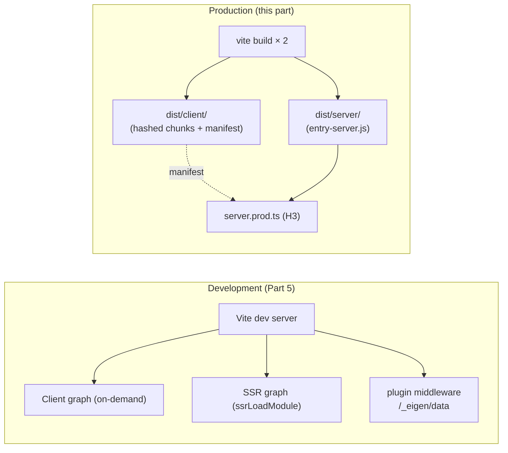
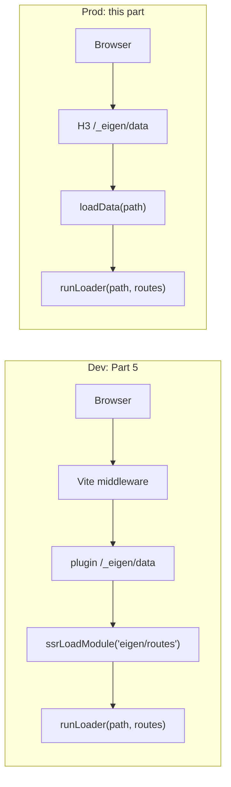

*This is the seventh installment in a series where we build a toy Next.js on top of Vite. In [Part 5](/05-typed-loaders), we built typed data loaders and a `/_eigen/data` endpoint via Vite's [`configureServer`](https://vite.dev/guide/api-plugin#configureserver) — a dev-only hook ([Part 0](/00-the-mental-model#hook-availability-dev-vs-build)). Now we move to production: two Rolldown builds connected by a manifest, an H3 server that imports a pre-built bundle instead of calling `ssrLoadModule`, and the data endpoint re-mounted directly on H3 because the plugin middleware no longer exists.*

---

## Development vs. production

Everything we've built so far runs on the Vite dev server — the on-demand module transformer from [Part 0](/00-the-mental-model#how-the-dev-server-actually-works). In development, the browser requests modules individually, and Vite transforms each one on the fly. This is great for DX (instant startup, fast HMR) but terrible for production: hundreds of individual HTTP requests, untransformed source files, no minification, no tree-shaking.

In production, Vite switches to a completely different mode: **[Rolldown](https://rolldown.rs) bundling**. Rolldown is a Rust-based bundler ([Rollup](https://rollupjs.org)-compatible) that processes the *entire* module graph eagerly and produces optimized output:

- **Bundling**: Hundreds of source modules are combined into a handful of chunks, eliminating the HTTP request waterfall.
- **Tree-shaking**: Rolldown analyzes `import`/`export` relationships and removes unused code. If a module exports 10 functions but only 3 are imported, the other 7 are eliminated from the output. This is what removes loaders from the client bundle: the client branch of `eigen/routes` (from [Part 2](/02-route-discovery-plugin#plugin-hooks)) never references them.
- **Scope hoisting**: Instead of wrapping each module in a function (like webpack), Rolldown concatenates modules into a single scope, reducing overhead and enabling better minification.
- **Code splitting**: Dynamic `import()` statements (like our [`React.lazy`](https://react.dev/reference/react/lazy)`(() => import('./Page'))`) create separate chunks that load on demand.
- **Minification**: Variable names are shortened, whitespace is removed, and dead code is eliminated.
- **Hashed filenames**: Output files get content-based hashes (`entry-client-a1b2c3d4.js`), enabling indefinite browser caching — when code changes, the hash changes, and the browser fetches the new version.

<Callout type="info" title="Your plugins run in both modes">
The same `resolveId`/`load`/`transform` hooks that served modules on-demand in development now process them eagerly during Rolldown's build. Your route plugin's virtual module is generated the same way — the only difference is *when* it runs (on-demand vs. ahead-of-time) and *what consumes the output* (browser requests vs. Rolldown's module graph).
</Callout>

For a server-rendered framework, we need **two** Rolldown builds — one for the client (browser-targeted, code-split, hashed) and one for the server (Node-targeted, single-file, unhashed). These are the same two module graphs from [Part 0](/00-the-mental-model#the-two-module-graphs), now producing two output directories instead of two on-demand pipelines. They're connected by a manifest file.



---

## Configuring the builds

```typescript title="vite.config.ts"
import { resolve } from "node:path";
import { defineConfig } from "vite";
import react from "@vitejs/plugin-react";
import inspect from "vite-plugin-inspect";
import eigenRoutes from "./plugins/eigen-routes";

export default defineConfig({
	plugins: [react(), eigenRoutes(), inspect()],
	resolve: {
		alias: {
			"eigen/types": resolve(__dirname, "packages/eigen/types.ts"),
			"eigen/match-route": resolve(__dirname, "packages/eigen/match-route.ts"),
			"eigen/helpers": resolve(__dirname, "packages/eigen/helpers.ts"),
			"eigen/run-loader": resolve(__dirname, "packages/eigen/run-loader.ts"),
		},
	},
	build: { // [!code ++]
		manifest: true, // [!code ++]
		rolldownOptions: { // [!code ++]
			input: "src/entry-client.tsx", // [!code ++]
		}, // [!code ++]
	}, // [!code ++]
});
```

**`build.manifest: true`** tells Vite to emit `.vite/manifest.json` alongside the build output. The manifest maps source paths to their built equivalents — we'll read it from the production server below.

**`build.rolldownOptions.input`** sets the entry point for the client build. Without this, Vite defaults to `index.html` and walks its `<script>` tags. That works in single-page setups, but here we want Rolldown to start from the entry module so it can produce code-split chunks for each lazy route. (`build.rollupOptions` still works as an alias — Vite 8's compatibility shim covers most Vite 7 configs, see [Part 0](/00-the-mental-model#vite-is-two-completely-different-things).)

### Build commands

```json title="package.json"
{
  "scripts": {
    "build": "npm run build:client && npm run build:server", // [!code ++]
    "build:client": "vite build --outDir dist/client", // [!code ++]
    "build:server": "vite build --outDir dist/server --ssr src/entry-server.tsx" // [!code ++]
  }
}
```

Two `vite build` invocations against the same config — one per environment. We'll consolidate these into a single command via [`buildApp`](https://vite.dev/guide/api-plugin#buildapp) in [Part 11](/11-framework-plugin), but two scripts make the asymmetry visible: the only thing that distinguishes a server build from a client build is the `--ssr <entry>` flag and the output directory.

The **`--ssr` flag** changes the build fundamentally:

- **Target**: Node instead of the browser (`platform: 'node'`).
- **Code splitting**: Disabled — the server bundle is a single file.
- **External dependencies**: `node_modules` packages are *not* bundled by default — they're available at runtime in Node, so bundling them would just bloat the output.
- **Module format**: ESM by default.
- **Asset handling**: No content hashing — server bundles don't need cache-busted filenames.
- **Plugins**: The `applyToEnvironment` filter ([Part 7](/07-transform-hook#applytoenvironment--environment-scoped-plugins)) decides which plugins run. Both builds run our `eigen-routes` plugin and produce a virtual module — the client gets `React.lazy(...)` references, the server gets static imports plus loaders, just like in dev.

---

## The manifest file

After `vite build --outDir dist/client`, the manifest at `dist/client/.vite/manifest.json` looks roughly like this:

```json
{
  "src/entry-client.tsx": {
    "file": "assets/entry-client-a1b2c3d4.js",
    "imports": [
      "_vendor-i9j0k1l2.js"
    ],
    "css": [
      "assets/style-e5f6g7h8.css"
    ],
    "isEntry": true
  },
  "src/pages/Home.tsx": {
    "file": "assets/Home-m3n4o5p6.js",
    "isDynamicEntry": true
  },
  "src/pages/posts/[id].tsx": {
    "file": "assets/_id_-q7r8s9t0.js",
    "isDynamicEntry": true
  }
}
```

The manifest tells the production server:

- The client entry compiled to `assets/entry-client-a1b2c3d4.js`.
- Each page compiled to its own chunk — because the client virtual module from [Part 2](/02-route-discovery-plugin#plugin-hooks) uses `React.lazy(() => import(...))`, Rolldown splits those dynamic imports into separate chunks.
- The CSS extracted to `assets/style-e5f6g7h8.css`.
- Vendor code (React, etc.) sits in a shared `_vendor-i9j0k1l2.js` chunk that the entry pulls in via the `imports` field.

The hex suffix in each filename (`a1b2c3d4`) is a hash of the file's *content*. Change the source, the hash changes, the filename changes, and the browser is forced to fetch the new version — even if the server set `Cache-Control: max-age=31536000`. This is content-addressed caching, and it's the reason production servers can ship aggressive cache headers without ever serving stale code.

---

## Exposing the loader for production

The dev `/_eigen/data` middleware in [Part 5](/05-typed-loaders#the-data-endpoint) called `server.ssrLoadModule('eigen/routes')` to grab the route table on every request and ran `runLoader(pathname, routes)` against it. Production has no `ssrLoadModule` — `eigen/routes` is bundled into `dist/server/entry-server.js` along with the rest of the server code. We expose a small wrapper from the server entry so the production server doesn't have to reach into the bundle's internals:

```tsx title="src/entry-server.tsx"
import { Suspense } from "react";
import { renderToString } from "react-dom/server";
import { matchRoute, type RouteMatch } from "eigen/match-route";
import { routes } from "eigen/routes";
import { runLoader } from "eigen/run-loader"; // [!code ++]

function App({ match, data }: { match: RouteMatch; data: unknown }) {
	const Component = match.route.component;
	return (
		<div>
			<nav>
				<a href="/">Home</a> | <a href="/about">About</a> |{" "}
				<a href="/posts/1">Post 1</a> | <a href="/posts/2">Post 2</a>
			</nav>
			<Suspense fallback={<div>Loading...</div>}>
				<Component params={match.params} data={data} />
			</Suspense>
		</div>
	);
}

export interface RenderResult {
	html: string;
	status: number;
	data: unknown;
}

export async function render(pathname: string): Promise<RenderResult> {
	const match = matchRoute(pathname, routes);
	if (!match) return { html: "<h1>404</h1>", status: 404, data: null };

	let data: unknown = null;
	if (match.route.loader) {
		data = await match.route.loader({ params: match.params });
	}

	const html = renderToString(<App match={match} data={data} />);
	return { html, status: 200, data };
}

export async function loadData(pathname: string): Promise<unknown> { // [!code ++]
	return runLoader(pathname, routes); // [!code ++]
} // [!code ++]
```

`loadData` is a one-liner that takes the place of the `runLoader(pathname, routes)` call in the dev plugin. The production server imports it from the bundle and never has to know about the routes array directly. Because `runLoader` lives in `packages/eigen/run-loader.ts` (a pure function with no Node-specific dependencies, as promised in [Part 5](/05-typed-loaders#the-data-endpoint)), it ports over unchanged — the difference is purely how the routes get loaded into memory.

---

## The production server

```typescript title="server.prod.ts"
import { readFileSync } from "node:fs";
import { H3, serve, serveStatic } from "h3";
import type { RenderResult } from "./src/entry-server";

const template = readFileSync("dist/client/index.html", "utf-8");
const manifest: Record<string, { file: string; css?: string[] }> = JSON.parse(
	readFileSync("dist/client/.vite/manifest.json", "utf-8"),
);

// Top-level await: load the pre-built server bundle once at startup
const { render, loadData } = (await import("./dist/server/entry-server.js")) as {
	render: (pathname: string) => Promise<RenderResult>;
	loadData: (pathname: string) => Promise<unknown>;
};

const app = new H3();

// Serve hashed static assets with year-long caching
app.get(
	"/assets/**",
	serveStatic({
		dir: "dist/client/assets",
		maxAge: 60 * 60 * 24 * 365, // 1 year — content hashes handle cache busting
	}),
);

// Data endpoint — the production equivalent of Part 5's plugin middleware
app.get("/_eigen/data", async (event) => {
	const pathname = new URL(event.request.url).searchParams.get("path") ?? "/";
	try {
		const data = await loadData(pathname);
		return Response.json(data);
	} catch (e) {
		console.error(e);
		return new Response("Internal server error", { status: 500 });
	}
});

// SSR fallback
app.all("/**", async (event) => {
	try {
		const url = new URL(event.request.url);
		const { html: appHtml, status, data } = await render(url.pathname);

		// Inject preload hints for the entry chunk and its CSS
		const entry = manifest["src/entry-client.tsx"];
		const headTags = [
			`<script type="module" src="/${entry.file}"></script>`,
			`<link rel="modulepreload" href="/${entry.file}" />`,
			...(entry.css?.map((href) => `<link rel="stylesheet" href="/${href}" />`) ?? []),
			`<script>window.__EIGEN_DATA__ = ${JSON.stringify(data)}</script>`,
		].join("\n    ");

		const finalHtml = template
			.replace("<!--ssr-outlet-->", appHtml)
			.replace("</head>", `    ${headTags}\n  </head>`);

		return new Response(finalHtml, {
			status,
			headers: { "Content-Type": "text/html" },
		});
	} catch (e) {
		console.error(e);
		return new Response("Internal server error", { status: 500 });
	}
});

serve(app, { port: 3000 });
console.log("Production server: http://localhost:3000");
```

Compared to the dev server in [Part 3](/03-server-side-rendering#the-custom-dev-server), four things changed:

- **No Vite instance.** No `createViteServer`, no [`ssrLoadModule`](https://vite.dev/guide/api-javascript#vitedevserver-ssrloadmodule), no [`transformIndexHtml`](https://vite.dev/guide/api-javascript#vitedevserver-transformindexhtml), no [`fromNodeHandler(vite.middlewares)`](https://vite.dev/guide/ssr#setting-up-the-dev-server) glue. Production doesn't import `vite` at all.
- **Static file serving replaces Vite's middleware.** [`serveStatic`](https://h3.dev/utils/serve-static) from H3 hands out the pre-built files in `dist/client/assets`. We use `h3` directly here (not `h3/node` like the dev server) — the production handler is pure web-standard code.
- **`import()` instead of `ssrLoadModule`.** The server entry is a pre-built ESM module that Node loads once at startup. Top-level await holds the import promise so subsequent requests pay nothing.
- **Manifest-driven asset injection.** The build already rewrote asset URLs in the HTML, but the `<script type="module" src="/src/entry-client.tsx">` tag from [Part 3](/03-server-side-rendering#updating-the-html-template) was a dev placeholder. We swap it for the hashed path resolved through the manifest, alongside `modulepreload` hints and the CSS link tag.

The data endpoint is the new piece. In dev, [Part 5's plugin middleware](/05-typed-loaders#the-data-endpoint) handled `/_eigen/data` because `configureServer` had a Vite instance to call `ssrLoadModule` on. Production has no Vite, no plugin, no `configureServer` — but it does have `loadData` exported from the pre-built bundle, which is enough. Same `runLoader` underneath, same JSON contract on the wire, different glue.



<Callout type="info" title="Why a separate file from `server.ts`?">

Splitting the dev server (`server.ts`) and production server (`server.prod.ts`) keeps each file focused on what it actually needs. The dev server's only job is mounting Vite as middleware and forwarding requests to `ssrLoadModule`. The production server's job is reading pre-built files and serving them. Folding both into one file means a `if (process.env.NODE_ENV === 'production') { ... } else { ... }` split that doubles the imports and obscures both paths.

In [Part 17](/17-deployment-adapters), we'll replace `server.prod.ts` entirely. The production server becomes a build artifact — generated by an adapter plugin that wraps `loadData` and `render` in platform-specific glue (Netlify Functions, Cloudflare Workers, Node, etc.). For now, hand-writing it makes the moving parts visible.

</Callout>

---

## What the builds produce

After running `npm run build`, you'll have:

<Files>
  <Folder name="dist" defaultOpen>
    <Folder name="client" defaultOpen>
      <Folder name=".vite" defaultOpen>
        <File name="manifest.json" comment="Maps source → hashed filenames" />
      </Folder>
      <File name="index.html" comment="Built HTML (script tags rewritten)" />
      <Folder name="assets" defaultOpen>
        <File name="entry-client-a1b2c3d4.js" comment="Client entry" />
        <File name="Home-m3n4o5p6.js" comment="Lazy-loaded page chunk" />
        <File name="_id_-q7r8s9t0.js" comment="Lazy-loaded posts/[id] chunk" />
        <File name="_vendor-i9j0k1l2.js" comment="Shared vendor chunk (React, ReactDOM)" />
      </Folder>
    </Folder>
    <Folder name="server" defaultOpen>
      <File name="entry-server.js" comment="Server bundle (no hashing, no splitting)" />
    </Folder>
  </Folder>
</Files>

The `dist/client/` directory is entirely static — drop it on a CDN and it serves correctly. The `dist/server/` directory contains a single ESM module that any Node-compatible runtime can `import()`.

**Type annotations are stripped.** The production bundles are pure JavaScript. TypeScript was a dev-time concern; the build output has no trace of it. The `.d.ts` files we generated in [Part 2](/02-route-discovery-plugin#type-declarations) live under `node_modules/.eigen/` and are also irrelevant at runtime — they exist to inform the type checker, not the runtime.

**Loaders are gone from the client.** Search `dist/client/assets/*.js` for the body of any loader function — `fetch('https://jsonplaceholder...')`, for example — and you won't find it. The client virtual module never imports loaders, and Rolldown's tree-shaker does the rest. (Tree-shaking handles the *named-export* case from [Part 2](/02-route-discovery-plugin); for loaders that import Node-only modules at the top level, we need the `transform` hook from [Part 7](/07-transform-hook). That's the next part.)

---

## What to observe

1. **Run the build.** `npm run build` produces both directories. Watch the terminal output — Vite reports chunk sizes and warns about chunks larger than 500 KB.

2. **Inspect the manifest.** Open `dist/client/.vite/manifest.json` and trace how source paths map to hashed filenames. Each `src/pages/*.tsx` file becomes its own `isDynamicEntry: true` chunk because of the `React.lazy` import in the client virtual module.

3. **Run the production server.** With both builds complete, `npx tsx server.prod.ts`. Compare it to the dev server: same HTML structure in the response body, but the asset URLs in `<head>` now point at hashed files in `/assets/`, not `/src/...` or `/@vite/client`.

4. **Verify the data endpoint ported over.** Start on `http://localhost:3000/posts/1`, click "Post 2". The Network tab shows `GET /_eigen/data?path=%2Fposts%2F2` returning the new post's JSON — exactly the same flow as in [Part 5](/05-typed-loaders#what-to-observe), but now served by the H3 route in `server.prod.ts` instead of the plugin middleware.

5. **Confirm loaders are gone from the client bundle.** `grep jsonplaceholder dist/client/assets/*.js` returns nothing. The same grep against `dist/server/entry-server.js` finds the loader body — it's only in the server bundle, where it belongs.

6. **Cache headers.** The `serveStatic` config sets `max-age=31536000` (one year) on `/assets/**`. Open DevTools → Network and confirm. Hashed filenames make this safe: when you change a file, its hash changes, so the URL changes, and the browser can't serve the stale version.

---

## Key insight

The production build is where "two module graphs" becomes "two output directories." The same plugin pipeline that served on-demand modules in dev now produces concrete files; the same `eigen/routes` virtual module emits client-flavored code into `dist/client/` and server-flavored code into `dist/server/`. Nothing about the plugin changes — only when it runs and what consumes its output.

The manifest is the seam. It carries the build's knowledge of "which source path became which hashed filename" forward to runtime, where the production server reads it and injects the right `<script>` and `<link>` tags. Every Vite-based SSR framework has this exact shape: build client → build server → use the manifest to bridge them at request time.

The data endpoint is a smaller version of the same migration. In dev, it's a closure over `server.ssrLoadModule` mounted by `configureServer`. In production, it's an H3 route over an `import()`-ed bundle. The middleware code disappears; the work it did (match → run loader → JSON) gets re-expressed against whatever runtime exists. We'll do this migration again, in different forms, for API routes ([Part 8](/08-dev-middleware)), framework middleware ([Part 14](/14-framework-middleware)), and deployment adapters ([Part 17](/17-deployment-adapters)).

In [Part 11](/11-framework-plugin), we'll see how [`buildApp`](https://vite.dev/guide/api-plugin#buildapp) — the Vite 7+ hook for build orchestration — lets the framework coordinate both builds in a single `vite build` command, eliminating the `npm run build:client && npm run build:server` shell glue.

---

<TestSection title="Testing: HTML composition">

The production server's request-handling code is mostly I/O, but the *HTML composition* — splicing rendered markup, manifest-driven script tags, and serialized data into the template — is a pure string transformation. Like `buildHref` in [Part 4](/04-hydration), it's worth extracting and testing separately, because a typo in the splice logic produces a broken page that may not fail loudly until users see it.

```typescript title="packages/eigen/compose-html.ts"
export interface ManifestEntry {
	file: string;
	css?: string[];
}

export function composeHtml(
	template: string,
	appHtml: string,
	entry: ManifestEntry,
	data: unknown,
): string {
	const headTags = [
		`<script type="module" src="/${entry.file}"></script>`,
		`<link rel="modulepreload" href="/${entry.file}" />`,
		...(entry.css?.map((href) => `<link rel="stylesheet" href="/${href}" />`) ?? []),
		`<script>window.__EIGEN_DATA__ = ${JSON.stringify(data)}</script>`,
	].join("\n    ");

	return template
		.replace("<!--ssr-outlet-->", appHtml)
		.replace("</head>", `    ${headTags}\n  </head>`);
}
```

```typescript title="packages/eigen/__tests__/compose-html.test.ts"
import { describe, expect, it } from "vitest";
import { composeHtml } from "../compose-html";

const template = `<!DOCTYPE html>
<html>
  <head><title>Eigen</title></head>
  <body><div id="root"><!--ssr-outlet--></div></body>
</html>`;

describe("composeHtml", () => {
	it("substitutes the SSR outlet with rendered markup", () => {
		const out = composeHtml(template, "<h1>Hello</h1>", { file: "x.js" }, null);
		expect(out).toContain("<div id=\"root\"><h1>Hello</h1></div>");
		expect(out).not.toContain("<!--ssr-outlet-->");
	});

	it("injects the entry script and modulepreload tag", () => {
		const out = composeHtml(template, "", { file: "assets/entry-abc.js" }, null);
		expect(out).toContain('<script type="module" src="/assets/entry-abc.js">');
		expect(out).toContain('<link rel="modulepreload" href="/assets/entry-abc.js" />');
	});

	it("injects stylesheet links from the manifest entry", () => {
		const out = composeHtml(
			template,
			"",
			{ file: "x.js", css: ["assets/style-abc.css"] },
			null,
		);
		expect(out).toContain('<link rel="stylesheet" href="/assets/style-abc.css" />');
	});

	it("omits stylesheet links when the entry has no css", () => {
		const out = composeHtml(template, "", { file: "x.js" }, null);
		expect(out).not.toContain("rel=\"stylesheet\"");
	});

	it("serializes loader data into __EIGEN_DATA__", () => {
		const data = { id: 1, title: "Post 1" };
		const out = composeHtml(template, "", { file: "x.js" }, data);
		expect(out).toContain(
			`<script>window.__EIGEN_DATA__ = ${JSON.stringify(data)}</script>`,
		);
	});

	it("inserts head tags before </head>, not after", () => {
		const out = composeHtml(template, "", { file: "x.js" }, null);
		const headEnd = out.indexOf("</head>");
		const script = out.indexOf("<script type=\"module\"");
		expect(script).toBeLessThan(headEnd);
	});
});
```

The last assertion catches a real failure mode: writing `template.replace('</head>', '<script>...</script></head>')` works, but writing `'</head><script>...'` puts the script after the closing tag, which most browsers tolerate but some validators (and HTTP/2 server-push hints) won't. Tests like this make the splice contract explicit.

Once `composeHtml` is extracted, swap the inline expression in `server.prod.ts` for a single call. `JSON.stringify` for `__EIGEN_DATA__` is fine for the tutorial, but a production framework should use a dedicated escaper (e.g., [`devalue`](https://github.com/Rich-Harris/devalue)) to handle `</script>` sequences inside string values — leaving that detail for [Part 12](/12-streaming-ssr), where the streaming SSR pipeline forces us to confront it anyway.

Run with `pnpm vitest run packages/`.

</TestSection>

## Further reading

- [Vite Build Guide](https://vite.dev/guide/build) — Production builds: Rolldown bundling, code splitting, chunking, and `build` config options.
- [Vite SSR: Building for Production](https://vite.dev/guide/ssr#building-for-production) — The official walkthrough of the two-build pattern, including `--ssr`, externalization, and manifest usage.
- [Vite Backend Integration](https://vite.dev/guide/backend-integration) — How non-Vite servers consume the manifest, with field-level reference for `file`, `imports`, `css`, `assets`, and `dynamicImports`.
- [Rolldown Documentation](https://rolldown.rs/guide/introduction) — The Rust-based bundler powering Vite 8's production builds, with Rollup-compatible plugin support.
- [H3 `serveStatic`](https://h3.dev/utils/serve-static) — Reference for the static asset middleware used in `server.prod.ts`, including ETag and `If-None-Match` handling.
- [HTTP Caching (MDN)](https://developer.mozilla.org/en-US/docs/Web/HTTP/Caching) — Background on `Cache-Control: max-age` and content-addressed caching, which justify the year-long max-age on hashed assets.
- [`devalue`](https://github.com/Rich-Harris/devalue) — A safer alternative to `JSON.stringify` for embedding loader data in HTML, used by [SvelteKit](https://kit.svelte.dev) and [Remix](https://remix.run).

---

## What's next

In [Part 7](/07-transform-hook), we dive into the `transform` hook — the most powerful and dangerous tool in the plugin API. Tree-shaking removed the loaders themselves from the client bundle in this part, but it can't help when a page component's *top-level imports* drag Node-only modules (database drivers, `fs`, `path`) into the client graph. We'll write a transform that strips loader exports — and the imports only they depend on — before Rolldown ever sees them, and weigh regex-based stripping against AST parsing with the TypeScript compiler API.
