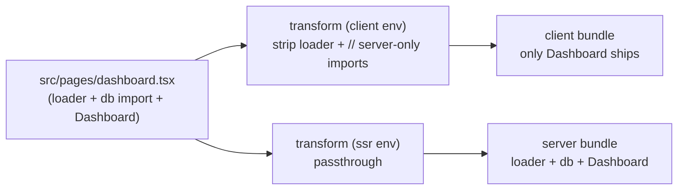

*This is the eighth installment in a series where we build a toy Next.js on top of Vite. In [Part 6](/06-production-builds#what-the-builds-produce), tree-shaking removed loader functions from the client bundle because the client virtual module never imports them. That works only as long as the loader stays self-contained. The moment a loader's *file* imports a Node-only module at the top level, that import survives into the client graph and the build either fails or ships server-only code to the browser. The fix is the `transform` hook: rewrite source code before Rolldown sees it, so the loader and its imports never enter the client graph in the first place.*

---

## The problem

Tree-shaking is an export-graph operation. It removes exports that nothing reaches, but it can't help with code that the file unconditionally pulls in at module-evaluation time:

```tsx title="src/pages/dashboard.tsx"
import { db } from "../lib/database"; // pulls in 'pg' (PostgreSQL driver)
import { defineLoader } from "eigen/helpers";

export const loader = defineLoader("/dashboard", async () => {
	const users = await db.query("SELECT * FROM users");
	return { users: users.rows };
});

export default function Dashboard({ data }) {
	return (
		<ul>
			{data.users.map((u) => (
				<li key={u.id}>{u.name}</li>
			))}
		</ul>
	);
}
```

The client virtual module from [Part 2](/02-route-discovery-plugin#plugin-hooks) only references `Dashboard`'s default export, so tree-shaking drops `loader` from the output — that part still works. But Rolldown evaluates `dashboard.tsx` to discover what it exports, and the file's first line is `import { db } from "../lib/database"`. That import pulls in `pg`, which pulls in `net`, `tls`, `fs` — Node built-ins that don't exist in the browser. The build either fails outright or, with polyfills, ships hundreds of kilobytes of broken server code to every visitor.

This is the "server-only imports leaking to client bundles" problem. Every framework that ships a loader/component split has to solve it:

- [Next.js](https://nextjs.org) compiles `getServerSideProps` in a [completely separate build pass](https://nextjs.org/docs/pages/building-your-application/data-fetching/get-server-side-props) so the server file never enters the client graph.
- [Remix](https://remix.run) [empties the server-only exports](https://remix.run/docs/en/main/file-conventions/-server) at compile time, leaving `import` statements that resolve to nothing.
- React Server Components draw the boundary at [`"use server"` / `"use client"` directives](https://react.dev/reference/rsc/use-client) and split the module graph at those markers.

Our solution is the simplest of the three: a `transform` hook that strips the `loader` export *and the imports only it depends on* from each page file, but only when Rolldown is processing that file for the client environment. The SSR build sees the file unchanged.



---

## Transform approaches

<Tabs items={["Regex", "AST"]}>
<Tab value="Regex">

### A regex-based transform

```typescript title="plugins/eigen-strip-loaders.ts"
import type { Plugin } from "vite";

/** Strip loader exports and server-only imports from client code */
export function stripLoaderForClient(code: string): string {
	// Strip the loader export.
	// This regex handles:
	//   export async function loader(...) { ... }
	//   export const loader = defineLoader(...)
	//   export const loader = (async () => { ... }) satisfies LoaderFn
	let stripped = code.replace(
		/export\s+(?:const\s+loader\s*=[\s\S]*?(?:;|\n(?=export|import|\/\/))|(?:async\s+)?function\s+loader\s*\([^)]*\)\s*(?::\s*[^{]*?)?\{[\s\S]*?\n\})/,
		"// [eigen] loader stripped for client bundle",
	);

	// Also strip defineLoader and LoaderFn imports if unused
	stripped = stripped.replace(
		/import\s*\{[^}]*defineLoader[^}]*\}\s*from\s*['"]eigen\/helpers['"]\s*;?\n?/,
		"",
	);
	stripped = stripped.replace(
		/import\s+type\s*\{[^}]*LoaderFn[^}]*\}\s*from\s*['"]eigen\/types['"]\s*;?\n?/,
		"",
	);

	// Strip server-only imports that are only used by the loader.
	// This is a simplified version — a real framework would do
	// import analysis to determine which imports are loader-only.
	// For now, strip imports marked with a comment convention:
	stripped = stripped.replace(
		/import\s+.*\/\/\s*server-only\s*\n/g,
		"// [eigen] server-only import stripped\n",
	);

	return stripped;
}

export default function eigenStripLoaders(): Plugin {
	return {
		name: "eigen-strip-loaders",

		// Vite 6+: only run this plugin in the client environment
		applyToEnvironment(environment) {
			return environment.name === "client";
		},

		transform(code: string, id: string) {
			// Only process page component files
			if (!id.includes("/pages/") || !id.endsWith(".tsx")) return;

			// Quick check: does this file export a loader?
			if (
				!/export\s+(const|async\s+function|function)\s+loader/.test(code)
			) {
				return; // No loader — don't transform
			}

			return { code: stripLoaderForClient(code), map: null };
		},
	};
}
```

#### `applyToEnvironment` — environment-scoped plugins

The [`applyToEnvironment`](https://vite.dev/guide/api-plugin#applytoenvironment) hook (introduced in [Vite 6](https://vite.dev/blog/announcing-vite6) and stable in Vite 8) is how a plugin declares which environments it should be active in. By returning `environment.name === 'client'`, we ensure this transform *only* runs when building or serving client-side code. The SSR environment keeps the loaders intact — it needs them to call from `render` and `loadData` ([Part 6](/06-production-builds#exposing-the-loader-for-production)).

Before the [Environment API](https://vite.dev/guide/api-environment), you'd check `this.environment?.name === 'ssr'` *inside* the hook and bail early, or rely on the `ssr` boolean parameter that some hooks received. The `applyToEnvironment` approach is cleaner: the plugin is simply not present in the SSR pipeline, so there's no conditional logic in `transform` and no chance of accidentally applying the strip to a server build.

</Tab>
<Tab value="AST">

### AST-based transform with the TypeScript compiler API

The TypeScript compiler API can parse TypeScript source into an AST, transform it, and print the result. This handles all syntactic forms correctly:

```typescript
import ts from "typescript";

function stripLoaderExport(code: string, id: string): string {
	const sourceFile = ts.createSourceFile(
		id,
		code,
		ts.ScriptTarget.Latest,
		true, // setParentNodes — needed for walking the tree
		ts.ScriptKind.TSX,
	);

	const printer = ts.createPrinter();

	const transformer: ts.TransformerFactory<ts.SourceFile> = (context) => {
		return (source) => {
			function visit(node: ts.Node): ts.Node | undefined {
				// Remove: export function loader(...) { ... }
				if (
					ts.isFunctionDeclaration(node) &&
					node.name?.text === "loader" &&
					node.modifiers?.some(
						(m) => m.kind === ts.SyntaxKind.ExportKeyword,
					)
				) {
					return undefined; // Removes the node entirely
				}

				// Remove: export const loader = ...
				if (
					ts.isVariableStatement(node) &&
					node.modifiers?.some(
						(m) => m.kind === ts.SyntaxKind.ExportKeyword,
					)
				) {
					const decl = node.declarationList.declarations[0];
					if (
						ts.isIdentifier(decl.name) &&
						decl.name.text === "loader"
					) {
						return undefined;
					}
				}

				// Remove: export type LoaderData = Awaited<ReturnType<typeof loader>>
				// (Type-only exports that reference the loader)
				if (
					ts.isTypeAliasDeclaration(node) &&
					node.name.text === "LoaderData" &&
					node.modifiers?.some(
						(m) => m.kind === ts.SyntaxKind.ExportKeyword,
					)
				) {
					return undefined;
				}

				return ts.visitEachChild(node, visit, context);
			}

			return ts.visitNode(source, visit) as ts.SourceFile;
		};
	};

	const result = ts.transform(sourceFile, [transformer]);
	return printer.printFile(result.transformed[0]);
}
```

<TypeDeepDive title="Concept: Abstract Syntax Trees (ASTs)">

An AST is a tree representation of source code. Instead of working with raw text (where regex can break on edge cases like strings containing `export`), you work with structured nodes: `FunctionDeclaration`, `ExportKeyword`, `Identifier`, etc. Each node knows its type, children, and position in the source. The TypeScript compiler API parses code into an AST via `ts.createSourceFile`, you walk the tree to find nodes you care about, and then `ts.createPrinter()` converts the modified tree back to source code. This is why the AST approach handles every syntactic form correctly — the parser already understands the full grammar.

</TypeDeepDive>

This correctly handles:
- Arrow function loaders: `export const loader = async () => { ... }`
- Function declaration loaders: `export async function loader() { ... }`
- Re-exported loaders: The AST walk finds exports regardless of syntax form
- `satisfies` expressions: TypeScript's parser understands these natively
- Type-only exports referencing the loader: Caught by checking the node type

<TypeDeepDive title="Concept: The visitor pattern for tree traversal">

The visitor pattern walks every node in a tree and lets you decide what to do with each one: return it unchanged, modify it, or remove it (by returning `undefined`). `ts.visitNode(source, visit)` starts the walk; your `visit` function is called for every node in the AST. Inside `visit`, you call `ts.visitEachChild(node, visit, context)` to recurse into children — if you forget this, the walk stops at that node. This is the standard pattern for code transformation tools: Babel, ESLint, TypeScript, and Rolldown/Rollup plugins all use variations of it. The key insight is that you only need to handle the node types you care about and pass everything else through unchanged.

</TypeDeepDive>

</Tab>
</Tabs>

<Callout type="warn" title="Why regex is fragile">
- **Nested braces**: `export function loader() { if (x) { return } }` — the regex might match the inner `}` instead of the outer one, truncating the function incorrectly.
- **Template literals with braces**: Code like `` `${obj}` `` inside a loader body contains braces that confuse the regex.
- **`satisfies` expressions**: `export const loader = (async () => ...) satisfies LoaderFn<'/path'>` has complex syntax that a simple regex can't reliably parse.
- **Type-only exports**: `export type LoaderData = ...` contains `export` but shouldn't be stripped.
- **Re-exports**: `export { loader } from './loaders'` uses a completely different syntax form.

For a toy framework, regex works on the canonical shapes our docs encourage. For production, you need AST parsing.
</Callout>

<Callout type="info" title="Performance trade-off">
`ts.createSourceFile` parses the entire file into an AST. This is slower than a regex check — roughly 10–50× slower per file. For a project with 50 page files, the total overhead is a few hundred milliseconds, which is fine for production builds but might feel sluggish during dev.

Production frameworks like [Remix](https://remix.run) and [TanStack Start](https://tanstack.com/start) use **[SWC](https://swc.rs)** instead of the TypeScript compiler for transforms. SWC is a Rust-based parser/transformer that's 10–100× faster than `ts.createSourceFile`. It provides the same AST fidelity with minimal latency. [`@vitejs/plugin-react`](https://github.com/vitejs/vite-plugin-react) already pulls in [Oxc](https://oxc.rs) (another Rust toolchain) for Fast Refresh, so a real Vite-based framework would lean on Oxc rather than the TypeScript compiler.

For our toy framework, the regex approach is fine during development (where the transform only runs when a file changes, not on every request), and the TypeScript API is appropriate for build-time correctness when we eventually swap it in.
</Callout>

---

## Wiring the plugin

Add the strip plugin to `vite.config.ts` after `eigenRoutes`:

```typescript title="vite.config.ts"
import { resolve } from "node:path";
import { defineConfig } from "vite";
import react from "@vitejs/plugin-react";
import inspect from "vite-plugin-inspect";
import eigenRoutes from "./plugins/eigen-routes";
import eigenStripLoaders from "./plugins/eigen-strip-loaders"; // [!code ++]

export default defineConfig({
	plugins: [react(), eigenRoutes(), eigenStripLoaders(), inspect()], // [!code ++]
	plugins: [react(), eigenRoutes(), inspect()], // [!code --]
	resolve: { /* ...aliases from previous parts */ },
	build: { manifest: true, rolldownOptions: { input: "src/entry-client.tsx" } },
});
```

Plugin order matters here, but only loosely. Both `eigenRoutes` and `eigenStripLoaders` operate on different sets of files — the first emits a virtual module (`eigen/routes`), the second transforms files under `src/pages/`. The `react()` plugin's JSX transform must run *after* our strip, otherwise the JSX-compiled output is what gets pattern-matched (and the regex won't recognize the post-transform shape). Vite's plugin pipeline runs plugins in array order for `transform`, so as long as `eigenStripLoaders` appears before `react()` is fine — but `react()` is conventionally first, and our strip is happy to run on the JSX-compiled output too because `export const loader = ...` survives JSX compilation unchanged. Inspecting the order in `/__inspect/` (from [Part 2](/02-route-discovery-plugin#what-to-observe)) is the easiest way to confirm.

A small subtlety: `applyToEnvironment` filters the *plugin*, not individual hooks. The whole plugin is absent from the SSR environment's pipeline, which is what we want — `transform` is the only hook this plugin defines, but if we later add `resolveId` or `load`, they'd also be skipped on the server side. For finer-grained control, Vite 6+ also supports a [`hookFilter` option](https://vite.dev/guide/api-vite-environment#hooks-filter) on individual hooks.

---

## What code stripping teaches about boundaries

The `transform` hook is where frameworks enforce the server/client boundary at the code level. There are several boundary models in use:

**Export stripping** (our approach, also [Remix](https://remix.run)'s) — The framework strips specific named exports (`loader`) from the client bundle. The boundary is at the export level: everything in the file is universal except the loader. Simple, but requires the developer to be careful about what *imports* the loader pulls in, since unused imports may not be detectable without analysis.

**File-level splitting** ([TanStack Start](https://tanstack.com/start)'s `.server.ts`, [Remix](https://remix.run)'s `.server.{ts,tsx}` convention) — Server-only code goes in files whose name ends with `.server.ts`. The framework either excludes these files from the client build entirely or replaces their exports with stubs. The boundary lives in the filesystem, which is easy to grep for and easy for the build tool to detect.

**Directive-based** ([React Server Components](https://react.dev/reference/rsc/server-components)' [`"use server"`](https://react.dev/reference/rsc/use-server) / [`"use client"`](https://react.dev/reference/rsc/use-client)) — The boundary is declared with a string directive at the top of the file. The compiler splits the module graph at these boundaries, generating RPC client stubs for server functions and component reference markers for server components. This is what we'll build in [Part 15 (server functions)](/15-server-functions) and [Part 21 (RSC)](/21-react-server-components).

All three approaches use the `transform` hook (or its build-time equivalent) under the hood. The difference is in *what they detect* (export names, file extensions, directives) and *what they produce* (stripped exports, empty modules, RPC stubs or reference markers).

<TypeDeepDive title="Concept: Why directives instead of file extensions?">

`"use client"` and `"use server"` look like a regression from `.server.ts` filenames — strings inside files are easier to overlook than file extensions. But directives compose better: a single component file can be sometimes-server, sometimes-client depending on which graph imports it, and the directive moves with the file when refactored. File extensions force you to split a module the moment any of its exports becomes server-only, even when the export is naturally co-located with related code. RSC's authors chose the trade-off explicitly: directives create more linting/tooling work but allow more natural code organization. The compiler enforces what the eye might miss.

</TypeDeepDive>

---

## What to observe

1. **Inspect the transform output.** With [`vite-plugin-inspect`](https://github.com/antfu-collective/vite-plugin-inspect) wired in (from [Part 2](/02-route-discovery-plugin#what-to-observe)), open `/__inspect/`, switch the environment selector to *client*, and find a page file that exports a loader (e.g., `src/pages/posts/[id].tsx`). The transform pipeline shows each plugin's output; `eigen-strip-loaders` is one of them, and you can see the loader replaced with `// [eigen] loader stripped for client bundle`. Switch the selector to *ssr* and the same file shows the loader intact — the plugin isn't in that pipeline at all.

2. **Confirm the boundary holds in production.** Re-run `npm run build` from [Part 6](/06-production-builds#what-the-builds-produce). Then `grep -l 'jsonplaceholder\|defineLoader' dist/client/assets/*.js` returns nothing — the loader is gone before Rolldown even sees it. The same grep against `dist/server/entry-server.js` finds the loader body, which is correct.

3. **Add a Node-only import.** In a page component, write `import { readFileSync } from "node:fs" // server-only` and reference it inside the loader. Without the strip transform, `npm run build:client` either fails (Rolldown can't resolve `node:fs` for the browser) or pulls in a polyfill. With the strip, the import is replaced by the comment marker and the build succeeds. Try it both ways by toggling the plugin in `vite.config.ts`.

4. **Watch the "no loader" fast-path.** Open `/__inspect/` and look at the transform output for `src/pages/About.tsx` — a page with no loader. The plugin's quick regex check returns early, so the `transform` hook returns `undefined` and the original code passes through unchanged. The inspect tab shows `eigen-strip-loaders` simply absent from the pipeline for that file.

5. **Watch a regex edge case break.** Add `export const message = "// export const loader = 'oops'";` to a page. The current regex doesn't see this is a string, but TypeScript would. This is the failure mode the AST-based variant in the *AST* tab eliminates.

---

## Key insight

The `transform` hook is essentially a compiler pass — you receive source code and return modified source code. For framework development, it's the mechanism that enforces *what code runs where*. Tree-shaking handles the easy half (an export the graph never reaches gets dropped); the `transform` hook handles the hard half (an import that runs on module evaluation, regardless of which exports get used).

The choice between regex and AST is the same trade-off compiler authors have made for decades: text patterns are fast and brittle; AST walks are slower and correct. Frameworks usually start with the former and migrate to the latter the first time a user files a bug about a syntactic form the regex didn't anticipate. The TypeScript compiler API is the most accessible AST option in a Node-only context; SWC and Oxc are the production-grade alternatives once latency matters.

This part finishes the server/client boundary story for the *loader pattern*. The same hook, with different detection logic, will reappear in [Part 15](/15-server-functions) (turning `"use server"` exports into RPC stubs) and [Part 21](/21-react-server-components) (turning `"use client"` exports into reference markers that the RSC environment can serialize). The pattern doesn't change; the input and output do.

---

<TestSection title="Testing: transform output">

Transform hooks are code-in, code-out — making them straightforward to test. The key technique is **snapshot testing**: capture the transform's output and compare it against a known-good baseline. Since we extracted `stripLoaderForClient` as an exported function above, tests import it directly:

```typescript title="plugins/__tests__/eigen-strip-loaders.test.ts"
import { describe, expect, it } from "vitest";
import { stripLoaderForClient } from "../eigen-strip-loaders";

describe("stripLoaderForClient", () => {
	it("strips a const loader export and its server-only imports", () => {
		const input = `
import { db } from '../lib/database' // server-only
import type { PageProps } from 'eigen/types'
import { defineLoader } from 'eigen/helpers'

export const loader = defineLoader('/posts/:id', async ({ params }) => {
  return db.query('SELECT * FROM posts WHERE id = $1', [params.id])
});

export default function PostPage({ data }: PageProps<'/posts/:id', { title: string }>) {
  return <h1>{data.title}</h1>
}
`;
		const output = stripLoaderForClient(input);

		// The loader is gone
		expect(output).not.toContain("defineLoader");
		expect(output).not.toContain("db.query");

		// The component survives
		expect(output).toContain("export default function PostPage");

		// Server-only import is replaced with a marker comment
		expect(output).toContain("[eigen] server-only import stripped");
		expect(output).not.toContain("from '../lib/database'");
	});

	it("leaves files without loaders untouched (early return path)", () => {
		const input = `export default function About() { return <h1>About</h1> }`;
		// The plugin's quick check matches what stripLoaderForClient assumes:
		// no loader export means no transform.
		expect(input).not.toMatch(
			/export\s+(const|async\s+function|function)\s+loader/,
		);
	});

	it("preserves non-loader exports", () => {
		const input = `
export const metadata = { title: 'Post' }

export const loader = async () => {
  return { posts: [] }
};

export default function Page() { return null }
`;
		const output = stripLoaderForClient(input);
		expect(output).toContain("export const metadata");
		expect(output).not.toContain("export const loader");
	});
});
```

Snapshot tests are especially valuable for transforms — if a regex change accidentally corrupts the output, the snapshot diff shows exactly what broke. Run `npx vitest run --update` to regenerate snapshots after intentional changes.

The interesting test to add later is the failing one: feed the regex a syntactic form it doesn't handle (e.g., a loader spread across multiple lines with embedded template literals) and watch it produce nonsense. That's the test that justifies migrating to the AST variant.

</TestSection>

## Further reading

- [Vite Plugin API: `transform`](https://vite.dev/guide/api-plugin#transform) — Reference for the hook itself, including return-value shape (`{ code, map }`), source-map handling, and ordering.
- [Vite Plugin API: `applyToEnvironment`](https://vite.dev/guide/api-plugin#applytoenvironment) — How to scope a plugin to specific environments (client, ssr, edge).
- [Vite Environment API](https://vite.dev/guide/api-environment) — The full picture for environment-aware plugins, including `this.environment` inside hooks and per-hook `hookFilter` options.
- [SWC](https://swc.rs) — The Rust-based compiler used by [Next.js](https://nextjs.org) and others for fast AST-based transforms; the production alternative to `ts.createSourceFile`.
- [Oxc](https://oxc.rs) — Another Rust-based JavaScript toolchain (parser, transformer, resolver) used by [`@vitejs/plugin-react`](https://github.com/vitejs/vite-plugin-react) for Fast Refresh.
- [`vite-plugin-inspect`](https://github.com/antfu-collective/vite-plugin-inspect) — Dev tool for visualizing the transform pipeline output per environment, indispensable when debugging a custom transform.
- [React `"use client"` and `"use server"` directives](https://react.dev/reference/rsc/use-client) — Background on the directive-based boundary model we'll implement in [Part 15](/15-server-functions) and [Part 21](/21-react-server-components).

## What's next

In [Part 8](/08-dev-middleware), we use [`configureServer`](https://vite.dev/guide/api-plugin#configureserver) to take broader control of the dev HTTP layer — adding API routes alongside the `/_eigen/data` endpoint from [Part 5](/05-typed-loaders#the-data-endpoint), and confronting the same dev-vs-production split we hit in [Part 6](/06-production-builds#the-production-server): plugin middleware exists only in dev, so the production server has to re-mount everything itself.
