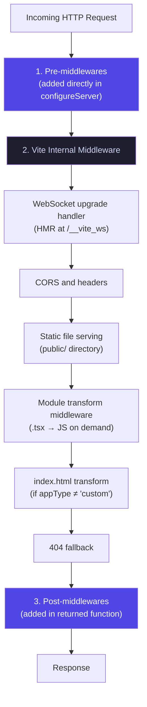

*This is the ninth installment in a series where we build a toy Next.js on top of Vite. In [Part 7](/07-transform-hook), we used the `transform` hook to strip server-only code. Now we'll use `configureServer` to give the framework control over the HTTP layer — adding API routes and dev middleware.*

---

## What [`configureServer`](https://vite.dev/guide/api-plugin#configureserver) does

`configureServer` gives your plugin access to the Vite dev server instance. Through it, you can add custom HTTP middleware — handlers that run for incoming requests before or after Vite's built-in middleware.

A framework uses this hook for everything that isn't a static file or a client module: SSR, API routes, redirects, authentication checks, data fetching endpoints, health checks, and WebSocket handlers.

---

## Middleware ordering

The ordering of middleware matters. `configureServer` supports two patterns:

```typescript
configureServer(server) {
	// Pattern 1: Direct addition — runs BEFORE Vite's middleware
	server.middlewares.use((req, res, next) => {
		// This runs before Vite handles static files, HMR, etc.
	});

	// Pattern 2: Return a function — runs AFTER Vite's middleware
	return () => {
		server.middlewares.use((req, res, next) => {
			// This runs after Vite handles static files, HMR, etc.
		});
	};
}
```

The execution order is:



Understanding this stack explains *why* framework middleware goes in the returned function (post-middleware). You want Vite to handle `.tsx` file requests, static assets, and HMR before your SSR/API handler runs. If your SSR handler ran first, it would try to SSR-render a request for `/src/main.tsx` instead of letting Vite serve the transformed module.

For SSR and API routes, you almost always want **post-middleware**. You want Vite to handle static assets (`/assets/style.css`), HMR (`/@vite/client`), and module requests (`/src/main.tsx`) first. Only requests that Vite doesn't handle should fall through to your framework middleware.

If you use pre-middleware, you'd need to manually check every URL and `next()` past all the ones Vite should handle. Post-middleware avoids this — if Vite handled the request, your middleware never runs.

---

## Adding typed API routes

### The types

```typescript title="packages/eigen/api-types.ts"
/** Context passed to an API route handler */
export interface ApiContext {
	params: Record<string, string>;
	query: Record<string, string>;
}

/** An API route handler — generic over the response type */
export type ApiHandler<TResponse = unknown> = (
	ctx: ApiContext,
	req: import("http").IncomingMessage,
	res: import("http").ServerResponse,
) => Promise<TResponse> | TResponse;
```

The `ApiHandler` type is generic over the response type. This doesn't enforce the response type at runtime (the handler could return anything), but it gives the developer autocomplete and type checking when writing the handler. The `req` and `res` parameters are the raw Node HTTP objects — a production framework would typically wrap these in a more ergonomic API.

### The plugin

```typescript title="plugins/eigen-api.ts"
import type { Plugin, ViteDevServer } from "vite";

export default function eigenApi(): Plugin {
	let viteServer: ViteDevServer;

	return {
		name: "eigen-api",

		configureServer(server) {
			viteServer = server;

			// Post-middleware: runs after Vite handles static files and modules
			return () => {
				server.middlewares.use(async (req, res, next) => {
					// Only handle /api/ routes
					if (!req.url?.startsWith("/api/")) return next();

					try {
						// Map URL to file: /api/hello → /src/api/hello.ts
						const urlPath = req.url.split("?")[0];
						const apiPath = `/src/api${urlPath.replace("/api", "")}.ts`;

						// Load the API handler through Vite's SSR pipeline
						// This means TypeScript, ESM, path aliases all work
						const mod = (await viteServer.ssrLoadModule(apiPath)) as {
							default?: (...args: unknown[]) => unknown;
						};

						if (typeof mod.default !== "function") {
							res.writeHead(404);
							res.end(JSON.stringify({ error: "Not found" }));
							return;
						}

						// Parse query params
						const url = new URL(req.url, "http://localhost");
						const ctx = {
							params: {},
							query: Object.fromEntries(url.searchParams),
						};

						// Call the handler
						const result = await mod.default(ctx, req, res);

						// If the handler didn't end the response, send the result as JSON
						if (!res.writableEnded) {
							res.setHeader("Content-Type", "application/json");
							res.end(JSON.stringify(result));
						}
					} catch (e) {
						if (e instanceof Error) {
							viteServer.ssrFixStacktrace(e);
							console.error(e.stack);
						}
						res.writeHead(500);
						res.end(JSON.stringify({ error: "Internal server error" }));
					}
				});
			};
		},
	};
}
```

### Writing an API route

```typescript title="src/api/hello.ts"
import type { ApiHandler } from "eigen/api-types";

interface HelloResponse {
	message: string;
	timestamp: number;
}

const handler: ApiHandler<HelloResponse> = async (ctx) => {
	return {
		message: `Hello! Query: ${JSON.stringify(ctx.query)}`,
		timestamp: Date.now(),
	};
};

export default handler;
```

The `ApiHandler<HelloResponse>` annotation tells TypeScript that this handler returns a `HelloResponse`. If you try to return `{ messages: "typo" }`, TypeScript catches the error. The type doesn't enforce anything at runtime — the framework's middleware accepts any return value and serializes it to JSON — but it gives the developer safety when writing the handler.

### How `ssrLoadModule` enables API routes

Notice that the API middleware uses `viteServer.ssrLoadModule(apiPath)` to load the handler. This is the same API we used for SSR. It means:

- The handler file can use TypeScript — Vite transforms it on the fly
- It can use ESM imports — including importing from `node_modules`
- It can use path aliases defined in `tsconfig.json`
- It benefits from HMR — edit the handler file and the next request uses the new code without restarting the server

This is a significant DX advantage over running API routes in a separate process. The entire application — pages, loaders, API routes — runs through a single Vite instance with shared configuration and consistent module resolution.

---

## The dev/prod gap

<Callout type="warn" title="The dev/prod gap">
`configureServer` only exists during development. In production, there is no Vite dev server. The production server is a plain H3/Hono/Fastify app that you write separately (or that a deployment adapter generates).
</Callout>

This means the API routing logic in `configureServer` has to be reimplemented for production. For our toy framework, the production server would need its own API route handler (shown here as pseudocode — the actual production server uses H3 as in [Part 6](/06-production-builds)):

```typescript title="server.prod.ts"
// Simplified for brevity — a production server would also need
// 404 handling for unknown routes, query parameter parsing for
// dynamic segments, error logging, and graceful shutdown.
import { readdirSync } from "fs";

// Pre-load all API route handlers at startup
const apiHandlers = new Map<string, Function>();
const apiFiles = readdirSync("dist/server/api", { recursive: true });
for (const file of apiFiles) {
	if (typeof file !== "string" || !file.endsWith(".js")) continue;
	const route = `/api/${file.replace(/\.js$/, "")}`;
	const mod = await import(`./dist/server/api/${file}`);
	apiHandlers.set(route, mod.default);
}

app.all("/api/*", async (req, res) => {
	const handler = apiHandlers.get(req.path);
	if (!handler) return res.status(404).json({ error: "Not found" });
	const result = await handler({ params: {}, query: req.query }, req, res);
	if (!res.writableEnded) res.json(result);
});
```

This gap between dev and prod middleware is why frameworks need **deployment adapters**. [TanStack Start](https://tanstack.com/start) uses [Nitro](https://nitro.build) (via the `@netlify/vite-plugin-tanstack-start` or equivalent Vercel/Cloudflare plugins) to generate platform-specific server code. [Remix](https://remix.run) has its adapter system. [Next.js](https://nextjs.org) bakes the production server into its own runtime.

For our Eigen framework, the dev server middleware is educational — it shows how `configureServer` works. The production equivalent is a separate concern.

---

## [`ssrLoadModule`](https://vite.dev/guide/api-javascript#vitedevserver-ssrloadmodule) at the boundary

The type assertion pattern appears again:

```typescript
const mod = (await viteServer.ssrLoadModule(apiPath)) as {
	default?: (...args: unknown[]) => unknown;
};
```

`ssrLoadModule` returns `Record<string, any>`. The framework can't statically know the shape of an arbitrary API route module. It uses a convention (default export is a function) and asserts the type.

The `ApiHandler<T>` type gives the *developer* safety when writing the route handler. The framework runtime trusts the convention. These are two different type systems operating at two different levels:

1. **Developer-facing types** (`ApiHandler<T>`) — enforced by the TypeScript compiler when the developer writes code
2. **Framework-internal types** (the `as` assertion on `ssrLoadModule`) — trusted at runtime, verified by convention

This is a recurring pattern in framework development. The plugin generates type declarations that the developer's IDE enforces. The runtime assumes those types are correct. The bridge between them is the convention (default export, named export, file location) that both sides agree on.

---

## What to observe

1. **Start the dev server** and visit `http://localhost:3000/api/hello?name=world`. You should get a JSON response.

2. **Edit the API handler** while the server is running. Make a change, save, and hit the endpoint again. The response reflects your changes immediately — `ssrLoadModule` always loads the latest version.

3. **Add a breakpoint** (or `console.log`) in the handler. It executes in the same Node process as the Vite dev server, so standard debugging tools work.

4. **Try returning a type that doesn't match** `ApiHandler<HelloResponse>`. TypeScript catches the error in your editor, even though the runtime would happily serialize whatever you return.

---

## Key insight

`configureServer` is how a framework takes control of the HTTP layer during development. It's middleware all the way down — your plugin adds middleware to Vite's connect stack, and Vite's own module serving is also middleware. The ordering matters, and the post-middleware pattern (return a function) is the safe default for framework authors.

The dev/prod gap is the biggest architectural challenge. Everything in `configureServer` is dev-only. Production needs its own routing, its own static file serving, its own error handling. Deployment adapters exist to bridge this gap, translating the framework's dev-time behavior into platform-specific production code.

---

## Further reading

- [Vite Plugin API: `configureServer`](https://vite.dev/guide/api-plugin#configureserver) — The official reference for adding dev server middleware, including pre- and post-middleware patterns.
- [Vite `ssrLoadModule`](https://vite.dev/guide/api-javascript#vitedevserver-ssrloadmodule) — How Vite loads and transforms modules for server-side execution.
- [Connect Middleware](https://github.com/senchalabs/connect) — The middleware framework that Vite's dev server is built on.
- [Nitro Documentation](https://nitro.build/guide) — The production server toolkit that bridges the dev/prod middleware gap for frameworks like TanStack Start and Nuxt.
- [H3 Documentation](https://h3.dev/guide) — H3's web-standard HTTP framework, used in our production server.

---

## What's next

In Part 9, we'll explore HMR — the module graph, hot update propagation, `handleHotUpdate`, and how type declaration regeneration creates a feedback loop between the dev server and the IDE.
