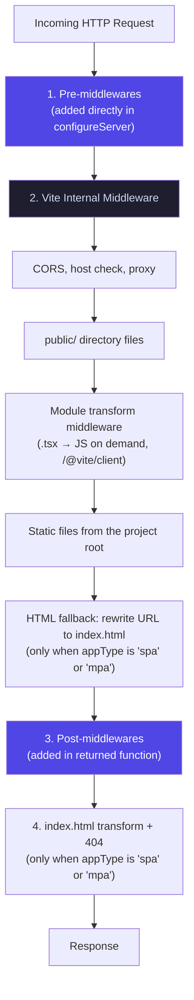

_This is the ninth installment in a series where we build a toy Next.js on top of Vite. In [Part 7](/07-transform-hook), we used the `transform` hook to strip server-only code. Now we'll use `configureServer` to give the framework control over the HTTP layer — adding API routes and dev middleware._

---

## What [`configureServer`](https://vite.dev/guide/api-plugin#configureserver) does

`configureServer` gives your plugin access to the Vite dev server instance. Through it, you can add custom HTTP middleware — handlers that run for incoming requests before or after Vite's built-in middleware.

A framework uses this hook for everything that isn't a static file or a client module: SSR, API routes, redirects, authentication checks, data fetching endpoints, and health checks. (WebSocket servers are the exception: they attach to the HTTP server's `upgrade` event rather than the middleware stack; see [Part 28](/28-realtime-websockets).)

---

## Middleware ordering

The ordering of middleware matters. `configureServer` supports two patterns:

```typescript
configureServer(server) {
	// Pattern 1: Direct addition — runs BEFORE Vite's middleware
	server.middlewares.use((req, res, next) => {
		// This runs before Vite handles static files, modules, etc.
	});

	// Pattern 2: Return a function — runs AFTER Vite's internal middleware
	return () => {
		server.middlewares.use((req, res, next) => {
			// This runs after Vite handles static files and modules,
			// but before its index.html fallback
		});
	};
}
```

The execution order is:


```mermaid
flowchart TD
    A["Incoming HTTP Request"] --> B["1. Pre-middlewares<br/>(added directly in configureServer)"]
    B --> C["2. Vite Internal Middleware"]
    C --> C1["CORS, host check, proxy"]
    C1 --> C2["public/ directory files"]
    C2 --> C3["Module transform middleware<br/>(.tsx → JS on demand, /@vite/client)"]
    C3 --> C4["Static files from the project root"]
    C4 --> C5["HTML fallback: rewrite URL to index.html<br/>(only when appType is 'spa' or 'mpa')"]
    C5 --> D["3. Post-middlewares<br/>(added in returned function)"]
    D --> E["4. index.html transform + 404<br/>(only when appType is 'spa' or 'mpa')"]
    E --> F["Response"]

    style B fill:#4f46e5,color:#fff
    style D fill:#4f46e5,color:#fff
    style C fill:#1e1e2e,color:#cdd6f4
```

Two details in that picture are easy to get wrong:

- **Post-middlewares run _before_ Vite serves `index.html`.** Vite installs its `index.html` transform and 404 handler _after_ calling the returned function, so a framework's post-middleware can answer page requests with its own HTML. (In `spa`/`mpa` mode, the HTML fallback has already rewritten `req.url` to `/index.html` for navigation requests by then.) In our custom server ([Part 3](/03-server-side-rendering#the-custom-dev-server)) `appType` is `'custom'`, so those last two middlewares aren't installed at all. Anything Vite doesn't handle falls out of `vite.middlewares` and into H3's SSR route.
- **HMR isn't a middleware.** Vite's HMR WebSocket attaches to the HTTP server's `upgrade` event, at the server's `base` path (plus `server.hmr.path` if you set one), using the `vite-hmr` subprotocol. It never passes through the Connect stack.

Understanding this stack explains _why_ framework middleware goes in the returned function (post-middleware). You want Vite to handle `.tsx` file requests, static assets, and `/@vite/client` before your SSR/API handler runs. If your SSR handler ran first, it would try to SSR-render a request for `/src/main.tsx` instead of letting Vite serve the transformed module.

For SSR and API routes, you almost always want **post-middleware**. You want Vite to handle static assets (`/assets/style.css`), the HMR client (`/@vite/client`), and module requests (`/src/main.tsx`) first. Only requests that Vite doesn't handle should fall through to your framework middleware.

If you use pre-middleware, you'd need to manually check every URL and `next()` past all the ones Vite should handle. Post-middleware avoids this — if Vite handled the request, your middleware never runs.

---

## Adding typed API routes

### The types

```typescript title="packages/eigen/api-types.ts"
/** Context passed to an API route handler */
export interface ApiContext {
  params: Record<string, string>;
  query: Record<string, string>;
}

/** An API route handler — generic over the response type */
export type ApiHandler<TResponse = unknown> = (ctx: ApiContext) => Promise<TResponse> | TResponse;
```

The `ApiHandler` type is generic over the response type. This doesn't enforce the response type at runtime (the handler could return anything), but it gives the developer autocomplete and type checking when writing the handler. Notice what the handler does _not_ receive: Node's `req`/`res`. A handler that only sees a plain context object and returns a value can run anywhere, whether that's behind Vite's Node middleware in dev, an H3 route in production, or a Worker at the edge ([Part 19](/19-edge-runtimes)). The framework owns the HTTP details; the handler owns the data. (Handlers that need the raw `Request`, for headers or a body, arrive with the framework context in [Part 14](/14-framework-middleware).)

Register the new module the same way as the others:

```json title="tsconfig.json"
{
  "compilerOptions": {
    "paths": {
      "eigen/types": ["./packages/eigen/types.ts"],
      "eigen/match-route": ["./packages/eigen/match-route.ts"],
      "eigen/helpers": ["./packages/eigen/helpers.ts"],
      "eigen/run-loader": ["./packages/eigen/run-loader.ts"],
      "eigen/api-types": ["./packages/eigen/api-types.ts"] // [!code ++]
    }
  }
}
```

```typescript title="vite.config.ts"
resolve: {
  alias: {
    // ...entries from previous parts
    'eigen/api-types': resolve(__dirname, 'packages/eigen/api-types.ts'), // [!code ++]
  },
},
```

### The plugin

```typescript title="plugins/eigen-api.ts"
import { existsSync } from "node:fs";
import { join } from "node:path";
import { isRunnableDevEnvironment, type Plugin, type ViteDevServer } from "vite";

export default function eigenApi(): Plugin {
  let viteServer: ViteDevServer;

  return {
    name: "eigen-api",

    configureServer(server) {
      viteServer = server;

      // Post-middleware: runs after Vite handles static files and modules
      return () => {
        server.middlewares.use(async (req, res, next) => {
          // Only handle /api/ routes
          if (!req.url?.startsWith("/api/")) return next();

          const sendJson = (status: number, body: unknown) => {
            res.writeHead(status, { "Content-Type": "application/json" });
            res.end(JSON.stringify(body));
          };

          try {
            // Map URL to file: /api/hello → /src/api/hello.ts
            const urlPath = req.url.split("?")[0];
            const apiPath = `/src/api${urlPath.replace("/api", "")}.ts`;

            // Unknown route → 404. Check before importing: the module
            // runner throws "Failed to load url" for a missing file,
            // which would otherwise surface as a 500.
            if (urlPath.includes("..") || !existsSync(join(viteServer.config.root, apiPath))) {
              return sendJson(404, { error: "Not found" });
            }

            // Load the API handler through the SSR environment's module runner.
            // This means TypeScript, ESM, and resolve.alias all work.
            const ssrEnv = viteServer.environments.ssr;
            if (!isRunnableDevEnvironment(ssrEnv)) {
              throw new Error("SSR environment is not runnable");
            }
            const mod = (await ssrEnv.runner.import(apiPath)) as {
              default?: (ctx: unknown) => unknown;
            };

            if (typeof mod.default !== "function") {
              return sendJson(404, { error: "Not found" });
            }

            // Parse query params
            const url = new URL(req.url, "http://localhost");
            const ctx = {
              params: {},
              query: Object.fromEntries(url.searchParams),
            };

            // Call the handler and send its result as JSON
            sendJson(200, await mod.default(ctx));
          } catch (e) {
            // The runner has already source-mapped the stack trace
            console.error(e);
            sendJson(500, { error: "Internal server error" });
          }
        });
      };
    },
  };
}
```

Add the plugin to `vite.config.ts`:

```typescript title="vite.config.ts"
import eigenApi from "./plugins/eigen-api"; // [!code ++]

export default defineConfig({
  plugins: [react(), eigenRoutes(), eigenStripLoaders(), inspect()], // [!code --]
  plugins: [react(), eigenRoutes(), eigenStripLoaders(), eigenApi(), inspect()], // [!code ++]
  // ...resolve and build unchanged
});
```

### Writing an API route

```typescript title="src/api/hello.ts"
import type { ApiHandler } from "eigen/api-types";

interface HelloResponse {
  message: string;
  timestamp: number;
}

const handler: ApiHandler<HelloResponse> = async (ctx) => {
  return {
    message: `Hello! Query: ${JSON.stringify(ctx.query)}`,
    timestamp: Date.now(),
  };
};

export default handler;
```

The `ApiHandler<HelloResponse>` annotation tells TypeScript that this handler returns a `HelloResponse`. If you try to return `{ messages: "typo" }`, TypeScript catches the error. The type doesn't enforce anything at runtime — the framework's middleware accepts any return value and serializes it to JSON — but it gives the developer safety when writing the handler.

### How the module runner enables API routes

Notice that the API middleware uses `server.environments.ssr.runner.import(apiPath)` to load the handler. This is the same API the dev server uses to load `entry-server.tsx` ([Part 3](/03-server-side-rendering#the-custom-dev-server)) and the `/_eigen/data` endpoint uses to load routes ([Part 5](/05-typed-loaders#the-data-endpoint)). It means:

- The handler file can use TypeScript — Vite transforms it on the fly
- It can use ESM imports — including importing from `node_modules`
- It can use the `eigen/*` aliases from `resolve.alias` (tsconfig `paths` alone don't affect Vite's resolution unless you enable `resolve.tsconfigPaths`)
- It picks up edits without a restart — when you save the handler, Vite invalidates it in the SSR module graph, and the next `runner.import()` re-executes the new code

This is a significant DX advantage over running API routes in a separate process. The entire application — pages, loaders, API routes — runs through a single Vite instance with shared configuration and consistent module resolution.

---

## The dev/prod gap

<Callout type="warn" title="The dev/prod gap">
  `configureServer` only exists during development. In production, there is no Vite dev server. The production server is
  a plain H3/Hono/Fastify app that you write separately (or that a deployment adapter generates).
</Callout>

This means the API routing logic in `configureServer` has to be reimplemented for production, in two places. First, the handlers have to _exist_ in the build. The Part 6 server build only contains what `entry-server.tsx` imports, and nothing imports `src/api/*.ts`. Vite's [`import.meta.glob`](https://vite.dev/guide/features#glob-import) fixes that at build time:

```tsx title="src/entry-server.tsx"
import type { ApiHandler } from "eigen/api-types"; // [!code ++]

// ...render and loadData from Part 6 unchanged...

// Bundle every API route into the server build. With `eager: true`, Vite // [!code ++]
// rewrites this into static imports, so the handlers land in entry-server.js. // [!code ++]
const apiModules = import.meta.glob<{ default: ApiHandler }>("/src/api/**/*.ts", {
  // [!code ++]
  eager: true, // [!code ++]
}); // [!code ++]
// [!code ++]
export function getApiHandler(pathname: string): ApiHandler | undefined {
  // [!code ++]
  // /api/hello → /src/api/hello.ts, the same mapping as the dev plugin // [!code ++]
  return apiModules[`/src/api${pathname.replace(/^\/api/, "")}.ts`]?.default; // [!code ++]
} // [!code ++]
```

Second, the production server needs a route for them. In `server.prod.ts` from [Part 6](/06-production-builds#the-production-server), register it before the SSR fallback:

```typescript title="server.prod.ts"
const { render, loadData, getApiHandler } = (await import("./dist/server/entry-server.js")) as { // [!code ++]
const { render, loadData } = (await import("./dist/server/entry-server.js")) as { // [!code --]
	render: (pathname: string) => Promise<RenderResult>;
	loadData: (pathname: string) => Promise<unknown>;
	getApiHandler: (pathname: string) => ApiHandler | undefined; // [!code ++]
};

// ...static assets and /_eigen/data from Part 6...

app.all("/api/**", async (event) => { // [!code ++]
	const handler = getApiHandler(event.url.pathname); // [!code ++]
	if (!handler) return Response.json({ error: "Not found" }, { status: 404 }); // [!code ++]
	try { // [!code ++]
		const query = Object.fromEntries(event.url.searchParams); // [!code ++]
		return Response.json(await handler({ params: {}, query })); // [!code ++]
	} catch (e) { // [!code ++]
		console.error(e); // [!code ++]
		return Response.json({ error: "Internal server error" }, { status: 500 }); // [!code ++]
	} // [!code ++]
}); // [!code ++]

// SSR fallback (unchanged)
app.all("/**", async (event) => { /* ... */ });
```

(Add `import type { ApiHandler } from "./packages/eigen/api-types";` at the top of `server.prod.ts`.) The route is the dev middleware's logic re-expressed against a different runtime. The handler lookup becomes a map from the glob instead of a file check and a module-runner import, and the Node `res.writeHead`/`res.end` calls become `Response.json`. H3 tries the more specific `/api/**` route before the `/**` fallback, so API requests never reach the SSR renderer.

This gap between dev and prod middleware is why frameworks need **deployment adapters**. [TanStack Start](https://tanstack.com/start) builds for Netlify and Cloudflare with platform-specific Vite plugins (`@netlify/vite-plugin-tanstack-start`, `@cloudflare/vite-plugin`) and uses [Nitro](https://nitro.build)'s `nitro/vite` plugin for other targets such as Node and Vercel. [Remix](https://remix.run)/React Router has its adapter system. [Next.js](https://nextjs.org) bakes the production server into its own runtime. We'll build Eigen's adapters in [Part 17](/17-deployment-adapters).

For our Eigen framework, the dev server middleware is educational — it shows how `configureServer` works. The production equivalent is a separate concern.

---

## The module runner at the boundary

The type assertion pattern appears again:

```typescript
const mod = (await ssrEnv.runner.import(apiPath)) as {
  default?: (ctx: unknown) => unknown;
};
```

`runner.import()` is typed `import<T = any>(url: string): Promise<T>`, so without the assertion `mod` is `any`. The framework can't statically know the shape of an arbitrary API route module. It uses a convention (default export is a function) and asserts the type. The production path has the same gap in a different spot: `import.meta.glob<{ default: ApiHandler }>` _declares_ the module shape rather than checking it.

The `ApiHandler<T>` type gives the _developer_ safety when writing the route handler. The framework runtime trusts the convention. These are two different type systems operating at two different levels:

1. **Developer-facing types** (`ApiHandler<T>`) — enforced by the TypeScript compiler when the developer writes code
2. **Framework-internal types** (the `as` assertion on `runner.import()`) — trusted at runtime, verified by convention

This is a recurring pattern in framework development. The plugin generates type declarations that the developer's IDE enforces. The runtime assumes those types are correct. The bridge between them is the convention (default export, named export, file location) that both sides agree on.

---

## What to observe

1. **Start the dev server** (`npx tsx server.ts`) and visit `http://localhost:3000/api/hello?name=world`. You should get a JSON response.

2. **Visit a route that doesn't exist**, like `/api/nope`. You get a JSON 404, not a 500. The existence check runs before the module runner ever tries to load `/src/api/nope.ts`.

3. **Edit the API handler** while the server is running. Make a change, save, and hit the endpoint again. The response reflects your changes immediately — Vite invalidated the module, so `runner.import()` re-executes it.

4. **Add a breakpoint** (or `console.log`) in the handler. It executes in the same Node process as the Vite dev server, so standard debugging tools work. Throw an error from the handler and the logged stack trace points at your `.ts` source lines.

5. **Try returning a type that doesn't match** `ApiHandler<HelloResponse>`. TypeScript catches the error in your editor, even though the runtime would happily serialize whatever you return.

6. **Check production.** Run `npm run build` and `npx tsx server.prod.ts`, then hit `/api/hello?name=world` again. Same JSON, now served by the H3 route from the glob-bundled handler.

---

## Key insight

`configureServer` is how a framework takes control of the HTTP layer during development. It's middleware all the way down — your plugin adds middleware to Vite's connect stack, and Vite's own module serving is also middleware. The ordering matters, and the post-middleware pattern (return a function) is the safe default for framework authors.

The dev/prod gap is the biggest architectural challenge. Everything in `configureServer` is dev-only. Production needs its own routing, its own static file serving, its own error handling. Keeping handlers free of Node's `req`/`res` is what makes that duplication cheap: the same handler runs behind both. Deployment adapters exist to bridge the rest of the gap, translating the framework's dev-time behavior into platform-specific production code.

---

## Further reading

- [Vite Plugin API: `configureServer`](https://vite.dev/guide/api-plugin#configureserver) — The official reference for adding dev server middleware, including pre- and post-middleware patterns.
- [Vite Environment API for Frameworks](https://vite.dev/guide/api-environment-frameworks) — `RunnableDevEnvironment` and `runner.import()`, the module-runner API used to load API routes.
- [Vite Glob Import](https://vite.dev/guide/features#glob-import) — `import.meta.glob`, used to bundle every API route into the production server build.
- [Connect Middleware](https://github.com/senchalabs/connect) — The middleware framework that Vite's dev server is built on.
- [Nitro Documentation](https://nitro.build) — The server toolkit that bridges the dev/prod gap for frameworks like Nuxt, and for TanStack Start on hosts without a dedicated plugin.
- [H3 Documentation](https://h3.dev/guide) — H3's web-standard HTTP framework, used in our production server.

---

## What's next

In [Part 9](/09-hmr), we'll explore HMR — the module graph, hot update propagation, the `hotUpdate` hook, and how type declaration regeneration creates a feedback loop between the dev server and the IDE.
