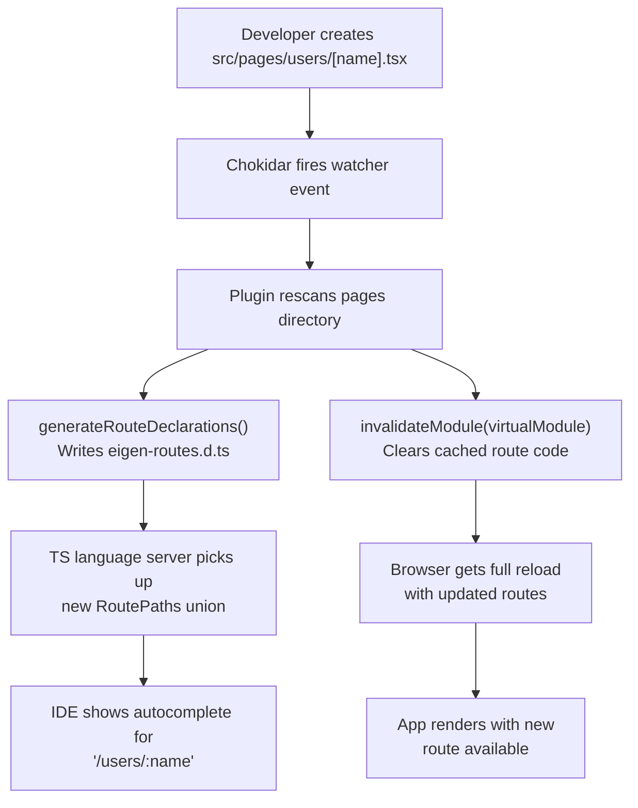

*This is the tenth installment in a series where we build a toy Next.js on top of Vite. In [Part 8](/08-dev-middleware), we added API routes with `configureServer`. Now we'll understand the HMR system that makes Vite development feel instant, and how framework plugins integrate with it.*

---

## How Vite HMR works

When you save a file, the update reaches the browser in milliseconds. Here's the full pipeline:

<Steps>
<Step>
### File change detection

Vite uses chokidar (a file system watcher) to monitor source files. When a file is saved, chokidar fires an event.
</Step>
<Step>
### Module graph lookup

Vite finds the changed file in its module graph — an in-memory data structure that tracks every module and its import relationships. The module graph knows that `App.tsx` imports `Header.tsx`, which imports `Logo.tsx`, and so on.
</Step>
<Step>
### HMR boundary search

Vite walks *up* the dependency tree (from the changed module toward the root) looking for an **HMR boundary** — a module that has registered an `import.meta.hot.accept()` handler. This handler says "I know how to update myself when my dependencies change."

`@vitejs/plugin-react` injects HMR boundary code into every React component via its `transform` hook (using Oxc for the Fast Refresh transform). This is why React components hot-reload by default — each component is a boundary.
</Step>
<Step>
### WebSocket update

Vite sends an update message via WebSocket to the `@vite/client` script running in the browser. The message identifies which modules need to be re-imported.
</Step>
<Step>
### Module re-import

The browser re-imports the changed modules (making new HTTP requests to Vite, which transforms the updated source) and calls the accept handlers. React's Fast Refresh mechanism re-renders the affected components without losing state.
</Step>
</Steps>

**If no HMR boundary is found** — for example, if you change a non-component utility module that's imported all the way up to the root — Vite does a **full page reload**. This is the safe fallback.

---

## The module graph

Vite's module graph is the central data structure of the dev server. You can inspect it programmatically:

```typescript
configureServer(server) {
  server.httpServer?.on('listening', () => {
    // Wait a moment for the initial module graph to populate
    setTimeout(() => {
      const graph = server.moduleGraph

      // The graph maps module IDs to ModuleNode objects
      for (const [id, mod] of graph.idToModuleMap) {
        const importedBy = [...(mod.importers || [])]
          .map(m => m.id)
          .filter(Boolean)

        if (importedBy.length > 0) {
          console.log(`${id}`)
          console.log(`  ← imported by: ${importedBy.join(', ')}`)
        }
      }
    }, 3000)
  })
}
```

Each `ModuleNode` tracks:
- **`id`** — The resolved module ID (absolute file path or virtual module ID)
- **`importers`** — Set of modules that import this one (edges pointing up the tree)
- **`importedModules`** — Set of modules this one imports (edges pointing down)
- **`transformResult`** — The cached transform output (so repeated requests don't re-transform)
- **`lastHMRTimestamp`** — When this module last received an HMR update

The graph is populated lazily during development. A module only appears in the graph after the browser has requested it. This is consistent with Vite's on-demand architecture — the graph reflects what has actually been loaded, not what exists on disk.

---

## `handleHotUpdate` — Custom HMR behavior

The `handleHotUpdate` hook lets a plugin customize what happens when a file changes. For our route plugin, we need special handling:

- When a page file's **content** changes (editing a component), let React HMR handle it normally.
- When a page file is **added or deleted**, regenerate the route manifest and type declarations.

```typescript title="plugins/eigen-routes.ts"
handleHotUpdate({ file, server }) {
  if (!file.includes('/pages/') || !file.endsWith('.tsx')) return

  // Regenerate type declarations
  const routes = discoverRoutes(pagesDir)
  generateRouteDeclarations(routes, resolve(root, 'node_modules/.eigen'))

  // Invalidate the virtual route module
  const routeModule = server.moduleGraph.getModuleById(
    resolvedVirtualModuleId,
  )
  if (routeModule) {
    server.moduleGraph.invalidateModule(routeModule)

    // For structural changes (new/deleted routes), do a full reload.
    // For content changes, let React HMR handle it.
    // We can detect structural changes by comparing route lists,
    // but for simplicity, always reload when the virtual module changes.
    return []  // Empty array = "we handled it, don't do default HMR"
  }
}
```

Returning an empty array from `handleHotUpdate` tells Vite "I've handled this update myself — don't propagate it through the normal HMR pipeline." This prevents a double-update (our custom handling + the default HMR propagation).

### Module invalidation

`server.moduleGraph.invalidateModule(mod)` does two things:

1. **Clears the cached transform result.** The next time this module is requested (by the browser or by `ssrLoadModule`), Vite re-runs the transform pipeline from scratch.

2. **Marks the module as stale.** Dependent modules know they need to re-import it.

For our route virtual module, invalidation means the next request triggers the `load` hook again, which rescans the pages directory and generates fresh route code. Combined with a full reload message, the browser gets the updated route table.

---

## The type regeneration cycle

Our framework maintains two parallel structures that need to stay in sync:

1. **The virtual module** (runtime) — JavaScript code that the browser and SSR environment execute
2. **The `.d.ts` declaration file** (type system) — TypeScript declarations that the IDE uses for autocomplete and type checking

When the filesystem changes, both must update:



This creates a feedback loop: the developer adds a file, and within seconds, the IDE offers autocomplete for the new route's path and params. This is the same cycle that TanStack Router's `@tanstack/router-plugin/vite` implements when it watches the filesystem and regenerates `routeTree.gen.ts`.

### Debouncing

In practice, file watcher events can fire rapidly (a single save might trigger multiple events, or the developer might be renaming a file which fires a delete + create). Production frameworks debounce the regeneration:

```typescript
let regenerateTimeout: NodeJS.Timeout | null = null

server.watcher.on('all', (event, filePath) => {
  if (!filePath.startsWith(pagesDir) || !filePath.endsWith('.tsx')) return

  // Debounce: wait 100ms for additional changes before regenerating
  if (regenerateTimeout) clearTimeout(regenerateTimeout)
  regenerateTimeout = setTimeout(() => {
    const routes = discoverRoutes(pagesDir)
    generateRouteDeclarations(routes, resolve(root, 'node_modules/.eigen'))

    const mod = server.moduleGraph.getModuleById(resolvedVirtualModuleId)
    if (mod) {
      server.moduleGraph.invalidateModule(mod)
      server.ws.send({ type: 'full-reload' })
    }
  }, 100)
})
```

---

## HMR boundaries and `import.meta.hot`

An HMR boundary is any module that calls `import.meta.hot.accept()`. This tells Vite "when this module or its dependencies change, I can handle the update without a full page reload."

`@vitejs/plugin-react` injects this automatically into every React component via its `transform` hook. After transformation, a component file like `Home.tsx` ends up with something like:

```typescript
// What @vitejs/plugin-react injects at the end of every component file:
if (import.meta.hot) {
  import.meta.hot.accept()

  // React Fast Refresh integration:
  // 1. Registers the component with React's refresh runtime
  // 2. On hot update, swaps the component's implementation
  //    without unmounting/remounting (preserving state)
  RefreshRuntime.register(Home, 'Home')
}
```

The `import.meta.hot` object is Vite's HMR client API. Its key methods:

- **`accept()`** — "I'm a boundary. When I change, re-import me and call my accept handler." This is a *self-accepting* module.
- **`accept(deps, callback)`** — "When these specific dependencies change, call my callback with the new modules." This is for accepting specific dependency updates.
- **`dispose(callback)`** — "Before I'm replaced, call this cleanup function." Used to tear down side effects (event listeners, intervals, subscriptions).
- **`invalidate()`** — "I can't handle this update. Propagate upward." Forces the HMR boundary search to continue to the parent.

When Vite finds a boundary, it sends a WebSocket message to the browser. The `@vite/client` script re-imports the module (making a new HTTP request to Vite, which re-transforms the updated source) and passes it to the accept handler. React Fast Refresh then swaps the component's implementation while preserving its state — hooks, refs, and local state survive the update.

**When no boundary is found** — for example, changing a utility function that's imported by a non-component module all the way up to the entry point — Vite has no safe update path. It falls back to a **full page reload**. This is the correct behavior: without an accept handler, there's no way to know how to apply the update without restarting the application.

Framework authors have an additional concern: hot updates to framework internals (the router, the data loading layer) might need special handling. If the route matching logic changes, a simple component re-render won't update the router — you need a full page reload.

This is why our `handleHotUpdate` returns an empty array (suppressing default HMR) and sends a full reload instead. It's the conservative choice. A more sophisticated framework could:

1. Detect whether the change is structural (new route) vs. cosmetic (component markup)
2. For structural changes, invalidate and reload
3. For cosmetic changes, let React HMR handle it
4. For router internals changes, force a hard refresh

---

## What to observe

1. **Edit a page component's markup** — just the JSX. The browser updates without a full reload. React HMR handles it.

2. **Create a new page file** (e.g., `src/pages/Contact.tsx`). Watch the terminal — you'll see the file watcher trigger. Check `node_modules/.eigen/eigen-routes.d.ts` — it now includes `/contact` in the `RoutePaths` union. The browser does a full reload with the new route available.

3. **Delete a page file.** The route disappears from the type declarations and from the runtime route table.

4. **Add `console.log` in the `handleHotUpdate` hook.** You can see exactly which files trigger it and trace the flow.

---

## Key insight

HMR is the module graph plus the WebSocket. The module graph tracks dependencies. The WebSocket delivers updates. HMR boundaries define where updates stop propagating. Framework plugins use `handleHotUpdate` to customize this behavior for framework-specific concerns — like regenerating route manifests and type declarations.

For a typed framework, HMR has a second dimension: declaration file regeneration. The runtime module graph and the TypeScript declaration graph are parallel structures maintained by the plugin. When the filesystem changes, both update. The module graph update is instant (invalidation). The declaration update requires a file write, which triggers the TypeScript language server to re-check and update autocomplete. This dual update loop is what gives typed frameworks their tight developer feedback cycle.

---

## What's next

In Part 10, we'll build Eigen's **dev overlay** — an in-browser diagnostic panel showing route matching, loader performance, cache state, and streaming progress in real-time. Then in Part 11, we'll compose everything into a single `eigen()` plugin function, introduce the `buildApp` hook for production build orchestration, and examine the three-layer type architecture that frameworks ship. This is where the toy framework becomes a coherent, distributable package.
