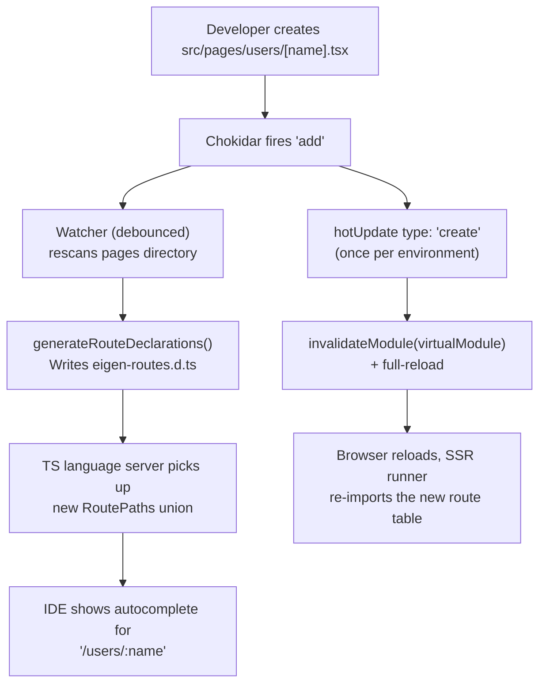

_This is the tenth installment in a series where we build a toy Next.js on top of Vite. In [Part 8](/08-dev-middleware), we added API routes with `configureServer`. Now we'll understand the HMR system that makes Vite development feel instant, and how framework plugins integrate with it._

---

## How Vite HMR works

When you save a file, the update reaches the browser in milliseconds. Here's the full pipeline:

<Steps>
<Step>
### File change detection

Vite uses [chokidar](https://github.com/paulmillr/chokidar) (a file system watcher) to monitor source files. When a file is saved, chokidar fires an event.

</Step>
<Step>
### Module graph lookup

Vite finds the changed file in its module graph — an in-memory data structure that tracks every module and its import relationships. The module graph knows that `App.tsx` imports `Header.tsx`, which imports `Logo.tsx`, and so on.

</Step>
<Step>
### HMR boundary search

Vite walks _up_ the dependency tree (from the changed module toward the root) looking for an **HMR boundary** — a module that has registered an [`import.meta.hot`](https://vite.dev/guide/api-hmr)`.accept()` handler. This handler says "I know how to update myself when my dependencies change."

[`@vitejs/plugin-react`](https://github.com/vitejs/vite-plugin-react) injects HMR boundary code into component modules via its `transform` hook (using [Oxc](https://oxc.rs) for the [React Fast Refresh](https://github.com/facebook/react/tree/main/packages/react-refresh) transform). This is why React components hot-reload by default — a module whose exports are all components is a boundary.

</Step>
<Step>
### WebSocket update

Vite sends an update message over the client environment's hot channel — a WebSocket — to the `@vite/client` script running in the browser. The message identifies which modules need to be re-imported.

</Step>
<Step>
### Module re-import

The browser re-imports the changed modules (making new HTTP requests to Vite, which transforms the updated source) and calls the accept handlers. React's Fast Refresh mechanism re-renders the affected components without losing state.

</Step>
</Steps>

**If no HMR boundary is found** — for example, if you change a non-component utility module that's imported all the way up to the root — Vite does a **full page reload**. This is the safe fallback.

---

## The module graph

Vite's module graph is the central data structure of the dev server. Since Vite 6 there isn't _one_ graph — each environment has its own. The client graph tracks what the browser has imported; the SSR graph tracks what the ModuleRunner has imported. You can inspect either programmatically:

```typescript
configureServer(server) {
	server.httpServer?.on("listening", () => {
		// Wait a moment for the initial module graph to populate
		setTimeout(() => {
			const graph = server.environments.client.moduleGraph;

			// The graph maps module IDs to EnvironmentModuleNode objects
			for (const [id, mod] of graph.idToModuleMap) {
				const importedBy = [...mod.importers]
					.map((m) => m.id)
					.filter(Boolean);

				if (importedBy.length > 0) {
					console.log(`${id}`);
					console.log(`  ← imported by: ${importedBy.join(", ")}`);
				}
			}
		}, 3000);
	});
}
```

Swap `client` for `ssr` and you'll see a different graph: no `@vite/client`, no `React.lazy` chunks, but static imports of every page and its loader.

Each `EnvironmentModuleNode` tracks:

- **`id`** — The resolved module ID (absolute file path or virtual module ID)
- **`importers`** — Set of modules that import this one (edges pointing up the tree)
- **`importedModules`** — Set of modules this one imports (edges pointing down)
- **`transformResult`** — The cached transform output (so repeated requests don't re-transform)
- **`lastHMRTimestamp`** — When this module last received an HMR update

Each graph is populated lazily. A module only appears in the client graph after the browser has requested it, and in the SSR graph after the runner has imported it. This is consistent with Vite's on-demand architecture — the graph reflects what has actually been loaded, not what exists on disk.

<Callout type="info" title="server.moduleGraph is the legacy view">
  You'll still find `server.moduleGraph` in older plugins. In Vite 6+ it's a backward-compatibility layer that merges
  the client and SSR graphs into mixed `ModuleNode`s. New code should pick the environment it means:
  `server.environments.client.moduleGraph`, `server.environments.ssr.moduleGraph`, or `this.environment.moduleGraph`
  inside a hook.
</Callout>

---

## `hotUpdate` — Custom HMR behavior

When a file changes, Vite calls each plugin's [`hotUpdate`](https://vite.dev/guide/api-environment-plugins#the-hotupdate-hook) hook once **per environment** — first for `client`, then for `ssr` — with `this.environment` set to the environment being updated. The hook receives:

- **`type`** — `'create'`, `'update'`, or `'delete'`
- **`file`** — The absolute path of the changed file
- **`modules`** — The modules in _this_ environment's graph that belong to the file
- **`timestamp`**, **`read()`**, **`server`**

Returning nothing lets Vite run its default HMR propagation. Returning an array replaces the set of modules to propagate — an empty array means "I've handled this, don't propagate anything."

For our route plugin, the rules are:

- When a page file's **content** changes (`type: 'update'`), do nothing. React Fast Refresh handles the client, and the SSR runner re-imports the module on the next request.
- When a page file is **created or deleted**, the route table changed structurally. Invalidate the virtual route module in this environment and tell it to reload.

[Part 2](/02-route-discovery-plugin) already has a watcher that reacts to `add` and `unlink` events. We keep it, but split its two jobs. Regenerating the `.d.ts` file is a filesystem concern that stays in the watcher (see [Debouncing](#debouncing) below). Invalidating the module graph and reloading are HMR concerns, and they move into `hotUpdate`, where Vite tells us which environment we're in. That also fixes a gap in the Part 2 version: it reloaded the browser, but invalidating the SSR graph doesn't clear the ModuleRunner's cache of already-evaluated modules, so `entry-server.tsx` could keep rendering the old route table until a restart.

```typescript title="plugins/eigen-routes.ts"
hotUpdate({ type, file }) {
	if (type === "update") return; // Content edit — default HMR (React Fast Refresh)
	if (!file.startsWith(pagesDir) || !file.endsWith(".tsx")) return;

	// A page was added or deleted: the route table is stale in this environment
	const graph = this.environment.moduleGraph;
	const routeModule = graph.getModuleById(resolvedVirtualModuleId);
	if (routeModule) graph.invalidateModule(routeModule);

	// client: the browser reloads the page
	// ssr: the ModuleRunner clears its module cache, so the next
	//      request re-imports entry-server and the fresh route table
	this.environment.hot.send({ type: "full-reload" });

	return []; // We handled it — skip default propagation
},
```

Because the hook runs once for each environment, the same five lines keep both the browser and the server-side runner in sync. Returning `[]` prevents a double update: without it, deleting a page would also make Vite propagate an update from the deleted module up through its importers.

<Callout type="info" title="handleHotUpdate is the legacy hook">
Older plugins use `handleHotUpdate({ file, server, modules })`. In Vite 8 it still runs, but only for `'update'` events — never for created or deleted files — and it receives the mixed backward-compatible graph instead of an environment. Setting `future: { removePluginHookHandleHotUpdate: 'warn' }` in your Vite config flags plugins that still use it. Use `hotUpdate` for new code.
</Callout>

### Module invalidation

`moduleGraph.invalidateModule(mod)` clears the module's cached transform result in that environment. The next time the module is requested — by the browser, or by the ModuleRunner — Vite re-runs the `resolveId` → `load` → `transform` pipeline from scratch.

For our route virtual module, invalidation means the next request triggers the `load` hook again, which rescans the pages directory and generates fresh route code. Invalidation alone doesn't push anything anywhere, though. That's the job of the `full-reload` message: the browser re-requests the page, and the SSR runner drops its cached modules.

---

## The type regeneration cycle

Our framework maintains two parallel structures that need to stay in sync:

1. **The virtual module** (runtime) — JavaScript code that the browser and SSR environment execute
2. **The `.d.ts` declaration file** (type system) — TypeScript declarations that the IDE uses for autocomplete and type checking

When the filesystem changes, both must update:


```mermaid
flowchart TD
    A["Developer creates src/pages/users/[name].tsx"] --> B["Chokidar fires 'add'"]
    B --> C["Watcher (debounced)\nrescans pages directory"]
    B --> E["hotUpdate type: 'create'\n(once per environment)"]
    C --> D["generateRouteDeclarations()\nWrites eigen-routes.d.ts"]
    E --> G["invalidateModule(virtualModule)\n+ full-reload"]
    D --> F["TS language server picks up\nnew RoutePaths union"]
    G --> I["Browser reloads, SSR runner\nre-imports the new route table"]
    F --> H["IDE shows autocomplete for\n'/users/:name'"]
```

This creates a feedback loop: the developer adds a file, and within seconds, the IDE offers autocomplete for the new route's path and params. This is the same cycle that [TanStack Router](https://tanstack.com/router)'s `@tanstack/router-plugin/vite` implements when it watches the filesystem and regenerates `routeTree.gen.ts`.

### Debouncing

In practice, file watcher events can fire rapidly (renaming a file fires `unlink` + `add`; a `git checkout` can fire dozens). Rewriting the declaration file on every event wastes work and makes the TypeScript server re-check repeatedly. Production frameworks debounce the regeneration. Here is Part 2's watcher with a debounce added:

```typescript title="plugins/eigen-routes.ts"
configureServer(server) {
	let regenerateTimeout: ReturnType<typeof setTimeout> | undefined;

	const onStructuralChange = (filePath: string) => {
		if (!filePath.startsWith(pagesDir) || !filePath.endsWith(".tsx")) return;

		// Debounce: wait 100ms for additional changes before regenerating
		clearTimeout(regenerateTimeout);
		regenerateTimeout = setTimeout(() => {
			const routes = discoverRoutes(pagesDir);
			generateRouteDeclarations(routes, resolve(root, "node_modules/.eigen"));
		}, 100);
	};

	server.watcher.on("add", onStructuralChange);
	server.watcher.on("unlink", onStructuralChange);
},
```

The watcher now only writes declarations. Graph invalidation and reloads live in `hotUpdate`, which Vite calls for the same `add`/`unlink` events (as `'create'`/`'delete'`).

---

## HMR boundaries and `import.meta.hot`

An HMR boundary is any module that calls `import.meta.hot.accept()`. This tells Vite "when this module or its dependencies change, I can handle the update without a full page reload."

`@vitejs/plugin-react` injects this into component modules via its `transform` hook. After transformation, a component file like `Home.tsx` ends up with something roughly like this (simplified):

```typescript
// Registration emitted by the Fast Refresh transform, next to each component:
$RefreshReg$(_c, "Home");

// Footer appended to the module:
if (import.meta.hot) {
  RefreshRuntime.__hmr_import(import.meta.url).then((currentExports) => {
    RefreshRuntime.registerExportsForReactRefresh(__SOURCE__, currentExports);
    import.meta.hot.accept((nextExports) => {
      // If any export isn't a component, Fast Refresh can't safely
      // swap it — escalate to the importer (usually a full reload)
      const invalidateMessage = RefreshRuntime.validateRefreshBoundaryAndEnqueueUpdate(
        __SOURCE__,
        currentExports,
        nextExports,
      );
      if (invalidateMessage) import.meta.hot.invalidate(invalidateMessage);
    });
  });
}
```

The validation step matters for framework authors. A module is only a Fast Refresh boundary if **every export is a React component**. A page that also exports a `loader` would fail validation and fall back to a reload — which is one more reason [Part 7](/07-transform-hook) strips loaders from the client bundle before the module ever reaches the browser.

The `import.meta.hot` object is Vite's HMR client API. Its key methods:

- **`accept()`** — "I'm a boundary. When I change, re-import me and call my accept handler." This is a _self-accepting_ module.
- **`accept(deps, callback)`** — "When these specific dependencies change, call my callback with the new modules." This is for accepting specific dependency updates.
- **`dispose(callback)`** — "Before I'm replaced, call this cleanup function." Used to tear down side effects (event listeners, intervals, subscriptions).
- **`invalidate()`** — "I can't handle this update. Propagate upward." Forces the HMR boundary search to continue to the parent.

When Vite finds a boundary, it sends a WebSocket message to the browser. The `@vite/client` script re-imports the module (making a new HTTP request to Vite, which re-transforms the updated source) and passes it to the accept handler. React Fast Refresh then swaps the component's implementation while preserving its state — hooks, refs, and local state survive the update.

**When no boundary is found** — for example, changing a utility function that's imported by a non-component module all the way up to the entry point — Vite has no safe update path. It falls back to a **full page reload**. This is the correct behavior: without an accept handler, there's no way to know how to apply the update without restarting the application.

Framework authors have an additional concern: hot updates to framework internals (the router, the data loading layer) might need special handling. If the route matching logic changes, a simple component re-render won't update the router — you need a full page reload.

That's why our `hotUpdate` hook splits the cases: content edits go through normal HMR, and structural changes (a route appearing or disappearing) force a reload. A more sophisticated framework could go further:

1. Diff the old and new route lists, and only reload if the route table actually changed
2. Re-render the router in place for new routes instead of reloading the page
3. Force a hard refresh when router internals themselves change

---

## What to observe

1. **Edit a page component's markup** — just the JSX. The browser updates without a full reload, and component state survives. React Fast Refresh handles it; our `hotUpdate` hook returns early for `type: 'update'`.

2. **Create a new page file** (e.g., `src/pages/Contact.tsx`). Check `node_modules/.eigen/eigen-routes.d.ts` — it now includes `/contact` in the `RoutePaths` union. The browser does a full reload, and `/contact` server-renders immediately because the SSR runner dropped its cached route table.

3. **Delete a page file.** The route disappears from the type declarations and from the runtime route table, on both the client and the server.

4. **Add `console.log(this.environment.name, type, file)` at the top of `hotUpdate`.** Every save logs twice — once for `client`, once for `ssr` — which makes the per-environment model concrete.

---

## Key insight

HMR is the module graph plus the hot channel. Each environment's module graph tracks dependencies. The hot channel delivers updates — a WebSocket for the browser, an in-process channel for the SSR runner. HMR boundaries define where updates stop propagating. Framework plugins use `hotUpdate` to customize this behavior per environment for framework-specific concerns — like regenerating route manifests and type declarations.

For a typed framework, HMR has a second dimension: declaration file regeneration. The runtime module graph and the TypeScript declaration graph are parallel structures maintained by the plugin. When the filesystem changes, both update. The module graph update is instant (invalidation plus a reload message). The declaration update requires a file write, which triggers the TypeScript language server to re-check and update autocomplete. This dual update loop is what gives typed frameworks their tight developer feedback cycle.

---

## Further reading

- [Vite HMR API](https://vite.dev/guide/api-hmr) — The full reference for `import.meta.hot`, including `accept`, `dispose`, `invalidate`, and `prune`.
- [Vite Environment API: the `hotUpdate` hook](https://vite.dev/guide/api-environment-plugins#the-hotupdate-hook) — The per-environment HMR hook that replaces `handleHotUpdate`.
- [React Fast Refresh](https://github.com/facebook/react/tree/main/packages/react-refresh) — React's hot reloading runtime that preserves component state across edits.
- [chokidar](https://github.com/paulmillr/chokidar) — The file system watcher library that Vite uses for change detection.
- [`@vitejs/plugin-react`](https://github.com/vitejs/vite-plugin-react) — The official React plugin for Vite, which injects HMR boundary code via the transform hook.

---

## What's next

In Part 10, we'll build Eigen's **dev overlay** — an in-browser diagnostic panel that streams request timings from the dev server in real time, with an instrumentation hook that later parts use for loaders, middleware, and caching. Then in Part 11, we'll compose everything into a single `eigen()` plugin function, introduce the `buildApp` hook for production build orchestration, and examine the three-layer type architecture that frameworks ship. This is where the toy framework becomes a coherent, distributable package.
