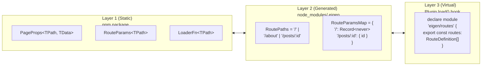

*This is the twelfth installment in a series where we build a toy Next.js on top of Vite. In [Part 10](/10-dev-overlay), we built the dev overlay. Now we'll compose everything into a distributable framework plugin and examine the architecture of the whole system.*

**Concepts introduced:** Composing plugins, the `buildApp` hook, plugin options, the framework's public type surface, the three-layer type architecture.

---

## From scattered plugins to a single export

Throughout this series, we've built four separate plugins:

- **`eigenRoutes`** — Route discovery, virtual module generation, type declaration generation, file watching
- **`eigenStripLoaders`** — Strips server-only code from client bundles
- **`eigenApi`** — API route handling in development
- **A config plugin** — Sets framework defaults for build configuration

A framework user shouldn't need to know about these internal pieces. They should add one thing to their config:

```typescript
import { defineConfig } from 'vite'
import react from '@vitejs/plugin-react'
import eigen from 'eigen/plugin'

export default defineConfig({
  plugins: [eigen(), react()],
})
```

---

## The unified plugin

```typescript title="packages/eigen/plugin.ts"
import type { Plugin, UserConfig } from 'vite'
import eigenRoutes from './plugins/eigen-routes'
import eigenStripLoaders from './plugins/eigen-strip-loaders'
import eigenApi from './plugins/eigen-api'

export interface EigenOptions {
  /** Directory containing page components. Default: 'src/pages' */
  pagesDir?: string
  /** Directory containing API routes. Default: 'src/api' */
  apiDir?: string
}

export default function eigen(options: EigenOptions = {}): Plugin[] {
  return [
    eigenRoutes({ pagesDir: options.pagesDir }),
    eigenStripLoaders(),
    eigenApi({ apiDir: options.apiDir }),

    {
      name: 'eigen',

      config(userConfig: UserConfig) {
        return {
          build: {
            manifest: true,
            rollupOptions: {
              input: userConfig.build?.rollupOptions?.input
                ?? 'src/entry-client.tsx',
            },
          },
          environments: {
            ssr: {
              build: {
                outDir: 'dist/server',
                rollupOptions: {
                  input: 'src/entry-server.tsx',
                },
              },
            },
          },
        }
      },

      buildApp: {
        order: 'pre' as const,
        async handler(builder) {
          await builder.build(builder.environments.client)
          await builder.build(builder.environments.ssr)
        },
      },
    },
  ]
}
```

### The `config` hook

The framework's `config` hook sets sensible defaults:
- **`manifest: true`** — Generate the asset manifest for production SSR
- **`input: 'src/entry-client.tsx'`** — Set the client entry point (overridable by the user)
- **`environments.ssr`** — Configure the SSR build with its own output directory and entry point

These defaults can be overridden by the user's config. Vite merges configs with a deep merge strategy, so the user can override `build.rollupOptions.input` without losing the `manifest: true` setting.

<TypeDeepDive title="Concept: Deep merge vs. shallow merge">

A shallow merge (`Object.assign` or `{ ...a, ...b }`) only merges top-level properties — if both objects have a `build` key, `b.build` completely replaces `a.build`. A deep merge recurses into nested objects, so `a.build.manifest` and `b.build.rollupOptions` both survive. Vite uses deep merge for plugin configs, which is why a framework can set `manifest: true` and the user can set `rollupOptions.input` without either overwriting the other. Arrays are typically replaced, not concatenated — so if two plugins both set `build.rollupOptions.external`, the last one wins.

</TypeDeepDive>

### The `buildApp` hook

`buildApp` is a Vite hook (added as a plugin hook in Vite 7) that gives the framework control over the production build process. It exists because SSR frameworks need to orchestrate *multiple coordinated builds* — a problem that had no clean solution before the Environment API.

**Before `buildApp`:** Frameworks either ran separate `vite build` commands via npm scripts (`build:client && build:server`), or used tools like Vinxi that spawned multiple Vite instances. The problem with separate commands: the builds can't share state. The client build might discover routes that the server build doesn't know about. A shared virtual module has to generate its code independently in each build, potentially producing inconsistent results.

**With `buildApp`:** A single `vite build` command creates a `ViteBuilder` instance — the build-time equivalent of `ViteDevServer`. The builder has access to *all* configured environments and their shared plugin pipeline. The framework's `buildApp` handler controls the build sequence:

```typescript
buildApp: {
  order: 'pre' as const,
  async handler(builder) {
    // builder.environments contains all configured environments
    // Each has its own build config (outDir, rollupOptions, etc.)

    // Build client first — generates manifest.json
    await builder.build(builder.environments.client)

    // Build server second — can reference the client manifest
    // because the client build has already written it to disk
    await builder.build(builder.environments.ssr)
  },
}
```

The handler receives a `builder` object with `builder.environments` — a record of all configured environments. Each environment carries its own build configuration (output directory, Rollup options, resolve conditions). The framework decides the order: client first (generates the manifest), server second (can reference the manifest).

The `order: 'pre'` ensures this handler runs before any other `buildApp` handlers. If a deployment adapter (like `@netlify/vite-plugin-tanstack-start`) also defines a `buildApp` hook with `order: 'post'`, it runs after the framework's builds complete — the adapter can post-process the build output into platform-specific artifacts.

This is exactly how TanStack Start orchestrates its builds. When TanStack Start migrated from Vinxi to native Vite at version 1.121.0, Vinxi's `vinxi build` command (which managed multiple Vite instances) was replaced by this `buildApp` hook (which coordinates multiple environments within a single Vite build). The config file moved from `app.config.ts` to `vite.config.ts`, and the build command became plain `vite build`.

In later parts, when we add edge runtimes (Part 19) and RSC (Part 21), the `buildApp` handler will coordinate three or four environments — but the pattern is the same: sequential builds, ordered by dependency, sharing the same plugin pipeline.

---

## The framework's type exports

```typescript title="packages/eigen/index.ts"
export type { PageProps, LoaderFn, RouteDefinition } from './types'
export type { ApiHandler, ApiContext } from './api-types'
export { defineLoader } from './helpers'
```

This is the surface area that application developers interact with. Everything else — the plugin internals, the route discovery logic, the code stripping transforms — is implementation detail.

---

## The three-layer type architecture

Looking at what Eigen exports, the framework's type API has three distinct layers:

### Layer 1: Static types (shipped in the npm package)

```
PageProps<TPath, TData>   — Props shape for page components
LoaderFn<TPath, TData>    — Loader function signature
RouteDefinition           — Internal route object shape
ApiHandler<TResponse>     — API route handler signature
RouteParams<TPath>        — Template literal type for param extraction
```

These types are authored by the framework developers and distributed via npm. They define contracts — the shapes that application code must conform to. They don't contain any project-specific information.

### Layer 2: Generated types (written per-project by the plugin)

```
RoutePaths                — Union of all valid route paths
RouteParamsMap            — Maps each path to its params type
```

These types are generated by the plugin at dev-server startup (and whenever the filesystem changes). They live in `node_modules/.eigen/eigen-routes.d.ts`. They contain project-specific information derived from the filesystem scan.

### Layer 3: Virtual module types (bridging runtime and types)

```
declare module 'eigen/routes' {
  export const routes: RouteDefinition[]
}
```

These declarations tell TypeScript about virtual modules — modules that exist at runtime (generated by the plugin's `load` hook) but don't have corresponding files on disk. They bridge Layer 1 (the `RouteDefinition` type) with Layer 2 (the generated route information).

### How the layers connect



<TypeDeepDive title="TypeScript: How declaration files (`.d.ts`) work">

A `.d.ts` file contains only type information — no runtime code. TypeScript uses it to understand the shape of a module without seeing the implementation. When the plugin generates `eigen-routes.d.ts` with `type RoutePaths = '/' | '/about' | '/posts/:id'`, TypeScript treats those as the available route paths everywhere in your code. Generated `.d.ts` files are the mechanism that connects filesystem state (what files exist) to compile-time type checking (what types are valid). This is why the plugin regenerates the declaration file on every filesystem change — the types must stay in sync with reality.

</TypeDeepDive>

Application code references all three layers:

```tsx
// Layer 3: import from virtual module
import { routes } from 'eigen/routes'

// Layer 2: import generated types
import type { RoutePaths, RouteParamsMap } from 'eigen/route-types'

// Layer 1: import framework types
import type { PageProps } from 'eigen/types'

// Using all three together:
function Link<T extends RoutePaths>({ to }: { to: T }) { ... }
// RoutePaths (Layer 2) constrains the prop
// which comes from PageProps (Layer 1)
// and the runtime routes come from eigen/routes (Layer 3)
```

This three-layer pattern is universal across typed frameworks. TanStack Router has static types (`RouteOptions`, `Link`), generated types (`routeTree.gen.ts`), and virtual modules. Next.js has static types (`GetServerSideProps`, `NextPage`), limited generated types (the `.next/types` directory), and internal virtual modules.

---

## Comparing to real frameworks

| Aspect | Eigen | TanStack Start | Next.js |
|---|---|---|---|
| Plugin entry | `eigen()` returns `Plugin[]` | `tanstackStart()` returns `Plugin[]` | Not Vite-based (webpack/turbopack) |
| Route discovery | Filesystem scan in `configResolved` | `@tanstack/router-plugin/vite` | Internal filesystem scanner |
| Virtual modules | `eigen/routes` | Internal virtual modules | Webpack virtual modules |
| Type generation | `.d.ts` in `node_modules/.eigen/` | `routeTree.gen.ts` (committed) | `.next/types/` (gitignored) |
| SSR | `ssrLoadModule` + Express | Nitro server | Built-in Node server |
| Build | `buildApp` hook | `buildApp` hook | Custom webpack/turbopack pipeline |
| Deployment | Manual prod server | Netlify/Vercel/Cloudflare adapters | Vercel-optimized, self-hostable |
| Code stripping | `transform` hook | `.server.ts` convention | RSC compiler + separate compilation |
| HMR | `handleHotUpdate` + React Fast Refresh | Same | Turbopack HMR |

The architectural patterns are identical. The differences are in scale (Eigen handles 3 routes; Next.js handles thousands), robustness (Eigen uses regex; Next.js uses SWC), and deployment surface (Eigen has one server file; Next.js supports dozens of platforms).

---

## What to observe

1. **Run `vite build`** with the unified plugin. A single command produces both `dist/client/` and `dist/server/`.

2. **Inspect the plugin array.** Add `console.log` to the `config` hook and watch how the framework's defaults merge with the user's config.

3. **Compare your `vite.config.ts`** with TanStack Start's:
   ```typescript
   // TanStack Start
   plugins: [tanstackStart(), react()]
   // Eigen
   plugins: [eigen(), react()]
   ```
   The shape is identical. The pattern is universal.

---

## Key insight

A framework is a *coordinated set of Vite plugins* that handles route discovery, code generation, type generation, SSR, code stripping, build orchestration, and dev middleware. These concerns are decomposed into separate plugins but composed into a single export function. The user sees one line of config; the framework manages the complexity.

The type architecture has three layers — static types in the package, generated types per-project, and virtual module declarations bridging runtime and type system. Each layer serves a different consumer (the compiler, the IDE, the runtime) but all are generated from the same source of truth.

---

## Where to go from here

You've built — in miniature — every core layer that a production framework implements. Parts 0–10 form the foundation. The remaining parts extend Eigen into increasingly sophisticated territory:

- **Part 12: Streaming SSR** — Replace `renderToString` with `renderToPipeableStream` for progressive page rendering powered by Suspense.
- **Part 13: Nested Layouts** — Implement a `layout.tsx` convention with recursive virtual module generation and typed parent-to-child data flow.
- **Part 14: Framework Middleware** — Typed context accumulation, `defineMiddleware`, `redirect()`, auth guards, the `createMiddlewareChain` builder pattern.
- **Part 15: Server Functions** — `createServerFn`, the `transform` hook generating RPC stubs, type preservation across transforms.
- **Part 16: Static Site Generation** — Pre-render pages at build time using the `closeBundle` hook, with a typed `generateStaticParams` convention.
- **Part 17: Deployment Adapters** — The adapter pattern for hosting providers (Netlify, Cloudflare, Vercel, Node standalone).
- **Part 18: Runtime Validation** — Integrate zod/valibot schemas to validate serialized data at the hydration boundary.
- **Part 19: Edge Runtimes** — Add a third Vite environment targeting Cloudflare Workers with Web API types.
- **Part 21: React Server Components** — The capstone: three environments, `"use client"` boundaries, RSC streaming payloads, and `@vitejs/plugin-rsc`.

---

## What's next

In Part 12, we'll tackle **streaming SSR** — replacing `renderToString` with React's `renderToPipeableStream` API to enable progressive page rendering powered by Suspense boundaries. This changes the server's contract from "here's a complete page" to "here's the start of a page, more is coming."
