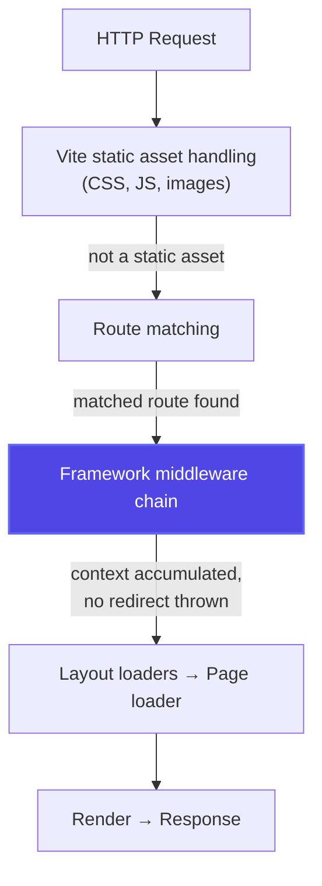

*This is the fourteenth installment in a series where we build a toy Next.js on top of Vite. In [Part 13](/13-nested-layouts), we built nested layouts. Now we'll implement a framework-level middleware system — a typed request pipeline that runs before loaders and route handlers, enabling authentication, redirects, context injection, and request transformation.*

---

## Framework middleware vs. `configureServer` middleware

In Part 8, we used `configureServer` to add Express-style middleware to the dev server. That middleware operates at the HTTP level — it receives raw `req`/`res` objects and runs for every request, including static assets.

Framework middleware is different. It runs inside the framework's routing pipeline — *after* route matching but *before* loaders and rendering. It has access to the matched route, its params, and can inject typed context that flows through to loaders and components.



---

## The middleware type system

The key design challenge: each middleware function can add properties to a context object, and downstream middleware and loaders should *see* those added properties in their types. This requires TypeScript to accumulate types through the chain.

```typescript title="packages/eigen/middleware.ts"
/** Base context available to all middleware */
export interface BaseContext {
  request: Request
  params: Record<string, string>
  pathname: string
}

/** A middleware function that can extend the context */
export type MiddlewareFn<
  TInput extends BaseContext = BaseContext,
  TOutput extends Record<string, unknown> = Record<string, never>,
> = (ctx: TInput, next: () => Promise<Response>) => Promise<Response | TOutput>

/** 
 * Define middleware with typed context extension.
 * The return value of the handler is merged into the context
 * for downstream middleware and loaders.
 */
export function defineMiddleware<TOutput extends Record<string, unknown>>(
  handler: MiddlewareFn<BaseContext, TOutput>,
): MiddlewareFn<BaseContext, TOutput> {
  return handler
}

/** 
 * A redirect response that middleware can throw to short-circuit
 * the pipeline and redirect the user.
 */
export class RedirectResponse {
  constructor(
    public readonly url: string,
    public readonly status: 301 | 302 | 303 | 307 | 308 = 302,
  ) {}
}

export function redirect(url: string, status?: 301 | 302 | 303 | 307 | 308): never {
  throw new RedirectResponse(url, status)
}
```

---

## Concrete middleware examples

### Authentication middleware

```typescript title="src/middleware/auth.ts"
import { defineMiddleware, redirect } from 'eigen/middleware'
import { verifySession } from '../lib/auth'

export const authMiddleware = defineMiddleware(async (ctx) => {
  const sessionToken = getCookie(ctx.request, 'session')

  if (!sessionToken) {
    redirect('/login')
  }

  const user = await verifySession(sessionToken)
  if (!user) {
    redirect('/login')
  }

  // Return value is merged into context — downstream middleware
  // and loaders can access ctx.user with full types
  return { user }
})

function getCookie(request: Request, name: string): string | undefined {
  const cookies = request.headers.get('cookie') ?? ''
  const match = cookies.match(new RegExp(`${name}=([^;]+)`))
  return match?.[1]
}
```

### Rate limiting middleware

```typescript title="src/middleware/rate-limit.ts"
import { defineMiddleware } from 'eigen/middleware'

const requestCounts = new Map<string, { count: number; resetAt: number }>()

export const rateLimitMiddleware = defineMiddleware(async (ctx, next) => {
  const ip = ctx.request.headers.get('x-forwarded-for') ?? 'unknown'
  const now = Date.now()

  const entry = requestCounts.get(ip)
  if (entry && entry.resetAt > now && entry.count >= 100) {
    return new Response('Too Many Requests', { status: 429 })
  }

  if (!entry || entry.resetAt <= now) {
    requestCounts.set(ip, { count: 1, resetAt: now + 60_000 })
  } else {
    entry.count++
  }

  return next()
})
```

### Request timing middleware

```typescript title="src/middleware/timing.ts"
import { defineMiddleware } from 'eigen/middleware'

export const timingMiddleware = defineMiddleware(async (ctx, next) => {
  const start = performance.now()
  const response = await next()
  const duration = performance.now() - start

  // Add Server-Timing header for DevTools
  if (response instanceof Response) {
    response.headers.set('Server-Timing', `total;dur=${duration.toFixed(1)}`)
  }

  return { requestDuration: duration }
})
```

---

## Registering middleware

### Global middleware

Global middleware runs on every route. It's registered in the framework configuration:

```typescript title="src/middleware.ts"
import { authMiddleware } from './middleware/auth'
import { timingMiddleware } from './middleware/timing'

// Export an ordered array — middleware runs in this sequence
export default [timingMiddleware, authMiddleware]
```

The route plugin discovers this file and generates a virtual module that wires middleware into the rendering pipeline:

```typescript
// In the route plugin's load() hook — middleware integration
if (id === resolvedVirtualModuleId) {
  // Check if src/middleware.ts exists
  const hasGlobalMiddleware = existsSync(resolve(pagesDir, '../middleware.ts'))

  const middlewareImport = hasGlobalMiddleware
    ? `import globalMiddleware from '/src/middleware.ts'`
    : `const globalMiddleware = []`

  return `
    ${middlewareImport}
    ${routeImports}
    export const routes = [${routeEntries}]
    export { globalMiddleware }
  `
}
```

### Per-route middleware

Individual routes can declare their own middleware via a `middleware` export:

```tsx title="src/pages/dashboard/index.tsx"
import { authMiddleware } from '../../middleware/auth'

export const middleware = [authMiddleware]

export const loader = defineLoader('/dashboard', async ({ params, ctx }) => {
  // ctx.user is typed — it was added by authMiddleware
  const dashboardData = await getDashboardForUser(ctx.user.id)
  return dashboardData
})
```

---

## The middleware execution engine

The server entry runs middleware before calling loaders:

```typescript title="entry-server.tsx"
export async function executeMiddleware(
  middlewares: MiddlewareFn[],
  baseCtx: BaseContext,
): Promise<{ context: Record<string, unknown>; response?: Response }> {
  let accumulatedContext: Record<string, unknown> = { ...baseCtx }

  for (const mw of middlewares) {
    try {
      const result = await mw(accumulatedContext as any, async () => {
        // next() — continue to the next middleware
        return new Response() // placeholder
      })

      if (result instanceof Response) {
        // Middleware returned a Response directly (e.g., rate limiter 429)
        return { context: accumulatedContext, response: result }
      }

      if (result && typeof result === 'object') {
        // Merge returned properties into context
        accumulatedContext = { ...accumulatedContext, ...result }
      }
    } catch (e) {
      if (e instanceof RedirectResponse) {
        return {
          context: accumulatedContext,
          response: Response.redirect(e.url, e.status),
        }
      }
      throw e
    }
  }

  return { context: accumulatedContext }
}

export async function render(pathname: string, request: Request) {
  const match = matchRoute(pathname)
  if (!match) return { html: '<h1>404</h1>', status: 404, data: null }

  // Combine global + route-specific middleware
  const allMiddleware = [
    ...globalMiddleware,
    ...(match.route.middleware ?? []),
  ]

  // Execute the middleware chain
  const { context, response } = await executeMiddleware(allMiddleware, {
    request,
    params: match.params,
    pathname,
  })

  // If middleware returned a Response (redirect, error), send it directly
  if (response) {
    return { response }
  }

  // Pass the accumulated context to the loader
  let data: unknown = null
  if (match.route.loader) {
    data = await match.route.loader({ params: match.params, ctx: context })
  }

  const html = renderToString(
    <match.route.component params={match.params} data={data} />,
  )
  return { html, status: 200, data }
}
```

---

## Typed context accumulation

The sophisticated version: TypeScript knows the accumulated context shape at each point in the chain.

```typescript title="packages/eigen/middleware.ts"
type ChainedMiddleware<TContext extends BaseContext> = {
  use<TOutput extends Record<string, unknown>>(
    mw: MiddlewareFn<TContext, TOutput>,
  ): ChainedMiddleware<TContext & TOutput>
  build(): MiddlewareFn[]
}

export function createMiddlewareChain(): ChainedMiddleware<BaseContext> {
  const middlewares: MiddlewareFn[] = []

  const chain: ChainedMiddleware<any> = {
    use(mw) {
      middlewares.push(mw)
      return chain // Each .use() returns a chain with extended context type
    },
    build() {
      return middlewares
    },
  }

  return chain
}
```

Usage:

```typescript title="src/middleware.ts"
const chain = createMiddlewareChain()
  .use(timingMiddleware)     // Context: BaseContext & { requestDuration: number }
  .use(authMiddleware)       // Context: ... & { user: User }
  .use(async (ctx) => {
    // TypeScript knows ctx has: request, params, pathname, requestDuration, user
    console.log(`User ${ctx.user.name} requested ${ctx.pathname}`)
    return {}
  })

export default chain.build()
```

Each `.use()` call returns a new chain type that includes the properties returned by the previous middleware. TypeScript tracks the accumulation through the chain. This is the same pattern TanStack Start uses in its `createServerFn().middleware([...])` builder API.

<TypeDeepDive title="TypeScript: Intersection types and type accumulation">

The `ChainedMiddleware<TContext & TOutput>` return type uses an intersection (`&`) to merge the existing context with the new properties. Each `.use()` call adds to the intersection: after `timingMiddleware`, the context is `BaseContext & { requestDuration: number }`. After `authMiddleware`, it becomes `BaseContext & { requestDuration: number } & { user: User }`. TypeScript tracks this accumulation through the generic parameter, so by the third `.use()`, the callback's `ctx` parameter has all accumulated properties. This is how typed middleware chains provide autocomplete and type checking without runtime overhead — the chain builder's generic parameter carries the full context shape at each step.

</TypeDeepDive>

---

## The middleware ↔ server function interaction

From our ILTA architecture review, we flagged that TanStack Start has a middleware double-execution issue: if middleware is registered both globally and in a server function's middleware array, it runs twice. Our design avoids this by keeping middleware execution in one place (the rendering pipeline) and passing the accumulated context *through* to server functions:

```typescript
// Server functions receive the middleware context automatically
export const updatePost = createServerFn(async (
  data: { title: string },
  ctx: { user: User },  // ← Injected by the middleware chain
) => {
  // ctx.user is available without the server function
  // needing to declare its own middleware
  await db.query('UPDATE posts SET title = $1 WHERE author_id = $2',
    [data.title, ctx.user.id],
  )
})
```

---

## What to observe

1. **Add `console.log` to each middleware.** Watch the execution order in the terminal — they run in array order, before the loader.

2. **Remove the session cookie** and navigate to a protected route. The auth middleware redirects to `/login` before the loader runs — no database query is wasted.

3. **Check the `Server-Timing` header** in DevTools (Network tab → response headers). The timing middleware adds the total request duration.

4. **Hover over `ctx` in a loader** that runs after auth middleware. TypeScript shows `{ user: User; requestDuration: number; ... }` — the accumulated context from all middleware in the chain.

---

## Key insight

Framework middleware is a typed function pipeline that runs between route matching and data loading. Unlike HTTP-level middleware (Part 8), it operates inside the framework's abstraction — it has access to matched routes, typed params, and can inject context that flows through to loaders with full type safety.

The type accumulation pattern (each middleware extends the context type for downstream consumers) is the TypeScript equivalent of a functional pipeline. It's the same pattern used in tRPC's middleware, TanStack Start's server function middleware, and Express's `req` extension pattern — but with compile-time type tracking instead of runtime `req.user = ...` mutations.

---

<TestSection title="Testing: middleware chains">

The middleware execution engine is pure async logic with no HTTP or Vite dependencies — test it directly. The `executeMiddleware` function is exported from `entry-server.tsx`, and the types and `RedirectResponse` class are exported from `packages/eigen/middleware.ts`:

```typescript title="src/__tests__/middleware.test.ts"
import { describe, it, expect, vi } from 'vitest'
import { executeMiddleware } from '../entry-server'
import { RedirectResponse } from 'eigen/middleware'
import type { BaseContext, MiddlewareFn } from 'eigen/middleware'

function makeCtx(overrides?: Partial<BaseContext>): BaseContext {
  return {
    request: new Request('http://localhost/'),
    params: {},
    pathname: '/',
    ...overrides,
  }
}

describe('executeMiddleware', () => {
  it('accumulates context from each middleware', async () => {
    const mw1: MiddlewareFn = async () => ({ user: 'alice' })
    const mw2: MiddlewareFn = async () => ({ role: 'admin' })

    const { context } = await executeMiddleware([mw1, mw2], makeCtx())

    expect(context).toMatchObject({ user: 'alice', role: 'admin' })
  })

  it('short-circuits on Response return', async () => {
    const blocker: MiddlewareFn = async () =>
      new Response('Forbidden', { status: 403 })
    const shouldNotRun = vi.fn(async () => ({}))

    const { response } = await executeMiddleware(
      [blocker, shouldNotRun],
      makeCtx(),
    )

    expect(response?.status).toBe(403)
    expect(shouldNotRun).not.toHaveBeenCalled()
  })

  it('handles redirect throws', async () => {
    const authGuard: MiddlewareFn = async () => {
      throw new RedirectResponse('/login')
    }

    const { response } = await executeMiddleware([authGuard], makeCtx())

    expect(response?.status).toBe(302)
    expect(response?.headers.get('location')).toContain('/login')
  })

  it('runs middleware in order', async () => {
    const order: string[] = []
    const mw1: MiddlewareFn = async () => { order.push('first'); return {} }
    const mw2: MiddlewareFn = async () => { order.push('second'); return {} }

    await executeMiddleware([mw1, mw2], makeCtx())

    expect(order).toEqual(['first', 'second'])
  })
})
```

The test for short-circuiting is especially important — it verifies that an auth guard (returning a 403 or redirecting) prevents downstream middleware from running. Without this guarantee, a misconfigured middleware chain could leak data from protected routes.

</TestSection>

## What's next

In Part 15, we'll build **server functions** — the `createServerFn` pattern where the `transform` hook replaces server-only function bodies with typed RPC client stubs. Middleware context flows into server functions automatically, so the auth check happens once and the user object is available everywhere.
