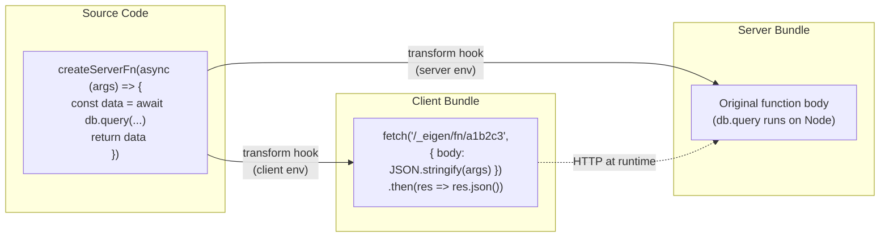

*This is the fifteenth installment in a series where we build a toy Next.js on top of Vite. In [Part 13](/13-nested-layouts), we built nested layouts. Now we'll implement the most sophisticated feature a framework can offer: server functions — where a developer writes a function that runs on the server, and the framework automatically generates a typed RPC client stub for the browser.*

**Concepts introduced:** The `createServerFn` pattern, deep `transform` hook usage, generating API endpoints from function signatures, typed client proxy generation, preserving TypeScript types across a code transform, request serialization, the "use server" directive model.

---

## The design goal

The developer experience we're targeting looks like this:

```tsx title="src/pages/Dashboard.tsx"
import { createServerFn } from 'eigen/server'
import { db } from '../lib/database'  // Node-only import

export const getUsers = createServerFn(async (filter: { role: string }) => {
  // This code runs on the server ONLY.
  // It can access databases, file systems, secrets — anything.
  const users = await db.query('SELECT * FROM users WHERE role = $1', [filter.role])
  return users.rows as Array<{ id: string; name: string; role: string }>
})

export default function Dashboard() {
  const [users, setUsers] = useState<Array<{ id: string; name: string; role: string }>>([])

  useEffect(() => {
    // getUsers() is callable from the browser.
    // Under the hood, it makes a fetch() to a generated API endpoint.
    getUsers({ role: 'admin' }).then(setUsers)
  }, [])

  return (
    <ul>
      {users.map(u => <li key={u.id}>{u.name} ({u.role})</li>)}
    </ul>
  )
}
```

From the developer's perspective, `getUsers` is just an async function. They call it the same way on client and server. But the framework does something radical at build time: it **replaces the function body** in the client bundle with a `fetch()` call to a generated API endpoint, while keeping the original implementation intact in the server bundle.

This is the architecture behind TanStack Start's `createServerFn`, Next.js Server Actions (`"use server"`), and SolidStart's server functions. Let's build it.



---

## The framework's `createServerFn` — the runtime identity

The actual `createServerFn` function is surprisingly simple. At runtime, it's essentially a pass-through:

```typescript title="packages/eigen/server.ts"
/**
 * Marks a function as a server function.
 * 
 * On the server, this returns the function as-is.
 * On the client, the framework's transform plugin replaces the
 * function body with an RPC call to a generated endpoint.
 * 
 * The type signature is preserved across the transform —
 * the client stub has the same parameter and return types.
 */
export function createServerFn<TArgs, TReturn>(
  fn: (args: TArgs) => Promise<TReturn>,
): (args: TArgs) => Promise<TReturn> {
  // At runtime (on the server), just return the function.
  // The magic happens at build time via the transform hook.
  return fn
}
```

The generics `TArgs` and `TReturn` are critical. They ensure that wherever the function is used — on the server directly, or on the client via the generated stub — TypeScript knows the parameter type and the return type. The transform hook changes the *implementation* but preserves the *type signature*.

<TypeDeepDive title="TypeScript: How generics preserve types through transforms">

In `createServerFn<TArgs, TReturn>(fn)`, the type parameters `TArgs` and `TReturn` are inferred from the function you pass in. The transform hook replaces the function body with an RPC stub, but the type signature stays the same — the client-side code still sees `(args: TArgs) => Promise<TReturn>`. This works because TypeScript types exist only at compile time and are erased before runtime. The transform changes the *implementation* but preserves the *interface*, so type checking remains valid.

</TypeDeepDive>

---

## The transform hook — the heart of the system

This is the most complex transform we've built. The plugin needs to:

<Steps>
<Step>
**Detect** files that use `createServerFn`
</Step>
<Step>
**Extract** each server function (its variable name, its argument type, its body)
</Step>
<Step>
**Register** each function as an API endpoint (with a unique ID)
</Step>
<Step>
**Replace** the function body in the client bundle with a `fetch()` call
</Step>
<Step>
**Leave** the function body intact in the server bundle
</Step>
</Steps>

```typescript title="plugins/eigen-server-fns.ts"
import type { Plugin, ViteDevServer } from 'vite'
import { createHash } from 'crypto'

interface ExtractedServerFn {
  /** Variable name: 'getUsers' */
  name: string
  /** Unique endpoint ID, derived from file + name */
  id: string
  /** The source file path */
  file: string
}

/** Generate a stable, short ID from file path + function name */
function generateFnId(file: string, name: string): string {
  const hash = createHash('sha256')
    .update(`${file}:${name}`)
    .digest('hex')
    .slice(0, 8)
  return hash
}

/**
 * Regex to find createServerFn calls.
 * Matches: export const NAME = createServerFn(async (ARGS) => { BODY })
 * 
 * A production implementation would use an AST parser.
 * We use regex here to keep the focus on the Vite concepts.
 */
const SERVER_FN_PATTERN =
  /export\s+const\s+(\w+)\s*=\s*createServerFn\s*\(/g

export default function eigenServerFns(): Plugin {
  /** Map of function ID → file path, used by the dev server to execute functions */
  const fnRegistry = new Map<string, { file: string; exportName: string }>()
  let viteServer: ViteDevServer | null = null

  return {
    name: 'eigen-server-fns',

    configureServer(server) {
      viteServer = server

      // Add the RPC endpoint middleware
      return () => {
        server.middlewares.use(async (req, res, next) => {
          if (!req.url?.startsWith('/_eigen/fn/')) return next()

          const fnId = req.url.replace('/_eigen/fn/', '').split('?')[0]
          const registration = fnRegistry.get(fnId)

          if (!registration) {
            res.writeHead(404)
            res.end(JSON.stringify({ error: 'Server function not found' }))
            return
          }

          try {
            // Collect the request body
            const chunks: Buffer[] = []
            for await (const chunk of req) {
              chunks.push(chunk as Buffer)
            }
            const body = Buffer.concat(chunks).toString()
            const args = body ? JSON.parse(body) : undefined

            // Load the module and call the function
            const mod = await server.ssrLoadModule(registration.file)
            const fn = mod[registration.exportName]

            if (typeof fn !== 'function') {
              res.writeHead(500)
              res.end(JSON.stringify({ error: 'Export is not a function' }))
              return
            }

            const result = await fn(args)

            res.setHeader('Content-Type', 'application/json')
            res.end(JSON.stringify(result))
          } catch (e) {
            const message = e instanceof Error ? e.message : 'Unknown error'
            if (e instanceof Error && server) {
              server.ssrFixStacktrace(e)
            }
            console.error('Server function error:', e)
            res.writeHead(500)
            res.end(JSON.stringify({ error: message }))
          }
        })
      }
    },

    transform(code: string, id: string) {
      // Only process files that use createServerFn
      if (!code.includes('createServerFn')) return

      const isSSR = this.environment?.name === 'ssr'

      if (isSSR) {
        // SERVER: register functions but leave the code intact.
        // We need to know which functions exist so the dev server
        // can route RPC calls to them.
        const matches = [...code.matchAll(SERVER_FN_PATTERN)]
        for (const match of matches) {
          const name = match[1]
          const fnId = generateFnId(id, name)
          fnRegistry.set(fnId, { file: id, exportName: name })
        }

        // No code transformation needed on the server
        return
      }

      // CLIENT: replace each server function's body with a fetch() call.
      let transformed = code

      // First, remove the createServerFn import — we're replacing the implementation
      transformed = transformed.replace(
        /import\s*\{[^}]*createServerFn[^}]*\}\s*from\s*['"]eigen\/server['"]\s*;?\n?/,
        '',
      )

      // Remove any server-only imports (like database, fs, etc.)
      // This is simplified — a real implementation tracks which imports
      // are used only inside createServerFn bodies
      transformed = transformed.replace(
        /import\s*\{[^}]*\}\s*from\s*['"]\.\.\/lib\/database['"]\s*;?\n?/g,
        '',
      )

      // Replace each createServerFn call with an RPC client stub
      const matches = [...code.matchAll(SERVER_FN_PATTERN)]
      for (const match of matches) {
        const name = match[1]
        const fnId = generateFnId(id, name)

        // Register so the dev server knows about it
        fnRegistry.set(fnId, { file: id, exportName: name })

        // Find the full createServerFn(...) expression and replace it
        // This regex matches: createServerFn(async (args) => { ... })
        // including nested braces (simplified — handles 3 levels of nesting)
        const fnCallPattern = new RegExp(
          `export\\s+const\\s+${name}\\s*=\\s*createServerFn\\s*\\([\\s\\S]*?\\n\\}\\)`,
        )

        transformed = transformed.replace(
          fnCallPattern,
          `export const ${name} = async (args) => {
  const res = await fetch('/_eigen/fn/${fnId}', {
    method: 'POST',
    headers: { 'Content-Type': 'application/json' },
    body: JSON.stringify(args),
  })
  if (!res.ok) {
    const err = await res.json()
    throw new Error(err.error || 'Server function failed')
  }
  return res.json()
}`,
        )
      }

      return { code: transformed, map: null }
    },
  }
}
```

---

## What the transform actually produces

Let's trace through the transform for a concrete example. Given this source file:

```tsx title="src/pages/Dashboard.tsx"
import { createServerFn } from 'eigen/server'
import { db } from '../lib/database'

export const getUsers = createServerFn(async (filter: { role: string }) => {
  const users = await db.query('SELECT * FROM users WHERE role = $1', [filter.role])
  return users.rows as Array<{ id: string; name: string; role: string }>
})

export default function Dashboard() {
  // ... uses getUsers()
}
```

**Server bundle (untouched):**
```tsx
import { createServerFn } from 'eigen/server'
import { db } from '../lib/database'

export const getUsers = createServerFn(async (filter: { role: string }) => {
  const users = await db.query('SELECT * FROM users WHERE role = $1', [filter.role])
  return users.rows as Array<{ id: string; name: string; role: string }>
})

export default function Dashboard() {
  // ... uses getUsers()
}
```

**Client bundle (transformed):**
```tsx
export const getUsers = async (args) => {
  const res = await fetch('/_eigen/fn/a3f2c891', {
    method: 'POST',
    headers: { 'Content-Type': 'application/json' },
    body: JSON.stringify(args),
  })
  if (!res.ok) {
    const err = await res.json()
    throw new Error(err.error || 'Server function failed')
  }
  return res.json()
}

export default function Dashboard() {
  // ... uses getUsers() — works identically, but calls the server
}
```

The client bundle has zero Node-specific code. The `db` import is gone. The function body is replaced with a `fetch()` call. The component doesn't know or care which version it's using — the API is the same.

---

## The type preservation problem

Here's the subtle challenge. The original `getUsers` has a precise TypeScript signature:

```typescript
const getUsers: (filter: { role: string }) => Promise<Array<{ id: string; name: string; role: string }>>
```

After the transform, the client stub is:

```typescript
const getUsers = async (args) => { ... fetch() ... return res.json() }
```

The parameter is now `args: any` and the return is `Promise<any>`. The types are gone.

This doesn't matter at *runtime* — the JSON serialization works regardless. But it destroys the developer experience. The IDE no longer knows what `getUsers` accepts or returns.

### Solution: generate a type declaration for the transformed module

The plugin can write a `.d.ts` file that preserves the original types:

```typescript
// Added to the transform hook, after modifying client code:

function generateServerFnDeclarations(
  fns: ExtractedServerFn[],
  sourceFile: string,
  outDir: string,
): void {
  // For each file with server functions, generate a type augmentation
  // that preserves the original signatures
  const declarations = fns.map(fn => {
    return `  // Types preserved from server function '${fn.name}'
  // Original implementation replaced with RPC stub at build time`
  }).join('\n')

  // The actual approach: the plugin doesn't need to generate declarations
  // for the *transformed* file, because TypeScript checks the *source* file.
  // The source still has createServerFn with full types.
  // The transform only affects what Vite serves to the browser.
}
```

Actually, here's the elegant part: **we don't need to generate declarations at all.** TypeScript's language server analyzes the *source* `.tsx` file, not the transformed output. The source file has `createServerFn` with full generic types. The IDE sees:

```typescript
export const getUsers: (filter: { role: string }) => Promise<Array<{ id: string; name: string; role: string }>>
```

And Vite serves the browser a version where the body is replaced with `fetch()`. The types live in the source; the implementation lives in the transform output. They never need to be in the same file at the same time.

This is a profound insight about Vite's architecture: **TypeScript checks source files, Vite transforms source files, and the browser receives the transformed output.** The type system and the runtime operate on different representations of the same code. A `transform` hook can completely rewrite a function's implementation without affecting its types, because the type checker never sees the transformed code.

This is exactly why `createServerFn` in TanStack Start can have full type safety — TypeScript sees the annotated source, the browser gets the RPC stub, and they never conflict.

---

## Serialization boundaries

<Callout type="warn" title="Serialization boundaries">
Server functions introduce a serialization constraint: everything that crosses the network — both arguments and return values — must be JSON-serializable. You can't pass a `Date` object (it becomes a string), a `Map` (it becomes `{}`), or a function (it vanishes).
</Callout>

A type-safe framework should enforce this at the type level:

```typescript title="packages/eigen/server.ts"
/** Types that survive JSON serialization */
type JsonPrimitive = string | number | boolean | null
type JsonArray = JsonValue[]
type JsonObject = { [key: string]: JsonValue }
type JsonValue = JsonPrimitive | JsonArray | JsonObject

/**
 * createServerFn constrains both args and return to be JSON-safe.
 * This catches errors at compile time rather than runtime:
 * 
 *   createServerFn(async (d: Date) => ...)
 *   // TS Error: 'Date' is not assignable to 'JsonValue'
 */
export function createServerFn<
  TArgs extends JsonValue,
  TReturn extends JsonValue,
>(
  fn: (args: TArgs) => Promise<TReturn>,
): (args: TArgs) => Promise<TReturn> {
  return fn
}
```

This is the `JsonValue` constraint pattern. It's deliberately restrictive — the DX trade-off is that developers sometimes need to map rich types to plain objects before returning them (the "Complex return types break serialization" issue we noted in the TanStack Start architecture review).

A more permissive approach uses `superjson` or `devalue` for serialization, which handles `Date`, `Map`, `Set`, `RegExp`, `undefined`, and circular references. The type constraint loosens accordingly:

```typescript
export function createServerFn<TArgs, TReturn>(
  fn: (args: TArgs) => Promise<TReturn>,
): (args: TArgs) => Promise<TReturn> {
  return fn
}
// Serialization errors become runtime errors instead of compile errors.
// The trade-off: more flexible, less safe.
```

TanStack Start takes the `superjson`-ish approach (via `@tanstack/react-router`'s serialization). Next.js Server Actions use a custom serializer. The choice depends on how much safety vs. flexibility the framework prioritizes.

---

## Adding middleware to server functions

TanStack Start's `createServerFn` supports a middleware chain:

```typescript
createServerFn({ method: 'POST' })
  .middleware([authMiddleware])
  .validator(schema)
  .handler(async ({ data, context }) => { ... })
```

Our simplified version can support middleware by extending the pattern:

```typescript title="packages/eigen/server.ts"
import type { IncomingMessage, ServerResponse } from 'http'

export interface ServerFnContext {
  req: IncomingMessage
  res: ServerResponse
  /** Added by middleware */
  [key: string]: unknown
}

type Middleware = (
  ctx: ServerFnContext,
  next: () => Promise<void>,
) => Promise<void>

export function createServerFn<TArgs extends JsonValue, TReturn extends JsonValue>(
  fn: (args: TArgs) => Promise<TReturn>,
): (args: TArgs) => Promise<TReturn>

export function createServerFn<TArgs extends JsonValue, TReturn extends JsonValue>(
  options: { middleware?: Middleware[] },
  fn: (args: TArgs, ctx: ServerFnContext) => Promise<TReturn>,
): (args: TArgs) => Promise<TReturn>

export function createServerFn(
  optionsOrFn: any,
  maybeFn?: any,
) {
  const fn = maybeFn ?? optionsOrFn
  const options = maybeFn ? optionsOrFn : {}

  // Return a wrapper that runs middleware before the handler
  return async (args: any) => {
    const ctx: ServerFnContext = {
      req: null as any, // Injected by the RPC endpoint
      res: null as any,
    }

    // Run middleware chain
    if (options.middleware) {
      let i = 0
      const next = async () => {
        if (i < options.middleware.length) {
          await options.middleware[i++](ctx, next)
        }
      }
      await next()
    }

    return fn(args, ctx)
  }
}
```

The dev server middleware needs to inject `req` and `res` into the context before calling the function. This is the same pattern as the middleware issues we flagged in the TanStack Start review — middleware + redirect serialization errors, global middleware double-execution — because these middleware chains are executing in the context of an HTTP request that the `transform` hook created.

---

## The `"use server"` alternative

Next.js uses a different approach: the `"use server"` directive.

```tsx
// Next.js Server Action
"use server"

export async function getUsers(filter: { role: string }) {
  const users = await db.query(...)
  return users.rows
}
```

Instead of wrapping with `createServerFn`, the file-level (or function-level) directive tells the compiler "everything in this file is server-only." The framework's SWC/Babel transform detects the directive and performs the same replacement we do.

The architectural difference is cosmetic. Both approaches need a `transform` hook that rewrites function bodies into RPC stubs. The `"use server"` model is more implicit (it's a string literal, not a function call), while `createServerFn` is more explicit (it's a function you import, with generic type parameters). The explicit approach is easier to type correctly because the generic function provides a natural place for the type constraint.

---

## Production considerations

In development, the RPC endpoint lives in `configureServer` middleware. In production, the framework needs to generate actual endpoint handlers.

The `generateBundle` Rollup hook runs during the client build and can output additional files:

```typescript
// In the plugin, add to the client build:
generateBundle() {
  // Write a manifest of all server functions and their source files
  const manifest: Record<string, { file: string; export: string }> = {}
  for (const [id, reg] of fnRegistry) {
    manifest[id] = { file: reg.file, export: reg.exportName }
  }

  this.emitFile({
    type: 'asset',
    fileName: '_mini/server-fn-manifest.json',
    source: JSON.stringify(manifest, null, 2),
  })
}
```

The production server reads this manifest and routes `/_eigen/fn/:id` requests to the appropriate handler, loaded from the server build output.

---

## The TanStack Start builder pattern

TanStack Start takes the `createServerFn` concept further with a builder API that chains method, middleware, validation, and handler:

```typescript
// TanStack Start's approach
import { createServerFn } from '@tanstack/react-start'
import { z } from 'zod'

const getUser = createServerFn({ method: 'GET' })
  .middleware([authMiddleware])
  .validator(z.object({ userId: z.string() }))
  .handler(async ({ data, context }) => {
    // data is typed from the validator: { userId: string }
    // context is typed from the middleware: { user: User }
    return db.query('SELECT * FROM users WHERE id = $1', [data.userId])
  })
```

This is more explicit than Next.js's `"use server"` model in several ways. The developer sees `createServerFn` — an explicit marker that this code crosses a network boundary. The `.validator()` step provides runtime validation of the arguments (not just TypeScript types). The `.middleware()` step declares which middleware runs before the handler, making auth requirements visible at the call site.

<TypeDeepDive title="TypeScript: The builder pattern for type accumulation">

The builder pattern (`createServerFn().middleware(mw).validator(schema).handler(fn)`) lets each method call add type information. `.middleware(mw)` adds the middleware's context type. `.validator(schema)` adds the validated input type via `z.infer`. `.handler(fn)` receives all accumulated types in its arguments. Each method returns a new object with a more specific type — the chain builds up the full type one step at a time. This is how TanStack Router and tRPC achieve end-to-end type safety.

</TypeDeepDive>

We can implement this builder in Eigen:

```typescript title="packages/eigen/server.ts"
interface ServerFnBuilder<TContext, TInput> {
  middleware<TNewContext extends Record<string, unknown>>(
    mws: Array<MiddlewareFn<BaseContext, TNewContext>>,
  ): ServerFnBuilder<TContext & TNewContext, TInput>

  validator<TSchema extends z.ZodType>(
    schema: TSchema,
  ): ServerFnBuilder<TContext, z.infer<TSchema>>

  handler<TResult>(
    fn: (opts: { data: TInput; context: TContext }) => Promise<TResult>,
  ): (input: TInput) => Promise<TResult>
}

export function createServerFn(
  options: { method?: 'GET' | 'POST' } = {},
): ServerFnBuilder<BaseContext, unknown> {
  const config = {
    method: options.method ?? 'POST',
    middlewares: [] as MiddlewareFn[],
    validator: null as z.ZodType | null,
  }

  const builder: ServerFnBuilder<any, any> = {
    middleware(mws) {
      config.middlewares.push(...mws)
      return builder
    },
    validator(schema) {
      config.validator = schema
      return builder
    },
    handler(fn) {
      return async (input: unknown) => {
        const data = config.validator ? config.validator.parse(input) : input
        let context: Record<string, unknown> = {}
        for (const mw of config.middlewares) {
          const result = await mw(context as any, async () => new Response())
          if (result && typeof result === 'object' && !(result instanceof Response)) {
            context = { ...context, ...result }
          }
        }
        return fn({ data, context })
      }
    },
  }

  return builder
}
```

### The key difference from Next.js Server Actions

Next.js Server Actions use `"use server"` — a directive that implicitly marks function bodies for server-only execution. The boundary is invisible until you read the directive at the top of the file. A developer looking at a function call in a client component can't tell whether it's a local function or a network request without checking the source file.

TanStack Start's `createServerFn` makes the boundary explicit: the import, the builder chain, and the `.handler()` call all signal "this crosses the network." The trade-off is verbosity for clarity. For agency projects where multiple developers need to understand the codebase quickly, this explicitness is a significant advantage.

The `transform` hook handles both patterns identically — it rewrites the function body into a `fetch()` stub. The difference is purely in developer ergonomics and how the boundary is communicated.

---

## What to observe

1. **Install `vite-plugin-inspect`** and examine the transform output for a file with `createServerFn`. Compare the client and SSR versions — the SSR version has the full function body, the client version has the `fetch()` stub.

2. **Check the browser's Network tab** when calling a server function. You'll see a POST request to `/_eigen/fn/a3f2c891` with the JSON arguments, and a JSON response with the return value.

3. **Hover over `getUsers` in your IDE.** Despite the `transform` rewriting the function body, TypeScript shows the full parameter and return types. The type information comes from the source file, not the transformed output.

4. **Try passing a non-serializable argument** (like a `Date` or a function) with the `JsonValue` constraint. TypeScript catches it at compile time.

5. **Add a `console.log` inside a server function.** It appears in the *terminal* (server), not the browser console — confirming the code runs server-side even though it's called from a client component.

---

## Key insight

Server functions are the most sophisticated example of Vite's `transform` hook in action. The same source file produces two completely different implementations: the server bundle keeps the original (database access, filesystem, secrets), while the client bundle gets an RPC stub (fetch, serialize, deserialize). The TypeScript types survive this transformation because the type checker operates on the source code, not the transformed output.

This separation of concerns — types from source, implementation from transform, transport from convention — is the fundamental architecture of modern full-stack TypeScript frameworks. Whether it's `createServerFn` (TanStack Start), `"use server"` (Next.js), or `server$` (SolidStart), the Vite/compiler mechanism is the same: a `transform` hook that rewrites function bodies based on the target environment.

And that's the core lesson of this entire series. A Vite-based framework is a *coordinated set of code transformations* — `resolveId` for module identity, `load` for code generation, `transform` for environment-specific rewrites — orchestrated by a plugin pipeline that runs identically in dev and production. The framework doesn't add magic. It generates code.

---

## What's next

In Part 16, we'll add **static site generation** — using the `generateBundle` Rollup hook to pre-render pages at build time, with a typed `generateStaticParams` convention for dynamic routes.
