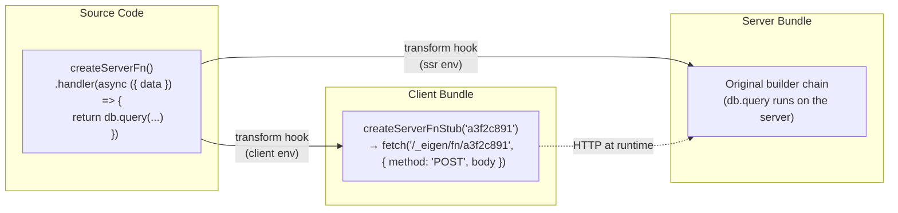

_This is the sixteenth installment in a series where we build a toy Next.js on top of Vite. In [Part 14](/14-framework-middleware), we built a typed middleware pipeline. Now we'll implement server functions — where a developer writes a function that runs on the server, and the framework automatically generates a typed RPC client stub for the browser._

---

## The design goal

The developer experience we're targeting looks like this:

```tsx title="src/pages/Dashboard.tsx"
import { useEffect, useState } from "react";
import { createServerFn } from "eigen/server";
import { db } from "../lib/database"; // Node-only import

type User = { id: string; name: string; role: string };

export const getUsers = createServerFn()
  .validator((input: unknown) => {
    const { role } = input as { role?: unknown };
    if (typeof role !== "string") throw new Error("role must be a string");
    return { role };
  })
  .handler(async ({ data }) => {
    // This code runs on the server ONLY.
    // It can access databases, file systems, secrets — anything.
    const users = await db.query("SELECT * FROM users WHERE role = $1", [data.role]);
    return users.rows as User[];
  });

export default function Dashboard() {
  const [users, setUsers] = useState<User[]>([]);

  useEffect(() => {
    // getUsers() is callable from the browser.
    // Under the hood, it makes a fetch() to a generated API endpoint.
    getUsers({ role: "admin" }).then(setUsers);
  }, []);

  return (
    <ul>
      {users.map((u) => (
        <li key={u.id}>
          {u.name} ({u.role})
        </li>
      ))}
    </ul>
  );
}
```

From the developer's perspective, `getUsers` is just an async function. But the framework does something radical at build time: it **replaces the whole `createServerFn(...)` expression** in the client bundle with a `fetch()` stub that calls a generated endpoint, while keeping the original implementation intact on the server.

This is the architecture behind TanStack Start's `createServerFn`, React's `"use server"` Server Functions (as used by Next.js), and SolidStart's `"use server"` functions. Let's build it.


```mermaid
flowchart LR
    subgraph Source["Source Code"]
        A["createServerFn()\n  .handler(async ({ data }) => {\n    return db.query(...)\n  })"]
    end

    subgraph Server["Server Bundle"]
        B["Original builder chain\n(db.query runs on the server)"]
    end

    subgraph Client["Client Bundle"]
        C["createServerFnStub('a3f2c891')\n→ fetch('/_eigen/fn/a3f2c891',\n  { method: 'POST', body })"]
    end

    A -->|"transform hook\n(ssr env)"| B
    A -->|"transform hook\n(client env)"| C
    C -.->|"HTTP at runtime"| B
```

---

## The runtime: `createServerFn` as a builder

The builder collects three things — the function's own middleware, an input validator, and the handler — and returns a callable. Every step returns a builder with a more specific type, so the handler sees exactly what the earlier steps produced.

```typescript title="packages/eigen/server.ts"
import { executeMiddleware, type MiddlewareFn } from "./middleware";
import type { EigenContext } from "./types";

/** Types that survive JSON serialization (see "Serialization boundaries") */
type JsonPrimitive = string | number | boolean | null;
export type JsonValue = JsonPrimitive | JsonValue[] | { [key: string]: JsonValue };

/** Anything with a parse() method (a zod schema, for example) or a plain function */
export type Validator<T> = { parse(input: unknown): T } | ((input: unknown) => T);

/** What createServerFn produces: callable, plus the endpoint URL (forms use it in Part 38) */
export interface ServerFn<TInput, TResult> {
  (input: TInput): Promise<TResult>;
  url: string;
}

export interface ServerFnBuilder<TContext extends EigenContext, TInput> {
  middleware<TNew extends Record<string, unknown> = {}>(
    mws: MiddlewareFn<TContext, TNew>[],
  ): ServerFnBuilder<TContext & TNew, TInput>;

  validator<T>(validator: Validator<T>): ServerFnBuilder<TContext, T>;

  handler<TResult extends JsonValue | void>(
    fn: (opts: { data: TInput; context: TContext }) => Promise<TResult> | TResult,
  ): ServerFn<TInput, TResult>;
}

export function createServerFn(
  // Kept for API parity with TanStack Start. This toy endpoint always uses POST.
  _options: { method?: "GET" | "POST" } = {},
): ServerFnBuilder<EigenContext, void> {
  const middlewares: MiddlewareFn<any, any>[] = [];
  let validate = (input: unknown): unknown => input;

  const builder: ServerFnBuilder<any, any> = {
    middleware(mws) {
      middlewares.push(...mws);
      return builder;
    },
    validator(v) {
      validate = typeof v === "function" ? v : (input) => v.parse(input);
      return builder;
    },
    handler(fn) {
      // Server-side implementation. The RPC endpoint calls it with the
      // context produced by the global middleware (Part 14). Client
      // bundles never contain this code — the transform replaces it.
      const serverFn = async (input: unknown, baseContext?: EigenContext) => {
        if (!baseContext) {
          throw new Error(
            "Server functions are invoked through their RPC endpoint. " +
              "In server code (loaders), call your data layer directly.",
          );
        }

        // The function's own middleware runs after the global middleware
        const { context, response } = await executeMiddleware(middlewares, baseContext);
        if (response) throw response; // redirect, 401, ... — the endpoint returns it

        let data: unknown;
        try {
          data = validate(input);
        } catch {
          throw Response.json({ error: "Invalid input" }, { status: 400 });
        }

        return fn({ data, context });
      };

      // .url is filled in by the transform on the server and by the stub on the client
      return Object.assign(serverFn, { url: "" });
    },
  };

  return builder;
}
```

Two decisions are worth calling out:

- **Middleware before validation.** An anonymous caller is redirected by the auth middleware before it learns anything about the expected input shape.
- **Calling a server function from server code throws.** The handler needs a request context (cookies, the session user) that only the endpoint can provide. TanStack Start solves this with request-scoped storage; we keep the toy honest and require loaders to call the data layer directly.

<TypeDeepDive title="TypeScript: The builder pattern for type accumulation">

`createServerFn()` returns `ServerFnBuilder<EigenContext, void>`. `.middleware([requireAuth])` returns `ServerFnBuilder<EigenContext & TNew, void>`, where `TNew` is inferred from what the middleware returns. `.validator(v)` replaces `TInput` with the validator's output type `T` — inferred from either `parse()`'s return type or the function's return type. `.handler(fn)` receives `{ data: TInput; context: TContext }` with everything accumulated so far, and produces `ServerFn<TInput, TResult>`. A `TInput` of `void` means the function takes no argument: TypeScript lets you omit trailing `void` parameters, so `getStats()` type-checks without a validator. Each method returns the _same_ builder object at runtime; only the static type gets more specific. This is how TanStack Start, TanStack Router, and tRPC achieve end-to-end type safety.

</TypeDeepDive>

---

## The transform hook — the heart of the system

This is the most complex transform we've built. The plugin needs to:

<Steps>
  <Step>**Detect** exports whose initializer is a `createServerFn(...)` builder chain</Step>
  <Step>**Assign** each a stable ID derived from its file and export name</Step>
  <Step>
    **Replace** the entire chain in the client bundle with an RPC stub, and drop imports only the replaced code used
  </Step>
  <Step>**Keep** the chain on the server, adding its endpoint URL as `.url`</Step>
  <Step>
    **Generate** an `eigen/server-fns` module mapping IDs to the real functions, which the endpoint uses in dev and
    production
  </Step>
</Steps>

Matching a builder chain with a regex means finding the closing parenthesis of `.handler(...)` — which depends on how the code is formatted, and a lazy `[\s\S]*?\n\}\)` happily swallows unrelated code when the formatting differs. So we parse. Vite 8 re-exports Rolldown's Oxc-based `parseAst`, which returns an ESTree AST with `start`/`end` offsets, and `magic-string` edits the source by offset while producing a sourcemap — the same toolkit as [Part 7](/07-transform-hook).

```typescript title="plugins/eigen-server-fns.ts"
import type { Plugin } from "vite";
import { isRunnableDevEnvironment, normalizePath, parseAst } from "vite";
import MagicString from "magic-string";
import { createHash } from "node:crypto";
import { readdirSync, readFileSync } from "node:fs";
import { relative, resolve } from "node:path";
import { sendWebResponse, toWebRequest } from "../packages/eigen/node-http";

const VIRTUAL_ID = "eigen/server-fns";
const RESOLVED_ID = "\0eigen/server-fns";
const SOURCE_FILE = /\.[cm]?[jt]sx?(?:$|\?)/;

/** Stable, short ID from the root-relative file path + export name */
export function generateFnId(file: string, name: string): string {
  return createHash("sha256").update(`${file}:${name}`).digest("hex").slice(0, 8);
}

function toRelative(file: string, root: string): string {
  return normalizePath(relative(root, file.split("?")[0]));
}

/** createServerFn(...), optionally followed by .middleware(...).validator(...).handler(...) */
function isServerFnChain(node: any): boolean {
  while (node?.type === "CallExpression") {
    if (node.callee.type === "Identifier") return node.callee.name === "createServerFn";
    if (node.callee.type !== "MemberExpression") return false;
    node = node.callee.object;
  }
  return false;
}

/** Find `export const NAME = createServerFn()...` declarations */
export function findServerFns(code: string, file: string) {
  const ast = parseAst(code, { lang: /x(?:$|\?)/.test(file) ? "tsx" : "ts" });
  const found: Array<{ name: string; start: number; end: number; statementEnd: number }> = [];

  for (const node of ast.body) {
    if (node.type !== "ExportNamedDeclaration" || node.declaration?.type !== "VariableDeclaration") continue;
    for (const decl of node.declaration.declarations) {
      if (decl.id.type === "Identifier" && decl.init && isServerFnChain(decl.init)) {
        found.push({ name: decl.id.name, start: decl.init.start, end: decl.init.end, statementEnd: node.end });
      }
    }
  }
  return { ast, found };
}

/** Every identifier outside imports and outside the replaced ranges */
function collectIdentifiers(ast: unknown, skip: Array<readonly [number, number]>): Set<string> {
  const names = new Set<string>();
  const visit = (node: any): void => {
    if (!node || typeof node.type !== "string" || node.type === "ImportDeclaration") return;
    if (skip.some(([start, end]) => node.start >= start && node.end <= end)) return;
    if (node.type === "Identifier" || node.type === "JSXIdentifier") names.add(node.name);
    for (const key in node) {
      const value = node[key];
      if (Array.isArray(value)) value.forEach(visit);
      else if (value && typeof value === "object") visit(value);
    }
  };
  visit(ast);
  return names;
}

export function transformForClient(code: string, file: string, root: string) {
  const { ast, found } = findServerFns(code, file);
  if (found.length === 0) return null;

  const s = new MagicString(code);
  const rel = toRelative(file, root);

  // 1. Replace each builder chain with a stub bound to its ID
  for (const fn of found) {
    s.overwrite(fn.start, fn.end, `createServerFnStub(${JSON.stringify(generateFnId(rel, fn.name))})`);
  }

  // 2. Drop imports that only the replaced code used (db, fs, secrets, eigen/server).
  //    Over-approximates "used" (property names count), which errs toward keeping imports.
  const stillUsed = collectIdentifiers(
    ast,
    found.map((fn) => [fn.start, fn.end] as const),
  );
  for (const node of ast.body) {
    if (node.type !== "ImportDeclaration" || node.specifiers.length === 0) continue;
    if (node.specifiers.every((spec) => !stillUsed.has(spec.local.name))) {
      s.remove(node.start, node.end);
    }
  }

  s.prepend(`import { createServerFnStub } from 'eigen/server-fn-client';\n`);
  return { code: s.toString(), map: s.generateMap({ hires: true, source: file }) };
}

export function transformForServer(code: string, file: string, root: string) {
  const { found } = findServerFns(code, file);
  if (found.length === 0) return null;

  const s = new MagicString(code);
  const rel = toRelative(file, root);
  for (const fn of found) {
    const url = `/_eigen/fn/${generateFnId(rel, fn.name)}`;
    s.appendLeft(fn.statementEnd, `\n${fn.name}.url = ${JSON.stringify(url)};`);
  }
  return { code: s.toString(), map: s.generateMap({ hires: true, source: file }) };
}

/** Scan src/ for server functions — the source of truth for eigen/server-fns */
function scanServerFns(root: string) {
  const srcDir = resolve(root, "src");
  const entries: Array<{ file: string; name: string; id: string }> = [];
  for (const rel of readdirSync(srcDir, { recursive: true, encoding: "utf8" })) {
    if (!SOURCE_FILE.test(rel) || rel.includes("__tests__")) continue;
    const file = resolve(srcDir, rel);
    const code = readFileSync(file, "utf8");
    if (!code.includes("createServerFn")) continue;
    for (const fn of findServerFns(code, file).found) {
      entries.push({ file, name: fn.name, id: generateFnId(toRelative(file, root), fn.name) });
    }
  }
  return entries;
}

export default function eigenServerFns(): Plugin {
  let root: string;

  return {
    name: "eigen-server-fns",
    // See the TypeScript source, before the TS/JSX transform
    enforce: "pre",

    configResolved(config) {
      root = config.root;
    },

    resolveId(id) {
      if (id === VIRTUAL_ID) return RESOLVED_ID;
    },

    load(id) {
      if (id !== RESOLVED_ID) return;
      if (this.environment.name === "client") {
        this.error("eigen/server-fns is server-only and must not be imported by client code");
      }

      const entries = scanServerFns(root);
      const files = [...new Set(entries.map((e) => e.file))];
      return [
        ...files.map((f, i) => `import * as ServerFnMod${i} from ${JSON.stringify(normalizePath(f))}`),
        `export const serverFns = {`,
        ...entries.map(
          (e) =>
            `  ${JSON.stringify(e.id)}: { file: ${JSON.stringify(toRelative(e.file, root))}, ` +
            `exportName: ${JSON.stringify(e.name)}, fn: ServerFnMod${files.indexOf(e.file)}.${e.name} },`,
        ),
        `}`,
      ].join("\n");
    },

    transform: {
      filter: { id: { include: SOURCE_FILE, exclude: /node_modules/ }, code: "createServerFn" },
      handler(code, id) {
        return this.environment.name === "client"
          ? transformForClient(code, id, root)
          : transformForServer(code, id, root);
      },
    },

    hotUpdate({ file, modules }) {
      // A source file changed: the set of server functions may have changed too
      if (this.environment.name !== "ssr" || !SOURCE_FILE.test(file)) return;
      const mod = this.environment.moduleGraph.getModuleById(RESOLVED_ID);
      if (!mod) return;
      this.environment.moduleGraph.invalidateModule(mod);
      return [...modules, mod];
    },

    configureServer(server) {
      // The dev RPC endpoint: Node req → Request → entry-server → Response → Node res
      server.middlewares.use(async (req, res, next) => {
        if (!req.url?.startsWith("/_eigen/fn/")) return next();
        try {
          const ssrEnv = server.environments.ssr;
          if (!isRunnableDevEnvironment(ssrEnv)) throw new Error("SSR environment is not runnable");
          const { callServerFn } = (await ssrEnv.runner.import("/src/entry-server.tsx")) as {
            callServerFn: (request: Request) => Promise<Response>;
          };
          await sendWebResponse(res, await callServerFn(await toWebRequest(req)));
        } catch (e) {
          next(e);
        }
      });
    },
  };
}
```

Add `eigenServerFns()` to the plugin array returned by `eigen()` ([Part 11](/11-framework-plugin)), register `eigen/server`, `eigen/server-fn-client`, and `eigen/server-fn-endpoint` in `resolve.alias` and tsconfig `paths` like the other framework modules (`eigen/server-fns` is virtual — the plugin resolves it), and install `magic-string` if [Part 7](/07-transform-hook) hasn't already.

Some details worth noting:

- **`enforce: 'pre'`** — the plugin sees the TypeScript source, so `parseAst` is told to parse `tsx`/`ts`. Running after the TS transform would work too, but then sourcemaps would have to chain through the reprinted output.
- **Hook filters** — `filter: { id, code }` lets Rolldown skip the JavaScript hook entirely for files that don't contain `createServerFn`. The definition file `packages/eigen/server.ts` matches the filter but has no `export const X = createServerFn(...)`, so it passes through unchanged.
- **IDs use root-relative paths**, so the client build, the server build, and every developer's machine compute the same ID.
- **Import pruning is conservative.** An import is removed only when _none_ of its bindings are referenced outside the replaced chains. `import { db, formatDate } from '../lib/database'` stays whole if `formatDate` is used by the component — keep server-only modules in their own import statements.

---

## What the transform actually produces

Given the `Dashboard.tsx` from the design goal:

**Server bundle (ssr environment):**

```tsx
import { useEffect, useState } from "react";
import { createServerFn } from "eigen/server";
import { db } from "../lib/database";

export const getUsers = createServerFn()
  .validator(/* ... */)
  .handler(async ({ data }) => {
    const users = await db.query("SELECT * FROM users WHERE role = $1", [data.role]);
    return users.rows as User[];
  });
getUsers.url = "/_eigen/fn/a3f2c891";

export default function Dashboard() {
  // ... uses getUsers()
}
```

**Client bundle (client environment):**

```tsx
import { createServerFnStub } from "eigen/server-fn-client";
import { useEffect, useState } from "react";

export const getUsers = createServerFnStub("a3f2c891");

export default function Dashboard() {
  // ... uses getUsers() — same call, but it goes over the network
}
```

The stub is a few lines of framework code:

```typescript title="packages/eigen/server-fn-client.ts"
export function createServerFnStub(id: string) {
  const url = `/_eigen/fn/${id}`;

  const call = async (input?: unknown) => {
    const res = await fetch(url, {
      method: "POST",
      headers: { "Content-Type": "application/json" },
      body: JSON.stringify(input ?? null),
    });

    // Middleware redirected (e.g. session expired) — see asClientRedirect in Part 14
    const redirectTo = res.headers.get("X-Eigen-Redirect");
    if (redirectTo) {
      window.location.assign(redirectTo);
      return new Promise<never>(() => {}); // the page is navigating away
    }

    if (!res.ok) {
      const body = await res.json().catch(() => null);
      throw new Error(body?.error ?? `Server function failed (${res.status})`);
    }
    return res.json();
  };

  return Object.assign(call, { url });
}
```

The client bundle has zero server code. The `db` import is gone, and so is `eigen/server` — the builder, the validator, and the handler body never ship. On the server, `getUsers.url` is set too, so a server-rendered `<form action={getUsers.url}>` ([Part 38](/38-forms-mutations)) points at the same endpoint the stub calls.

---

## The RPC endpoint

The endpoint is plain web-standard code, so dev and production share it. It's the most security-sensitive piece of the framework: it's an HTTP entry point that executes server code with caller-supplied arguments.

```typescript title="packages/eigen/server-fn-endpoint.ts"
import { asClientRedirect, executeMiddleware, RedirectResponse, type MiddlewareFn } from "./middleware";
import type { EigenContext } from "./types";

export type ServerFnImpl = (input: unknown, baseContext: EigenContext) => Promise<unknown>;

/** One entry of the generated eigen/server-fns registry */
export interface ServerFnRegistration {
  /** Root-relative source file, e.g. 'src/pages/Dashboard.tsx' (for logs and tracing) */
  file: string;
  /** The export name, e.g. 'getUsers' */
  exportName: string;
  fn: ServerFnImpl;
}

export const SERVER_FN_PREFIX = "/_eigen/fn/";

function isSameOrigin(request: Request): boolean {
  const origin = request.headers.get("origin");
  if (!origin) return false;
  try {
    return new URL(origin).host === new URL(request.url).host;
  } catch {
    return false; // e.g. "Origin: null" from sandboxed iframes
  }
}

export async function handleServerFnRequest(
  request: Request,
  serverFns: Record<string, ServerFnRegistration>,
  globalMiddleware: MiddlewareFn<any, any>[],
): Promise<Response> {
  if (request.method !== "POST") {
    return new Response("Method Not Allowed", { status: 405, headers: { Allow: "POST" } });
  }

  // A cross-site <form> can POST text/plain or form data, but not
  // application/json without passing a CORS preflight first.
  if (!request.headers.get("content-type")?.startsWith("application/json")) {
    return new Response("Unsupported Media Type", { status: 415 });
  }

  // Defense in depth against CSRF: browsers always send Origin on POST.
  if (!isSameOrigin(request)) {
    return new Response("Forbidden", { status: 403 });
  }

  // Only functions the build discovered are callable — never an arbitrary module/export
  const pathname = new URL(request.url).pathname;
  const fnId = pathname.slice(SERVER_FN_PREFIX.length);
  const registration = Object.hasOwn(serverFns, fnId) ? serverFns[fnId] : undefined;
  if (!registration) return Response.json({ error: "Server function not found" }, { status: 404 });

  let input: unknown;
  try {
    input = await request.json();
  } catch {
    return Response.json({ error: "Invalid JSON" }, { status: 400 });
  }

  // Global middleware from Part 14 — the same session/rate-limit code as page requests
  const { context, response } = await executeMiddleware(globalMiddleware, {
    request,
    params: {},
    pathname,
  });
  if (response) return asClientRedirect(response);

  try {
    const result = await registration.fn(input, context);
    return Response.json(result ?? null);
  } catch (e) {
    if (e instanceof Response) return asClientRedirect(e);
    if (e instanceof RedirectResponse) return asClientRedirect(e.toResponse());
    console.error(`Server function ${registration.exportName} (${registration.file}) failed:`, e);
    // Don't leak internals (SQL errors, stack traces) to the caller
    return Response.json({ error: "Server function failed" }, { status: 500 });
  }
}
```

The server entry wires it to the generated registry and the global middleware:

```tsx title="src/entry-server.tsx"
import { serverFns } from "eigen/server-fns";
import { handleServerFnRequest } from "eigen/server-fn-endpoint";
import { globalMiddleware } from "eigen/routes";

export function callServerFn(request: Request): Promise<Response> {
  return handleServerFnRequest(request, serverFns, globalMiddleware);
}
```

```typescript title="packages/eigen/virtual.d.ts"
declare module "eigen/server-fns" {
  import type { ServerFnRegistration } from "eigen/server-fn-endpoint";
  export const serverFns: Record<string, ServerFnRegistration>;
}
```

In dev, the plugin's `configureServer` middleware above forwards `/_eigen/fn/*` to `callServerFn` through the SSR module runner. In production, the H3 server from [Part 6](/06-production-builds#the-production-server) mounts it in one line:

```typescript title="server.prod.ts"
app.post("/_eigen/fn/**", (event) => callServerFn(event.req));
```

Because `eigen/server-fns` statically imports every server function, the production server bundle contains them all, and an ID resolves to a function with a single object lookup. No manifest of source paths is needed — source files don't exist in production anyway.

The Origin check compares against the request's own host. Behind a proxy that rewrites `Host`, compare against your public origin (or a trusted `X-Forwarded-Host`) instead. Next.js Server Actions apply the same Origin-vs-Host check.

---

## The type preservation question

The client stub is untyped JavaScript — `createServerFnStub("a3f2c891")` knows nothing about `{ role: string }` or `User[]`. Do we need to generate declarations for the transformed module?

**No.** TypeScript's language server analyzes the _source_ `.tsx` file, not the transformed output. The source still has the full builder chain, so the IDE sees:

```typescript
export const getUsers: ServerFn<{ role: string }, User[]>;
```

And Vite serves the browser a version where the chain is replaced with a stub. The types live in the source; the implementation lives in the transform output. They never need to be in the same file at the same time.

This is a profound insight about Vite's architecture: **TypeScript checks source files, Vite transforms source files, and the browser receives the transformed output.** The type system and the runtime operate on different representations of the same code. A `transform` hook can completely rewrite a function's implementation without affecting its types, because the type checker never sees the transformed code. The obligation that comes with this freedom: the stub must actually honor the source's type — same input, same JSON-decoded output — which is what the serialization constraint below enforces.

---

## Serialization boundaries

<Callout type="warn" title="Serialization boundaries">
  Server functions introduce a serialization constraint: everything that crosses the network — both arguments and return
  values — must survive `JSON.stringify`/`JSON.parse`. You can't pass a `Date` object (it becomes a string), a `Map` (it
  becomes `{}`), or a function (it vanishes).
</Callout>

That's why `handler` constrains its result with `TResult extends JsonValue | void`:

```typescript
createServerFn().handler(async () => new Date());
// TS Error: Type 'Date' does not satisfy the constraint 'JsonValue | void'
```

`Date` is an interface with methods, so it isn't assignable to `{ [key: string]: JsonValue }`. The constraint is deliberately restrictive. One sharp edge: _interfaces_ never get implicit index signatures, so returning a value typed with `interface User { ... }` fails too, while the equivalent `type User = { ... }` passes. Developers sometimes need to map rich types to plain objects before returning them.

Inputs are covered by the validator rather than the type system: whatever arrives is `unknown` JSON until `validate()` has checked it.

A more permissive approach uses a richer serializer that handles `Date`, `Map`, `Set`, `undefined`, and even circular references, loosening the type constraint accordingly — serialization mistakes then become runtime errors instead of compile errors. TanStack Start takes that route (it serializes with [seroval](https://github.com/lxsmnsyc/seroval)). React's Server Functions use React's own Flight serialization, which supports a defined set of types including `Date`, `Map`, `Set`, and promises. The choice depends on how much safety vs. flexibility the framework prioritizes.

---

## Server function middleware

The builder's `.middleware()` runs _after_ the global middleware from [Part 14](/14-framework-middleware), and its output is merged into the handler's `context`:

```typescript title="src/pages/Settings.tsx"
import { createServerFn } from "eigen/server";
import { redirect } from "eigen/middleware";
import { requireAuth } from "../middleware/require-auth";
import { db } from "../lib/database";

export const updateName = createServerFn({ method: "POST" })
  .middleware([requireAuth])
  .validator((input: unknown) => {
    const { name } = input as { name?: unknown };
    if (typeof name !== "string" || name.length === 0) throw new Error("name is required");
    return { name };
  })
  .handler(async ({ data, context }) => {
    // context: EigenContext — request, pathname, user (from the global session middleware)
    const user = context.user ?? redirect("/login");
    await db.query("UPDATE users SET name = $1 WHERE id = $2", [data.name, user.id]);
  });
```

Each piece of middleware is listed exactly once: global middleware in `src/middleware.ts`, function-specific middleware on the builder. Nothing runs twice, and nothing is skipped because a request came through the RPC endpoint instead of a page.

`.middleware()` infers a single output type from the array, so if two middlewares add _different_ context properties, call `.middleware()` twice — once per middleware — to keep the accumulated type precise.

---

## How other frameworks express the boundary

### TanStack Start

Our builder deliberately mirrors TanStack Start's:

```typescript
// TanStack Start
import { createServerFn } from "@tanstack/react-start";
import { z } from "zod";

const getUser = createServerFn({ method: "GET" })
  .middleware([authMiddleware])
  .validator(z.object({ userId: z.string() }))
  .handler(async ({ data, context }) => {
    // data is typed from the validator: { userId: string }
    // context is typed from the middleware
    return db.query("SELECT * FROM users WHERE id = $1", [data.userId]);
  });
```

The structural differences are the ones we chose to skip: GET functions that pass input in the query string (so responses can be cached), request-scoped storage so server functions can be called from server code, and a richer serializer.

### `"use server"`

React's Server Functions (Next.js calls them Server Actions when used for mutations) use a directive instead of a wrapper:

```tsx
// actions.ts
"use server";

export async function getUsers(filter: { role: string }) {
  const users = await db.query(/* ... */);
  return users.rows;
}
```

A file-level `"use server"` marks every export of the module as a server function; the directive can also appear at the top of an individual async function body. The bundler integration (SWC in Next.js) detects the directive and does what our transform does: keep the implementation on the server and give the client a reference that calls an endpoint.

The difference is how visible the boundary is. With `"use server"`, a developer looking at a call site in a client component can't tell whether it's a local function or a network request without opening the source file. `createServerFn` makes the boundary explicit at the definition: the import, the builder chain, and the `.handler()` call all signal "this crosses the network." The trade-off is verbosity for clarity. The explicit form is also easier to type, because the builder provides natural places for the validator and the serialization constraint. Either way, the request is a public HTTP endpoint — validation and authorization belong inside it, not in the UI that calls it.

The underlying Vite mechanism is the same for both: a `transform` hook that rewrites server code into a stub based on the target environment.

---

## What to observe

1. **Inspect the transform output.** With `vite-plugin-inspect`, open a file that uses `createServerFn` in both environments. The _ssr_ version has the full builder chain plus a `.url` assignment; the _client_ version has `createServerFnStub("…")` and no `db` import.

2. **Check the browser's Network tab** when calling a server function. You'll see a POST to `/_eigen/fn/a3f2c891` with a JSON body and a JSON response.

3. **Try the endpoint from outside the app.** `curl -X POST localhost:3000/_eigen/fn/a3f2c891 -d '{"role":"admin"}'` gets a `415` (no JSON content type); add `-H 'content-type: application/json'` and you get a `403` (no matching `Origin`).

4. **Hover over `getUsers` in your IDE.** Despite the `transform` rewriting the whole expression, TypeScript shows `ServerFn<{ role: string }, User[]>`. The type information comes from the source file, not the transformed output.

5. **Return a `Date` from a handler.** TypeScript rejects it at compile time.

6. **Add a `console.log` inside a handler.** It appears in the _terminal_ (server), not the browser console — confirming the code runs server-side even though it's called from a client component.

---

## Key insight

Server functions are the most demanding use of Vite's `transform` hook so far. The same source file produces two different programs: the server bundle keeps the original (database access, filesystem, secrets), while the client bundle gets an RPC stub (fetch, serialize, deserialize). The TypeScript types survive this transformation because the type checker operates on the source code, not the transformed output.

The other half of the lesson is that the transform creates an HTTP endpoint. Everything an attacker can send to `/_eigen/fn/:id` — any method, any content type, any origin, any JSON — has to be handled: an allowlist of discovered functions, same-origin JSON-only POSTs, global middleware, per-function middleware, and input validation before the handler runs.

This separation of concerns — types from source, implementation from transform, transport from convention — is the fundamental architecture of modern full-stack TypeScript frameworks. Whether it's `createServerFn` (TanStack Start) or `"use server"` (React, Next.js, SolidStart), the mechanism is the same: a compiler pass that rewrites server code based on the target environment, plus a generated endpoint that runs it.

---

<TestSection title="Testing: server function transforms and the endpoint">

Server functions have two testable surfaces: the transforms that generate stubs, and the endpoint that executes functions. Both are exported as plain functions, so the tests exercise the real code rather than a copy of its regexes.

```typescript title="plugins/__tests__/eigen-server-fns.test.ts"
import { describe, it, expect } from "vitest";
import { generateFnId, transformForClient, transformForServer } from "../eigen-server-fns";

const root = "/project";
const file = "/project/src/pages/Dashboard.tsx";

const input = `import { createServerFn } from 'eigen/server'
import { db } from '../lib/database'
import { formatName } from '../lib/format'

export const getUsers = createServerFn()
  .validator((input: unknown) => input as { role: string })
  .handler(async ({ data }) => {
    if (data.role === 'x') { return [] }
    const users = await db.query('SELECT * FROM users WHERE role = $1', [data.role])
    return users.rows
  })

export const ping = createServerFn().handler(async () => 'pong')

export default function Dashboard() {
  return <div>{formatName('Dashboard')}</div>
}`;

describe("generateFnId", () => {
  it("produces stable IDs for the same input", () => {
    expect(generateFnId("src/pages/Dashboard.tsx", "getUsers")).toBe(
      generateFnId("src/pages/Dashboard.tsx", "getUsers"),
    );
  });

  it("produces different IDs for different functions and files", () => {
    const id = generateFnId("src/pages/Dashboard.tsx", "getData");
    expect(generateFnId("src/pages/Dashboard.tsx", "other")).not.toBe(id);
    expect(generateFnId("src/pages/Settings.tsx", "getData")).not.toBe(id);
  });
});

describe("transformForClient", () => {
  const output = transformForClient(input, file, root)!.code;

  it("replaces every builder chain with a stub, regardless of formatting", () => {
    const id = generateFnId("src/pages/Dashboard.tsx", "getUsers");
    expect(output).toContain(`export const getUsers = createServerFnStub("${id}")`);
    expect(output).toContain("export const ping = createServerFnStub(");
  });

  it("removes server-only code and the imports only it used", () => {
    expect(output).not.toContain("db.query");
    expect(output).not.toContain("../lib/database");
    expect(output).not.toContain("from 'eigen/server'");
  });

  it("keeps imports the component still uses", () => {
    expect(output).toContain("from '../lib/format'");
    expect(output).toContain("export default function Dashboard");
  });

  it("ignores files without server functions", () => {
    expect(transformForClient("export const x = 1", file, root)).toBeNull();
  });
});

describe("transformForServer", () => {
  it("keeps the implementation and attaches the endpoint URL", () => {
    const output = transformForServer(input, file, root)!.code;
    const id = generateFnId("src/pages/Dashboard.tsx", "getUsers");
    expect(output).toContain("db.query");
    expect(output).toContain(`getUsers.url = "/_eigen/fn/${id}";`);
  });
});
```

```typescript title="packages/eigen/__tests__/server-fn-endpoint.test.ts"
import { describe, it, expect } from "vitest";
import { createServerFn } from "eigen/server";
import { handleServerFnRequest, type ServerFnImpl } from "eigen/server-fn-endpoint";
import type { MiddlewareFn } from "eigen/middleware";

const greet = createServerFn()
  .validator((input: unknown) => input as { name: string })
  .handler(async ({ data, context }) => `hi ${data.name} (${String(context.user)})`);

const fns = {
  abc123: { file: "src/pages/Greet.tsx", exportName: "greet", fn: greet as unknown as ServerFnImpl },
};
const session: MiddlewareFn = () => ({ user: "ada" });

function call(init: { method?: string; headers?: Record<string, string>; body?: string }, id = "abc123") {
  return handleServerFnRequest(new Request(`http://localhost/_eigen/fn/${id}`, init), fns, [session]);
}

const ok = {
  method: "POST",
  headers: { "content-type": "application/json", origin: "http://localhost" },
  body: JSON.stringify({ name: "grace" }),
};

describe("handleServerFnRequest", () => {
  it("runs global middleware and the handler", async () => {
    const res = await call(ok);
    expect(await res.json()).toBe("hi grace (ada)");
  });

  it("rejects non-POST, non-JSON, and cross-origin requests", async () => {
    expect((await call({ ...ok, method: "GET", body: undefined })).status).toBe(405);
    expect((await call({ ...ok, headers: { ...ok.headers, "content-type": "text/plain" } })).status).toBe(415);
    expect((await call({ ...ok, headers: { ...ok.headers, origin: "https://evil.example" } })).status).toBe(403);
  });

  it("only calls registered functions", async () => {
    expect((await call(ok, "constructor")).status).toBe(404);
  });
});
```

The ID stability test is critical — if IDs differ between the client and server builds, the client's `fetch()` calls hit the wrong endpoint. The `'constructor'` test guards the allowlist: a naive `serverFns[id]` lookup would find `Object.prototype.constructor` and call it.

</TestSection>

## What's next

In [Part 16](/16-static-site-generation), we'll add **static site generation** — a `buildApp` hook that pre-renders pages after the client and server builds finish, with a typed `generateStaticParams` convention for dynamic routes.
