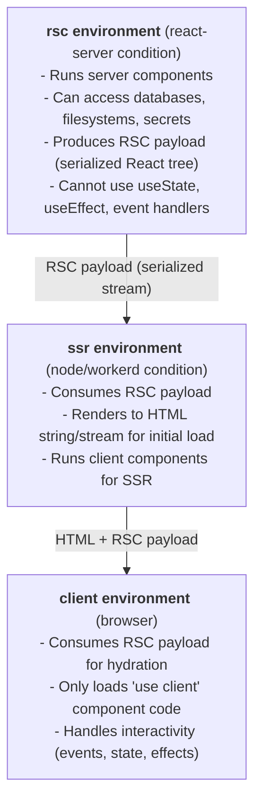

*This is the twenty-first installment in a series where we build a toy Next.js on top of Vite. In [Part 20](/20-observability), we added observability. Now we'll implement React Server Components — the feature that brings together everything we've built: multiple environments, streaming, code transformation, and the boundary between server and client code.*

---

## What RSC actually is

React Server Components is a rendering model where some components run *only* on the server and are never included in the client JavaScript bundle. Unlike SSR (where all components run on both server and client), RSC components run on the server, produce a serialized representation (the RSC payload), and the client React runtime consumes that payload without ever loading the component code.

The key distinction from everything we've built so far:

| Feature | SSR (Parts 3–4) | RSC |
|---|---|---|
| Server rendering | Components run on server, HTML is produced | Components run on server, RSC payload is produced |
| Client bundle | All component code ships to browser | Only `"use client"` components ship to browser |
| Hydration | Client re-runs all components to attach events | Client only runs `"use client"` components |
| Data fetching | Separate loader convention | Components fetch data directly (async components) |

RSC eliminates the loader pattern entirely. A server component *is* the data fetching layer:

```tsx
// This component runs on the server ONLY.
// It's never bundled for the browser.
// No loader needed — the component IS the loader.
async function PostPage({ params }: { params: { id: string } }) {
  const post = await db.query('SELECT * FROM posts WHERE id = $1', [params.id])
  return (
    <article>
      <h1>{post.title}</h1>
      <LikeButton postId={post.id} />  {/* This is a client component */}
    </article>
  )
}
```

---

## The three-environment model

RSC requires three environments, each with different module resolution:



<Callout type="info" title="The RSC environment">
The `rsc` environment is the critical addition. It uses the `react-server` export condition, which gives it a version of React that supports async components and server-only APIs but *does not* include hooks like `useState` or `useEffect`.
</Callout>

---

## Configuring the RSC environment in Vite

```typescript title="vite.config.ts"
import { defineConfig } from 'vite'
import react from '@vitejs/plugin-react'
import rsc from '@vitejs/plugin-rsc'
import eigen from 'eigen/plugin'

export default defineConfig({
  plugins: [
    eigen(),
    rsc({
      entries: {
        rsc: 'src/entry-rsc.tsx',
        ssr: 'src/entry-ssr.tsx',
        client: 'src/entry-client.tsx',
      },
    }),
    react(),
  ],
  environments: {
    rsc: {
      resolve: {
        // The critical condition — React exports server-only APIs
        conditions: ['react-server'],
      },
      build: {
        outDir: 'dist/rsc',
        rolldownOptions: {
          input: 'src/entry-rsc.tsx',
        },
      },
    },
    ssr: {
      build: {
        outDir: 'dist/server',
        rolldownOptions: {
          input: 'src/entry-ssr.tsx',
        },
      },
    },
  },
})
```

The `@vitejs/plugin-rsc` official plugin (from the Vite team) handles the low-level RSC bundler requirements: tracking `"use client"` boundaries, generating client reference manifests, wiring up `react-server-dom` APIs, and coordinating the module graphs across environments. We build *on top of* it rather than reimplementing the RSC protocol.

---

## The `"use client"` boundary

In RSC, all components are server components by default. To make a component interactive (with hooks, event handlers, browser APIs), you add `"use client"` at the top of the file:

```tsx title="src/components/LikeButton.tsx"
"use client"

import { useState } from 'react'

export function LikeButton({ postId }: { postId: string }) {
  const [liked, setLiked] = useState(false)

  return (
    <button onClick={() => setLiked(!liked)}>
      {liked ? '❤️' : '🤍'} Like
    </button>
  )
}
```

### What `"use client"` means for the plugin pipeline

When the `rsc` environment encounters `"use client"`, the file is *not* bundled into the RSC output. Instead, `@vitejs/plugin-rsc` generates a **client reference** — a small object that says "this component exists, its module ID is X, its export name is Y." The RSC stream includes this reference instead of the component's rendered output.

The transform looks roughly like:

```typescript
// In the rsc environment, LikeButton.tsx becomes:
import { registerClientReference } from '@vitejs/plugin-rsc/rsc'

export const LikeButton = registerClientReference(
  'src/components/LikeButton.tsx',  // module ID
  'LikeButton',                      // export name
)
```

The SSR and client environments import the *actual* component code. The RSC environment only sees a reference marker. This is the mechanism that keeps server-only code (database imports, API secrets) out of the client bundle — not through a `transform` hook stripping code (our approach in Part 7), but through entirely separate module graphs that resolve the same import differently.

---

## The RSC rendering pipeline

Rendering a page with RSC is a three-phase process:

### Phase 1: RSC rendering (rsc environment)

```typescript title="src/entry-rsc.tsx"
import { renderToReadableStream } from '@vitejs/plugin-rsc/rsc'

// This is the RSC-specific renderToReadableStream, NOT react-dom/server's.
// It produces an RSC payload stream, not an HTML stream.

export async function renderRSC(pathname: string): Promise<ReadableStream> {
  const match = matchRoute(pathname)
  if (!match) return renderToReadableStream(<h1>404</h1>)

  const Component = match.route.component
  // Server components can be async — they fetch data directly
  const element = <Component params={match.params} />

  return renderToReadableStream(element)
}
```

The output of Phase 1 is an **RSC payload** — a binary stream that encodes the React element tree. Server component output is serialized inline. Client component references are included as markers. Props passed from server to client components are serialized.

### Phase 2: SSR rendering (ssr environment)

```typescript title="src/entry-ssr.tsx"
import { createFromReadableStream } from '@vitejs/plugin-rsc/ssr'
import { renderToPipeableStream } from 'react-dom/server'

export async function renderToHTML(
  rscStream: ReadableStream,
): Promise<{ pipe: Function }> {
  // Deserialize the RSC payload into a React element tree
  // Client references are resolved to actual component imports
  const element = await createFromReadableStream(rscStream)

  // Render the full tree (server + client components) to HTML
  return renderToPipeableStream(element)
}
```

Phase 2 takes the RSC payload, deserializes it into a React tree (resolving client references to actual component code), and renders the whole thing to HTML using the standard `renderToPipeableStream` from Part 12.

### Phase 3: Client hydration (client environment)

```typescript title="src/entry-client.tsx"
import { createFromReadableStream } from '@vitejs/plugin-rsc/browser'
import { hydrateRoot } from 'react-dom/client'

// The RSC payload is embedded in the HTML or fetched separately
const rscStream = /* ... get the RSC payload ... */
const element = await createFromReadableStream(rscStream)

hydrateRoot(document.getElementById('root')!, element)
```

The client only hydrates `"use client"` components. Server components are already rendered in the HTML — the client doesn't load or execute their code at all.

---

## What this means for Eigen's architecture

RSC changes our framework architecture in several ways:

### Loaders become unnecessary

With server components, data fetching happens *inside* the component:

```tsx
// Server component — no loader export needed
async function PostPage({ params }: { params: { id: string } }) {
  const post = await db.query('SELECT * FROM posts WHERE id = $1', [params.id])
  return <article><h1>{post.title}</h1><p>{post.body}</p></article>
}
```

The `defineLoader` pattern from Part 5 and `createServerFn` from Part 15 are still useful for mutations and client-initiated data fetching, but the primary read path is just... React components that are async.

### The `transform` hook changes role

In our SSR architecture, the `transform` hook strips loaders from client bundles (Part 7). In RSC, the boundary is enforced by *module graph separation* — the rsc and client environments are distinct graphs with different resolve conditions. The `"use client"` directive tells the RSC environment "stop here, emit a reference." The `transform` hook's role shifts to processing these directives and generating the reference metadata.

### The virtual route module becomes three-way

```typescript
load(id: string) {
  if (id !== resolvedVirtualModuleId) return

  const envName = this.environment?.name

  if (envName === 'rsc') {
    // RSC: import server components directly
    // "use client" components are automatically handled by @vitejs/plugin-rsc
    return generateRouteCode(routes, {
      lazy: false,
      includeLoaders: false,  // No loaders — components fetch their own data
    })
  } else if (envName === 'ssr') {
    // SSR: import all components for HTML rendering
    return generateRouteCode(routes, { lazy: false, includeLoaders: false })
  } else {
    // Client: lazy import only "use client" components
    return generateRouteCode(routes, { lazy: true, includeLoaders: false })
  }
}
```

### Build orchestration becomes four-phase

```typescript
buildApp: {
  async handler(builder) {
    // 1. Client build (generates manifest + client reference IDs)
    await builder.build(builder.environments.client)
    // 2. RSC build (server components, references client manifest)
    await builder.build(builder.environments.rsc)
    // 3. SSR build (HTML rendering, consumes RSC output)
    await builder.build(builder.environments.ssr)
  },
}
```

---

## Typing across the RSC boundary

The type challenge with RSC is at the server/client component boundary. When a server component passes props to a client component, those props must be serializable (they cross the RSC wire format):

```tsx
// Server component
async function PostPage({ params }: { params: { id: string } }) {
  const post = await db.query(...)
  return (
    <article>
      <h1>{post.title}</h1>
      {/* Props passed to client components must be serializable */}
      <LikeButton postId={post.id} initialCount={post.likes} />
      {/* This would be a type error with proper constraints: */}
      {/* <LikeButton onLike={() => db.increment(post.id)} /> */}
    </article>
  )
}
```

You can't pass functions, classes, or other non-serializable values from server to client components. A type-safe framework would enforce this:

```typescript
// Hypothetical: constrain props passed across the boundary
type SerializableProps<T> = {
  [K in keyof T]: T[K] extends Function ? never
    : T[K] extends Date ? never
    : T[K]
}
```

In practice, React's own types (with `react-server` conditions) enforce some of these constraints, and `@vitejs/plugin-rsc` adds build-time warnings for common mistakes.

---

## The relationship between `"use server"` and server functions

RSC introduces `"use server"` as a way to define server functions that client components can call — this is essentially our `createServerFn` from Part 15, but as a language-level directive:

```tsx title="src/actions/posts.ts"
"use server"

export async function likePost(postId: string): Promise<{ likes: number }> {
  await db.query('UPDATE posts SET likes = likes + 1 WHERE id = $1', [postId])
  const result = await db.query('SELECT likes FROM posts WHERE id = $1', [postId])
  return { likes: result.rows[0].likes }
}
```

```tsx title="src/components/LikeButton.tsx"
"use client"
import { likePost } from '../actions/posts'

export function LikeButton({ postId }: { postId: string }) {
  const [likes, setLikes] = useState(0)

  async function handleClick() {
    const result = await likePost(postId) // Calls the server via RPC
    setLikes(result.likes)
  }

  return <button onClick={handleClick}>{likes} Likes</button>
}
```

The mechanism is identical to Part 15: the `rsc` environment keeps the function body, the `client` environment gets an RPC stub. The `"use server"` directive is the signal (instead of `createServerFn`), and `@vitejs/plugin-rsc` handles the transform.

---

## What to observe

1. **Check the three build outputs.** `dist/client/` contains only `"use client"` component code. `dist/rsc/` contains server components. `dist/server/` contains the SSR renderer that ties them together.

2. **Compare bundle sizes.** In the client bundle, server components are completely absent — not even their import paths appear. Only client components and the RSC runtime are bundled.

3. **Inspect the RSC payload.** In development, fetch `/_rsc?pathname=/posts/1` and examine the binary stream. You'll see serialized React elements, client references (module IDs), and serialized props.

4. **Try using `useState` in a server component.** React's type definitions under the `react-server` condition don't export `useState`, so TypeScript catches it at compile time — the hook literally doesn't exist in the type system for the RSC environment.

5. **Watch `@vitejs/plugin-rsc`'s transform output** in `vite-plugin-inspect`. The same `LikeButton.tsx` file produces three different outputs: a client reference stub (rsc), the full component (ssr), and the hydration-ready component (client).

---

## Key insight

React Server Components is the architectural culmination of everything this series has built. It takes the multi-environment model to its logical conclusion: not just "client and server" but "client, SSR server, and RSC server" — three separate module graphs with three different resolve conditions processing the same source files into three different outputs.

The Vite concepts are exactly the ones we've used throughout:

- **Virtual modules** (Part 2) generate route tables per environment
- **`ssrLoadModule`** (Part 3) becomes multi-environment module loading
- **Streaming** (Part 12) carries the RSC payload from server to client
- **Code transformation** (Part 7/15) enforces `"use client"` and `"use server"` boundaries
- **`buildApp`** (Part 11) orchestrates the three-phase build
- **Environment API** (Part 19) provides the multi-runtime foundation

RSC doesn't add new Vite concepts — it pushes the existing ones to their full generality. A framework is a coordinated set of code transformations operating across multiple environments from a single source tree. That's been the thesis of this series from Part 0, and RSC is its most complete expression.

---

## What's next

With the core framework complete, the remaining parts explore the frontier — new browser APIs and emerging patterns that are reshaping what frameworks do. In Part 22, we'll replace our `pushState`/`popstate` router with the **Navigation API**, the browser-native routing primitive that became Baseline in January 2026.
