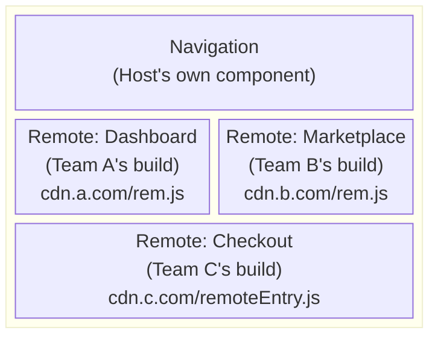

*This is the twenty-ninth and final installment in a series where we build a toy Next.js on top of Vite. In [Part 28](/28-realtime-websockets), we added real-time WebSocket communication. Now we'll explore Module Federation — composing independently-deployed applications into a unified UI, where different teams ship different parts of the product as separate Vite builds that integrate at runtime.*

**Concepts introduced:** Module Federation concepts (host/remote, shared dependencies), Vite's `@module-federation/vite` plugin, runtime module loading, shared React instances, typed remote module contracts, independent deployment, the "micro-frontend" architecture, version negotiation for shared libraries, server-side composition vs. client-side composition.

---

## The problem Module Federation solves

In a large organization, a single Vite build becomes a bottleneck. The marketing team, the dashboard team, and the checkout team all share a monorepo (or worse, deploy from the same CI pipeline). A CSS change in the footer blocks the checkout team's hotfix.

Module Federation allows each team to build and deploy independently. The "host" application loads "remote" modules at runtime from other deployed applications. Each remote is a separate Vite build with its own deployment pipeline:



Each remote is built, tested, and deployed independently. The host loads them at runtime.

---

## Vite and Module Federation

Module Federation originated in webpack 5. The `@module-federation/vite` plugin brings the same model to Vite:

```typescript title="vite.config.ts"
import { defineConfig } from 'vite'
import react from '@vitejs/plugin-react'
import { federation } from '@module-federation/vite'
import eigen from 'eigen/plugin'

export default defineConfig({
  plugins: [
    eigen(),
    react(),
    federation({
      name: 'host',
      remotes: {
        // Each remote is loaded at runtime from its deployment URL
        dashboard: 'dashboard@https://dashboard.cdn.example.com/remoteEntry.js',
        marketplace: 'marketplace@https://marketplace.cdn.example.com/remoteEntry.js',
        checkout: 'checkout@https://checkout.cdn.example.com/remoteEntry.js',
      },
      shared: {
        // These libraries are shared — only loaded once, not per-remote
        react: { singleton: true, requiredVersion: '^19.0.0' },
        'react-dom': { singleton: true, requiredVersion: '^19.0.0' },
      },
    }),
  ],
})
```

```typescript title="vite.config.ts (dashboard remote)"
import { defineConfig } from 'vite'
import react from '@vitejs/plugin-react'
import { federation } from '@module-federation/vite'

export default defineConfig({
  plugins: [
    react(),
    federation({
      name: 'dashboard',
      filename: 'remoteEntry.js',
      exposes: {
        // These modules are available to the host
        './DashboardApp': './src/DashboardApp.tsx',
        './MetricsWidget': './src/widgets/MetricsWidget.tsx',
      },
      shared: {
        react: { singleton: true },
        'react-dom': { singleton: true },
      },
    }),
  ],
})
```

---

## Consuming remote modules

The host application imports remote modules using a special import convention:

```tsx
// In the host — loading a remote module
const DashboardApp = React.lazy(() => import('dashboard/DashboardApp'))
const MetricsWidget = React.lazy(() => import('marketplace/MetricsWidget'))

function App() {
  return (
    <div>
      <Navigation />
      <Suspense fallback={<div>Loading dashboard...</div>}>
        <DashboardApp />
      </Suspense>
    </div>
  )
}
```

At build time, these imports don't resolve to local files — the federation plugin marks them as external. At runtime, the `remoteEntry.js` script is loaded from the CDN, and the module is resolved from the remote's bundle.

### How it works under the hood

1. **Build time:** The federation plugin generates a `remoteEntry.js` manifest for each remote that lists its exposed modules and shared dependency versions.
2. **Runtime:** The host loads each remote's `remoteEntry.js`, negotiates shared dependency versions, and lazy-loads exposed modules on demand.
3. **Shared libraries:** React is loaded once by the host. All remotes use the same React instance — no duplicate React in the bundle.

---

## Typing remote modules

The critical challenge: how does the host's TypeScript know the shape of remote modules? They're loaded at runtime from a CDN.

### Approach 1: Shared type packages

Each team publishes a types-only npm package:

```typescript
// @dashboard-team/types (published to npm)
export interface DashboardAppProps {
  userId: string
  theme: 'light' | 'dark'
}

export interface MetricsWidgetProps {
  metrics: string[]
  timeRange: '1h' | '24h' | '7d'
}
```

The host imports these types:

```typescript
// In the host's type declarations
declare module 'dashboard/DashboardApp' {
  import type { DashboardAppProps } from '@dashboard-team/types'
  const DashboardApp: React.ComponentType<DashboardAppProps>
  export default DashboardApp
}
```

### Approach 2: Generated type declarations

The `@module-federation/typescript` plugin generates `.d.ts` files from remotes at build time:

```typescript
// Host vite.config.ts
import { federation } from '@module-federation/vite'
import { FederationTypePlugin } from '@module-federation/typescript'

export default defineConfig({
  plugins: [
    federation({ /* ... */ }),
    FederationTypePlugin({
      // Downloads type declarations from remotes at build time
      remotes: {
        dashboard: 'https://dashboard.cdn.example.com/types/',
      },
    }),
  ],
})
```

This fetches `.d.ts` files that each remote publishes alongside its `remoteEntry.js`, giving the host IDE-level type safety over remote modules.

---

## Integration with Eigen's route system

Module Federation composes naturally with file-based routing. Remote modules can provide entire route sub-trees:

```typescript
// In the host's route plugin — extending Part 2
// A special convention for federated routes:
// src/pages/dashboard.remote.ts → loads from the dashboard remote

// src/pages/dashboard.remote.ts
export { default } from 'dashboard/DashboardApp'
export const layout = () => import('dashboard/DashboardLayout')
```

The route plugin detects `.remote.ts` files and generates lazy imports that resolve through Module Federation:

```typescript
// Generated virtual module
const DashboardPage = React.lazy(() => import('dashboard/DashboardApp'))

export const routes = [
  { path: '/dashboard', component: DashboardPage },
  // ... other routes
]
```

---

## Server-side composition

For SSR, remote modules need to be available on the server. This introduces complexity: the server can't load modules from a CDN URL at runtime the way a browser can.

Two approaches:

**Build-time integration:** The SSR build includes the remote modules as regular npm dependencies. The client build uses Module Federation for independent deployment. This means the server always runs a coordinated version, while the client can load independently-deployed remotes.

**Runtime server federation:** Use `@module-federation/node` to load remotes on the server at runtime, similar to how the browser does it. This enables fully independent deployment for both client and server, but requires more infrastructure (a shared module registry).

---

## Version negotiation

When the host expects React 19.2 but a remote was built with React 19.0, the `shared` configuration handles version negotiation:

```typescript
shared: {
  react: {
    singleton: true,
    // Only one version of React can exist (singleton)
    requiredVersion: '^19.0.0',
    // The host's version is used if compatible
    // If incompatible, the remote loads its own copy (bad — two Reacts)
  },
}
```

<Callout type="warn" title="React must be a singleton">
The `singleton: true` flag is critical — two React instances cause hooks to break. The version range ensures compatibility while allowing minor version differences.
</Callout>

---

## When NOT to use Module Federation

Module Federation adds significant complexity. It's justified when:

- Multiple teams deploy independently on different schedules
- The application is large enough that a single build is measurably slow
- Different parts of the app have different deployment cadences

It's not justified for small teams, monorepos with fast builds, or applications where deployment coordination is easy. The overhead (runtime loading, version negotiation, type synchronization, debugging across bundle boundaries) is real.

---

## What to observe

1. **Deploy a remote to a static file server** (or just `localhost:5001`). Load the host at `localhost:5173`. The remote module loads from the other server — visible in the Network tab as a cross-origin request for `remoteEntry.js`.

2. **Update the remote and redeploy** without touching the host. The host picks up the new version on the next page load.

3. **Check the bundle sizes.** React appears in neither remote's bundle — it's loaded once by the host and shared.

4. **Break the type contract** — change a remote's prop interface without updating the host's type package. TypeScript catches the mismatch if you're using shared type packages.

---

## Key insight

Module Federation is the architectural extreme of Vite's module system. Throughout this series, we've treated modules as local files processed by a single Vite build. Federation extends the module graph *across builds and deployment boundaries*. The same `import` statement that resolved to a local file in Part 1 now resolves to a runtime-loaded module from another team's CDN.

From a Vite plugin perspective, federation is another `resolveId` hook — it intercepts imports like `'dashboard/DashboardApp'` and marks them as external references to be resolved at runtime. The build pipeline, type generation, and route integration all work the same way they have since Part 2. The difference is that the module graph is no longer contained within a single build output.

---

## Series conclusion

Over twenty-five parts, we've built Eigen — a toy framework that implements every layer of a modern React meta-framework:

**Foundation (Parts 0–10):** Vite's mental model, the dev server, plugins, virtual modules, SSR, hydration, typed loaders, production builds, code transformation, dev middleware, HMR, and plugin composition.

**Advanced rendering (Parts 11–17):** Streaming SSR, nested layouts, server functions, static site generation, runtime validation, edge runtimes, and React Server Components.

**Platform and frontier (Parts 18–24):** The Navigation API, View Transitions, Speculation Rules, `"use cache"`, Partial Prerendering, AI streaming, real-time WebSockets, and Module Federation.

The throughline has been constant: **a framework is a coordinated set of Vite plugins that generate code**. `resolveId` for module identity. `load` for code generation. `transform` for environment-specific rewrites. `configureServer` for the dev experience. `buildApp` for production orchestration. And TypeScript declarations, generated alongside the runtime code, to give developers type safety over all of it.

Every production framework — TanStack Start, Next.js, Remix, Astro, SolidStart — implements these patterns at scale. The names differ. The polish differs. But the architecture is what you've built here.

The web platform keeps evolving. New browser APIs (Navigation, View Transitions, Speculation Rules) shift responsibilities from frameworks to the platform. New React features (`"use cache"`, Server Components) push more work to the compiler. And new use cases (AI streaming, real-time collaboration, micro-frontends) extend the framework's surface.

But the foundation — Vite's plugin pipeline processing modules through environments — remains the substrate on which all of it is built.
