*This module builds the data fetching strategy layer — the framework infrastructure that sits between "a loader calls fetch" and "the user sees data." It covers request deduplication, fetch-level caching, parallel loader execution, client-side cache management, and TanStack Query integration for seamless SSR-to-client handoff.*

**Concepts introduced:** Request deduplication via a render-scoped cache, extended `fetch` with caching semantics, parallel vs. waterfall loader execution, the SSR → client cache handoff pattern, `prefetchQuery` in loaders for TanStack Query integration, `staleTime` / `gcTime` configuration, background refetching, isomorphic fetch normalization, the `queryClient` virtual module.

---

## The problems with naive data fetching

Our loaders from Part 5 call `fetch` or query a database directly. This works, but it has several issues at scale:

**Problem 1: Duplicate requests.** A layout loader and a page loader might both need the current user. Without deduplication, the database gets hit twice for the same data in the same render pass.

**Problem 2: Waterfall loading.** With nested layouts (Part 12), loaders run sequentially by default — the root layout loader finishes before the child layout loader starts. If each takes 200ms, a three-level layout stack takes 600ms.

**Problem 3: No client-side cache.** After hydration, every client-side navigation fetches fresh data from the server. There's no caching, no stale-while-revalidate, no optimistic updates.

**Problem 4: No prefetching.** When a user hovers over a link, we could start fetching data before they click. Our current router doesn't do this.

---

## Request deduplication

During a single SSR render pass, the framework provides a request-scoped cache that deduplicates identical fetches:

```typescript title="packages/eigen/fetch.ts"
// Per-request cache (scoped to the current render, not shared across requests)
const requestCache = new Map<string, Promise<unknown>>()

/**
 * A fetch wrapper that deduplicates identical requests within a render pass.
 * Two components calling eigenFetch('/api/user') in the same render
 * produce one network request.
 */
export async function eigenFetch(
  input: RequestInfo | URL,
  init?: RequestInit & {
    /** Cache behavior: 'default' deduplicates, 'no-store' skips cache */
    cache?: 'default' | 'no-store' | 'force-cache'
    /** Revalidation interval in seconds */
    revalidate?: number
  },
): Promise<Response> {
  const url = typeof input === 'string' ? input : input.toString()
  const method = init?.method?.toUpperCase() ?? 'GET'

  // Only cache GET requests
  if (method !== 'GET' || init?.cache === 'no-store') {
    return fetch(input, init)
  }

  const cacheKey = `${method}:${url}`

  if (requestCache.has(cacheKey)) {
    // Return a clone so each consumer can read the body independently
    const cached = await requestCache.get(cacheKey)!
    return (cached as Response).clone()
  }

  const promise = fetch(input, init)
  requestCache.set(cacheKey, promise)

  const response = await promise
  // Store the response for cloning
  requestCache.set(cacheKey, Promise.resolve(response.clone()))

  return response
}

/**
 * Clear the request cache. Called at the start of each SSR render
 * to ensure no data leaks between requests.
 */
export function clearRequestCache() {
  requestCache.clear()
}
```

<Callout type="warn" title="Per-process, not per-request">
The module-level `requestCache` shown above is a simplification. In a production server handling concurrent requests, a module-level `Map` is shared across all in-flight requests. The `clearRequestCache()` call at the start of each render prevents stale data, but concurrent requests could still interfere. A production implementation would use `AsyncLocalStorage` to create a truly request-scoped cache.
</Callout>

The SSR pipeline calls `clearRequestCache()` at the start of each request:

```typescript title="entry-server.tsx"
export async function render(pathname: string, request: Request) {
  clearRequestCache()  // Fresh cache per request
  // ... run middleware, loaders, render
}
```

Now two loaders that both call `eigenFetch('https://api.example.com/user')` produce one network request. This is the same pattern Next.js uses with its extended `fetch` — but we're making it explicit rather than monkey-patching the global `fetch`.

---

## Parallel loader execution

```mermaid
gantt
    title Waterfall vs Parallel Loader Execution
    dateFormat X
    axisFormat %Lms
    section Sequential
        Root layout loader    :a1, 0, 200
        Dashboard layout loader :a2, after a1, 200
        Page loader           :a3, after a2, 200
    section Parallel
        Root layout loader    :b1, 0, 200
        Dashboard layout loader :b2, 0, 200
        Page loader           :b3, 0, 200
```



Nested layouts (Part 12) create a loader hierarchy. By default, they run sequentially because each layout wraps its children. But layout loaders are usually independent — the root layout's user data doesn't depend on the dashboard layout's metrics data.

The framework runs all matched loaders in parallel:

```typescript title="entry-server.tsx"
async function executeLoaders(
  match: RouteMatch,
): Promise<{ layoutData: Record<string, unknown>; pageData: unknown }> {
  // Collect all loaders (layouts + page)
  const loaderTasks: Array<{
    id: string
    loader: Function
    params: Record<string, string>
  }> = []

  for (const layout of match.layouts) {
    if (layout.loader) {
      loaderTasks.push({ id: layout.path, loader: layout.loader, params: match.params })
    }
  }

  if (match.route.loader) {
    loaderTasks.push({ id: '__page', loader: match.route.loader, params: match.params })
  }

  // Run ALL loaders in parallel
  const results = await Promise.all(
    loaderTasks.map(async (task) => {
      const data = await task.loader({ params: task.params, ctx: match.context })
      return [task.id, data] as const
    }),
  )

  const dataMap = Object.fromEntries(results)
  const pageData = dataMap.__page ?? null
  delete dataMap.__page

  return { layoutData: dataMap, pageData }
}
```

A three-level layout stack with 200ms loaders now takes ~200ms total (parallel) instead of ~600ms (sequential). This is the Remix approach — all loaders for matched routes run concurrently.

---

## Client-side data management with TanStack Query

[TanStack Query](https://tanstack.com/query) (formerly React Query) is a data fetching and caching library for React. It manages server state on the client — caching responses, background refetching when data becomes stale, retry logic, and cache invalidation on mutations. Its `prefetchQuery` method lets loaders seed the cache during SSR, and its `HydrationBoundary` component transfers that cache to the client after hydration.

After hydration, the client needs its own data management strategy. Raw `fetch` calls on every navigation waste bandwidth and show loading states unnecessarily. TanStack Query provides the client-side cache layer:

```typescript title="packages/eigen/query.ts"
import { QueryClient, dehydrate, hydrate } from '@tanstack/react-query'

/**
 * Create a QueryClient configured for SSR.
 * The server populates it during rendering,
 * then dehydrates it to JSON for the client to hydrate.
 */
export function createQueryClient(): QueryClient {
  return new QueryClient({
    defaultOptions: {
      queries: {
        // On the server: don't retry (fail fast)
        retry: typeof window === 'undefined' ? false : 3,
        // Data fetched during SSR is fresh for 60 seconds
        staleTime: 60 * 1000,
      },
    },
  })
}
```

### Seeding the query cache in loaders

The loader doesn't just return data — it populates the query cache so the client can pick up where the server left off:

```typescript title="packages/eigen/helpers.ts"
import type { QueryClient } from '@tanstack/react-query'
import type { RouteParamsMap } from 'eigen/route-types'

export function defineQueryLoader<
  TPath extends keyof RouteParamsMap,
  TData,
>(
  path: TPath,
  options: {
    queryKey: (params: RouteParamsMap[TPath]) => unknown[]
    queryFn: (params: RouteParamsMap[TPath]) => Promise<TData>
    staleTime?: number
  },
) {
  return {
    // The loader populates the query cache during SSR
    loader: async ({ params, ctx }: { params: RouteParamsMap[TPath]; ctx: any }) => {
      const queryClient: QueryClient = ctx.queryClient

      await queryClient.prefetchQuery({
        queryKey: options.queryKey(params),
        queryFn: () => options.queryFn(params),
        staleTime: options.staleTime,
      })

      // Return the data for the initial render
      return queryClient.getQueryData(options.queryKey(params)) as TData
    },
    // The query key and fn, for client-side use
    queryKey: options.queryKey,
    queryFn: options.queryFn,
  }
}
```

### Usage in a page

```tsx title="src/pages/posts/[id].tsx"
import { useQuery } from '@tanstack/react-query'
import { defineQueryLoader } from 'eigen/helpers'

export const { loader, queryKey, queryFn } = defineQueryLoader('/posts/:id', {
  queryKey: (params) => ['posts', params.id],
  queryFn: async (params) => {
    const res = await eigenFetch(`https://api.example.com/posts/${params.id}`)
    return res.json() as Promise<{ title: string; body: string }>
  },
  staleTime: 5 * 60 * 1000,  // 5 minutes
})

export default function PostPage({ params }: { params: { id: string } }) {
  // On initial SSR: data is already in the cache (from the loader)
  // On client navigation: uses cached data if fresh, refetches if stale
  const { data, isLoading } = useQuery({
    queryKey: queryKey(params),
    queryFn: () => queryFn(params),
  })

  if (isLoading) return <div>Loading...</div>
  return <article><h1>{data.title}</h1><p>{data.body}</p></article>
}
```

### The SSR → client handoff

The query cache is dehydrated (serialized to JSON) during SSR and hydrated on the client:

```typescript title="entry-server.tsx"
import { dehydrate } from '@tanstack/react-query'

export async function render(pathname: string, request: Request) {
  const queryClient = createQueryClient()
  // Pass queryClient through middleware context so loaders can use it
  const ctx = { ...baseCtx, queryClient }

  // ... run loaders (they populate queryClient)

  const dehydratedState = dehydrate(queryClient)

  // Serialize alongside page data
  return {
    html,
    status: 200,
    data: pageData,
    queryState: dehydratedState,  // Sent to client as JSON
  }
}
```

```tsx title="entry-client.tsx"
import { HydrationBoundary, QueryClientProvider } from '@tanstack/react-query'

const queryClient = createQueryClient()
const dehydratedState = (window as any).__EIGEN_QUERY_STATE__

hydrateRoot(
  document.getElementById('root')!,
  <QueryClientProvider client={queryClient}>
    <HydrationBoundary state={dehydratedState}>
      <App />
    </HydrationBoundary>
  </QueryClientProvider>,
)
```

After hydration, TanStack Query manages all subsequent data fetching: background refetching when data becomes stale, cache invalidation on mutations, optimistic updates, and retry logic. The framework's loader seeds the cache; TanStack Query manages it from there.

---

## Prefetching on navigation intent

The advanced router (Part 22) introduced preloading. With TanStack Query integration, prefetching becomes cache-aware:

```typescript
// In the Link component — prefetch on hover
function handleMouseEnter() {
  const match = matchRoute(href)
  if (match?.route.queryKey && match?.route.queryFn) {
    // Prefetch into the query cache
    queryClient.prefetchQuery({
      queryKey: match.route.queryKey(match.params),
      queryFn: () => match.route.queryFn(match.params),
    })
  }
}
```

If the data is already cached and fresh, the prefetch is a no-op. If it's stale or missing, TanStack Query fetches it in the background. By the time the user clicks, the data is already in the cache and the page renders instantly.

---

## Isomorphic fetch normalization

`fetch` behaves differently across environments:

| Environment | `fetch` source | Differences |
|---|---|---|
| Browser | Native `window.fetch` | Sends cookies automatically, respects CORS |
| Node SSR | `undici` (built into Node 18+) | No cookies, no CORS, different redirect handling |
| Edge (Workers) | Web standard `fetch` | Similar to browser but no cookie jar |

The framework normalizes this by providing `eigenFetch` as the standard data fetching function. On the server, it forwards relevant headers (cookies, authorization) from the incoming request:

```typescript
// In the SSR pipeline — create a fetch that forwards auth headers
function createServerFetch(request: Request): typeof fetch {
  return (input: RequestInfo | URL, init?: RequestInit) => {
    const headers = new Headers(init?.headers)

    // Forward cookies from the incoming request
    const cookie = request.headers.get('cookie')
    if (cookie && !headers.has('cookie')) {
      headers.set('cookie', cookie)
    }

    // Forward auth header
    const auth = request.headers.get('authorization')
    if (auth && !headers.has('authorization')) {
      headers.set('authorization', auth)
    }

    return fetch(input, { ...init, headers })
  }
}
```

This is injected into the context so loaders use it automatically:

```typescript
const ctx = {
  ...baseCtx,
  fetch: createServerFetch(request),  // Auth-aware fetch
  queryClient,
}
```

---

## What to observe

1. **Add two loaders that fetch the same URL.** Check your API server's logs — only one request arrives, even though two loaders called `eigenFetch` with the same URL.

2. **Add `console.log` to each layout loader.** With parallel execution, all logs appear at nearly the same timestamp. With sequential execution (disable parallel mode), they're staggered.

3. **Navigate to a page, then navigate away and back.** With TanStack Query, the second visit shows data instantly (from cache) while a background refetch runs. Without it, the second visit shows a loading spinner.

4. **Hover over a link for 200ms, then click.** The data is already in the query cache from the prefetch — the page renders with no loading state.

---

## Key insight

Data fetching strategy is the layer between "the loader returns data" and "the user sees content." Without it, every navigation is a cold fetch, every render pass might duplicate requests, and there's no continuity between server-rendered data and client-side interactions.

The framework provides three things: request deduplication (per-render cache), parallel loader execution (Promise.all instead of sequential await), and a query cache handoff pattern (server seeds it, client manages it). TanStack Query is the natural client-side cache manager because it's designed for exactly this SSR → client transition — `dehydrate` on the server, `HydrationBoundary` on the client, and automatic cache management from there.

This is the pattern TanStack Start uses natively — its loaders integrate with TanStack Query through `prefetchQuery`, and `useSuspenseQuery` provides streaming support. We're implementing the same architecture explicitly.
