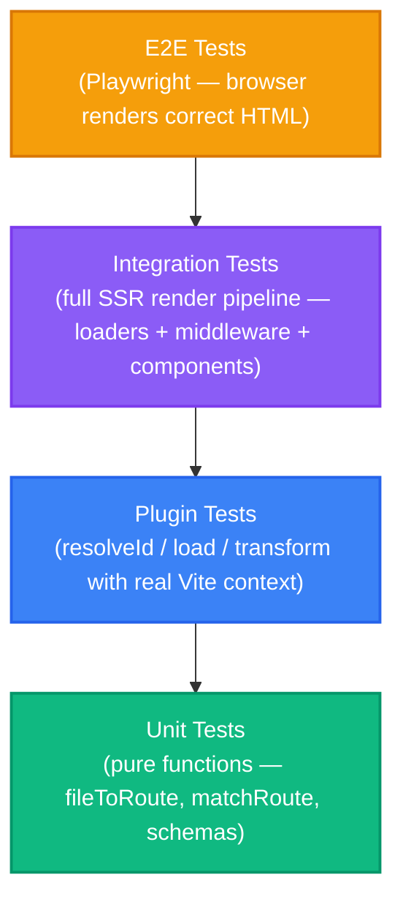

*This is a deep dive that ties together the testing patterns introduced throughout the series. In the inline test sections of [Part 2](/02-route-discovery-plugin), [Part 3](/03-server-side-rendering), [Part 7](/07-transform-hook), [Part 14](/14-framework-middleware), [Part 15](/15-server-functions), and [Part 18](/18-runtime-validation), we tested individual functions in isolation. Now we'll build a complete testing strategy for a Vite-based framework — from unit tests through plugin tests to full integration tests.*

---

## Why framework code is unusually testable

Framework code has a property that application code often lacks: **most of the interesting logic is pure functions.** Route matching takes a string and returns a match. Transforms take source code and return modified source code. Middleware takes a context and returns an extended context. Loaders take params and return data. Validation schemas take unknown input and return typed output.

This purity isn't accidental — it's a consequence of the plugin architecture. Vite plugins are functions that receive well-defined inputs (module IDs, source code, config objects) and produce well-defined outputs (resolved IDs, generated code, transformed code). The side effects (file watching, WebSocket messages, HTTP responses) live at the edges.

This means we can test the framework's core logic without starting a dev server, without a browser, and without any I/O. The tests run in milliseconds.

---

## Setting up Vitest

Vitest is the natural choice for testing Vite-based projects — it shares Vite's transform pipeline, understands TypeScript natively, and resolves virtual modules the same way Vite does.

```bash
npm i -D vitest
```

```typescript title="vitest.config.ts"
import { defineConfig } from 'vitest/config'

export default defineConfig({
  test: {
    globals: true,
    environment: 'node',
    include: ['**/__tests__/**/*.test.ts', '**/*.test.ts'],
  },
})
```

Add a test script to `package.json`:

```json
{
  "scripts": {
    "test": "vitest run",
    "test:watch": "vitest"
  }
}
```

---

## The testing pyramid for a Vite framework

A framework's test suite naturally falls into four layers:



| Layer | What it tests | Speed | Example |
|---|---|---|---|
| **Unit** | Pure functions (route parsing, matching, ID generation) | ~1ms each | `fileToRoute('posts/[id].tsx')` → `/posts/:id` |
| **Plugin** | Vite plugin hooks in isolation (resolveId, load, transform) | ~10ms each | Transform strips `loader` from client output |
| **Integration** | Full render pipeline (middleware → loader → component → HTML) | ~100ms each | `render('/posts/42')` returns HTML with post title |
| **E2E** | Browser behavior (navigation, hydration, interactivity) | ~1s each | Click link, see new page without full reload |

The inline test sections throughout the series focused on unit tests. This chapter builds upward through plugin and integration tests.

---

## Unit tests: the foundation

We covered unit tests in earlier chapters. Here's a quick reference for the testable functions across the framework:

| Function | Location | What to test |
|---|---|---|
| `fileToRoute` | Route plugin | Filename → route path conversion, param extraction |
| `matchRoute` | Entry server/client | Static matches, dynamic params, 404 returns |
| `generateFnId` | Server functions plugin | ID stability, uniqueness across files |
| `executeMiddleware` | Entry server | Context accumulation, short-circuiting, redirect handling |
| Schema `.parse()` | Page components | Valid data, type transforms, rejection of invalid input |

These functions have no external dependencies. They're the fastest, most reliable tests in the suite.

---

## Plugin tests: testing Vite hooks

Plugin hooks are harder to test than pure functions because they interact with Vite's module graph, environment context, and configuration. There are two approaches.

### Approach 1: Extract and test the logic

The simplest approach — extract the hook's logic into a testable function, and test that function directly. This is what we did for `fileToRoute` and `matchRoute`.

```typescript title="plugins/eigen-routes.ts"
// Export the logic for testing
export function generateClientRouteModule(routes: DiscoveredRoute[]): string {
  const imports = routes.map((r, i) =>
    `const Page${i} = React.lazy(() => import('${r.componentPath}'))`
  ).join('\n')

  const routeArray = routes.map((r, i) =>
    `  { path: '${r.path}', component: Page${i} }`
  ).join(',\n')

  return `import React from 'react'\n${imports}\nexport const routes = [\n${routeArray}\n]`
}

export function generateServerRouteModule(routes: DiscoveredRoute[]): string {
  const imports = routes.map((r, i) =>
    `import Page${i}, { loader as loader${i} } from '${r.componentPath}'`
  ).join('\n')

  const routeArray = routes.map((r, i) =>
    `  { path: '${r.path}', component: Page${i}, loader: typeof loader${i} !== 'undefined' ? loader${i} : undefined }`
  ).join(',\n')

  return `${imports}\nexport const routes = [\n${routeArray}\n]`
}
```

```typescript title="plugins/__tests__/route-codegen.test.ts"
import { describe, it, expect } from 'vitest'
import {
  generateClientRouteModule,
  generateServerRouteModule,
} from '../eigen-routes'

const routes = [
  { path: '/', componentPath: '/src/pages/Home.tsx', file: 'Home.tsx', paramNames: [] },
  { path: '/posts/:id', componentPath: '/src/pages/posts/[id].tsx', file: 'posts/[id].tsx', paramNames: ['id'] },
]

describe('generateClientRouteModule', () => {
  it('uses React.lazy for code splitting', () => {
    const code = generateClientRouteModule(routes)
    expect(code).toContain('React.lazy')
    expect(code).toContain("import('/src/pages/Home.tsx')")
  })

  it('does not include loader references', () => {
    const code = generateClientRouteModule(routes)
    expect(code).not.toContain('loader')
  })
})

describe('generateServerRouteModule', () => {
  it('uses static imports', () => {
    const code = generateServerRouteModule(routes)
    expect(code).toContain("import Page0")
    expect(code).not.toContain('React.lazy')
  })

  it('includes loader references', () => {
    const code = generateServerRouteModule(routes)
    expect(code).toContain('loader: typeof loader0')
  })
})
```

This tests the code generation logic without any Vite involvement. The trade-off: you're not testing the hook integration (does `resolveId` correctly intercept the virtual module ID? does `load` check the environment correctly?). For most cases, this coverage is sufficient — the glue code is thin enough to verify by inspection.

### Approach 2: Test with a real Vite build

For higher confidence, create a minimal Vite project in your test fixtures and run a build:

```typescript title="plugins/__tests__/plugin-integration.test.ts"
import { describe, it, expect } from 'vitest'
import { build } from 'vite'
import { resolve } from 'path'

describe('eigen-routes plugin (integration)', () => {
  it('generates different code for client and SSR', async () => {
    const fixtureDir = resolve(__dirname, 'fixtures/basic-app')

    // Build client
    const clientResult = await build({
      root: fixtureDir,
      build: {
        write: false, // Don't write to disk — return in-memory
        rolldownOptions: {
          input: resolve(fixtureDir, 'src/main.tsx'),
        },
      },
    })

    // Build SSR
    const ssrResult = await build({
      root: fixtureDir,
      build: {
        write: false,
        ssr: resolve(fixtureDir, 'src/entry-server.tsx'),
      },
    })

    // Client bundle should have React.lazy
    const clientCode = Array.isArray(clientResult)
      ? clientResult[0].output[0].code
      : clientResult.output[0].code
    expect(clientCode).toContain('lazy')

    // SSR bundle should have static imports
    const ssrCode = Array.isArray(ssrResult)
      ? ssrResult[0].output[0].code
      : ssrResult.output[0].code
    expect(ssrCode).not.toContain('lazy')
  })
})
```

This is slower (~500ms per test) but tests the full plugin lifecycle. Use it sparingly — for the critical path (does the virtual module resolve correctly?) and for regression tests when you fix a bug.

---

## Snapshot testing transforms

Transform hooks are the highest-risk code in a framework — a bug silently corrupts application code. Snapshot tests provide a safety net by recording the exact output of every transform.

```typescript title="plugins/__tests__/transforms.test.ts"
import { describe, it, expect } from 'vitest'

// Import your transform function
import { stripLoaderForClient } from '../eigen-strip-loaders'

describe('loader stripping snapshots', () => {
  it('handles const loader with defineLoader', () => {
    const input = `
import { defineLoader } from 'eigen/helpers'
import { db } from '../lib/database' // server-only

export const loader = defineLoader('/posts/:id', async ({ params }) => {
  return db.query('SELECT * FROM posts WHERE id = $1', [params.id])
});

export default function PostPage({ data }) {
  return <h1>{data.title}</h1>
}
`
    expect(stripLoaderForClient(input)).toMatchSnapshot()
  })

  it('handles async function loader', () => {
    const input = `
import { db } from '../lib/database' // server-only

export async function loader({ params }) {
  return db.query('SELECT * FROM posts WHERE id = $1', [params.id])
}

export default function PostPage({ data }) {
  return <h1>{data.title}</h1>
}
`
    expect(stripLoaderForClient(input)).toMatchSnapshot()
  })

  it('handles loader with satisfies', () => {
    const input = `
import type { LoaderFn } from 'eigen/types'

export const loader = (async ({ params }) => {
  return { title: 'Hello' }
}) satisfies LoaderFn<'/posts/:id'>;

export default function PostPage({ data }) {
  return <h1>{data.title}</h1>
}
`
    expect(stripLoaderForClient(input)).toMatchSnapshot()
  })
})
```

When the transform output changes, Vitest shows a diff:

```diff
- // [eigen] loader stripped for client bundle
+ // [eigen] loader removed for client
```

If the change is intentional, run `npx vitest run --update` to accept the new snapshots. If it's accidental, you've caught a regression before it reaches users.

### When snapshots break down

Snapshots become brittle when transforms produce non-deterministic output (timestamps, random IDs) or when the output includes content that changes frequently (import paths that depend on the test runner's working directory). Use `expect.stringContaining()` or targeted assertions for those cases instead.

---

## Integration tests: the full render pipeline

Integration tests verify that the pieces work together — middleware runs, loaders fetch data, components render HTML.

```typescript title="src/__tests__/render.integration.test.ts"
import { describe, it, expect } from 'vitest'

// Test the render function from entry-server.tsx directly.
// This requires the virtual module to be available,
// so we either mock it or run through Vite.

// Approach: test with a simplified render function
// that uses a mock route table

interface Route {
  path: string
  component: (props: any) => string // Simplified: return HTML string
  loader?: (ctx: { params: Record<string, string> }) => Promise<unknown>
  middleware?: Array<(ctx: any) => Promise<Record<string, unknown>>>
}

async function render(pathname: string, routes: Route[]) {
  // Match
  for (const route of routes) {
    const routeParts = route.path.split('/')
    const pathParts = pathname.split('/')
    if (routeParts.length !== pathParts.length) continue

    const params: Record<string, string> = {}
    const match = routeParts.every((part, i) => {
      if (part.startsWith(':')) {
        params[part.slice(1)] = pathParts[i]
        return true
      }
      return part === pathParts[i]
    })

    if (match) {
      // Run middleware
      let context: Record<string, unknown> = { params, pathname }
      for (const mw of route.middleware ?? []) {
        const result = await mw(context)
        context = { ...context, ...result }
      }

      // Run loader
      const data = route.loader
        ? await route.loader({ params })
        : null

      // Render
      const html = route.component({ params, data })
      return { html, status: 200, data }
    }
  }

  return { html: '<h1>404</h1>', status: 404, data: null }
}

describe('render pipeline', () => {
  const routes: Route[] = [
    {
      path: '/',
      component: () => '<h1>Home</h1>',
    },
    {
      path: '/posts/:id',
      loader: async ({ params }) => ({
        title: `Post ${params.id}`,
        body: 'Content',
      }),
      component: ({ data }) =>
        `<article><h1>${data.title}</h1><p>${data.body}</p></article>`,
    },
    {
      path: '/dashboard',
      middleware: [
        async (ctx) => {
          // Simulate auth check
          return { user: { name: 'Alice', role: 'admin' } }
        },
      ],
      loader: async ({ params }) => ({ stats: { views: 100 } }),
      component: ({ data }) =>
        `<div>Views: ${data.stats.views}</div>`,
    },
  ]

  it('renders a static page', async () => {
    const result = await render('/', routes)
    expect(result.status).toBe(200)
    expect(result.html).toBe('<h1>Home</h1>')
  })

  it('renders a dynamic page with loader data', async () => {
    const result = await render('/posts/42', routes)
    expect(result.status).toBe(200)
    expect(result.html).toContain('Post 42')
    expect(result.data).toEqual({ title: 'Post 42', body: 'Content' })
  })

  it('returns 404 for unmatched routes', async () => {
    const result = await render('/nonexistent', routes)
    expect(result.status).toBe(404)
  })

  it('runs middleware before the loader', async () => {
    const result = await render('/dashboard', routes)
    expect(result.status).toBe(200)
    expect(result.html).toContain('Views: 100')
  })
})
```

These tests exercise the full pipeline — matching, middleware, loading, rendering — without any HTTP server or browser. They're the best tool for catching integration bugs like "middleware context doesn't reach loaders" or "loader data isn't passed to components."

---

## Testing serialization boundaries

The most subtle framework bugs live at serialization boundaries — where data crosses from server to client via JSON. Test these explicitly:

```typescript title="src/__tests__/serialization.test.ts"
import { describe, it, expect } from 'vitest'
import { z } from 'zod'

describe('serialization boundary', () => {
  it('Date survives round-trip with schema transform', () => {
    const schema = z.object({
      createdAt: z.string().transform(s => new Date(s)),
    })

    // Server-side: loader returns a Date
    const serverData = { createdAt: new Date('2026-06-01T00:00:00Z') }

    // Serialization (server → HTML → client)
    const serialized = JSON.parse(JSON.stringify(serverData))

    // Without validation: createdAt is a string
    expect(serialized.createdAt).toBe('2026-06-01T00:00:00.000Z')
    expect(typeof serialized.createdAt).toBe('string')

    // With validation: createdAt is a Date again
    const validated = schema.parse(serialized)
    expect(validated.createdAt).toBeInstanceOf(Date)
    expect(validated.createdAt.getFullYear()).toBe(2026)
  })

  it('detects schema drift between server and client', () => {
    // Server returns a field that the client schema doesn't expect
    const serverData = {
      title: 'Hello',
      body: 'World',
      internalField: 'should-not-leak',
    }

    const clientSchema = z.object({
      title: z.string(),
      body: z.string(),
    })

    // Zod strips unknown fields by default
    const parsed = clientSchema.parse(JSON.parse(JSON.stringify(serverData)))
    expect(parsed).toEqual({ title: 'Hello', body: 'World' })
    expect(parsed).not.toHaveProperty('internalField')
  })
})
```

The "schema drift" test catches a real-world scenario: the server adds a field (maybe containing sensitive data), but the client schema doesn't know about it. Zod's default behavior strips unknown fields, which is both a safety feature and a potential source of confusion. The test documents this behavior explicitly.

---

## Testing with `ssrLoadModule`

For the highest-fidelity plugin tests, use Vite's `ssrLoadModule` to load modules through the full plugin pipeline:

```typescript title="plugins/__tests__/ssr-load.test.ts"
import { describe, it, expect, beforeAll, afterAll } from 'vitest'
import { createServer, type ViteDevServer } from 'vite'
import { resolve } from 'path'

describe('virtual module via ssrLoadModule', () => {
  let server: ViteDevServer

  beforeAll(async () => {
    server = await createServer({
      root: resolve(__dirname, 'fixtures/basic-app'),
      server: { middlewareMode: true },
      appType: 'custom',
    })
  })

  afterAll(async () => {
    await server.close()
  })

  it('resolves the eigen/routes virtual module', async () => {
    const mod = await server.ssrLoadModule('eigen/routes')
    expect(mod.routes).toBeDefined()
    expect(Array.isArray(mod.routes)).toBe(true)
  })

  it('generates routes with correct paths', async () => {
    const mod = await server.ssrLoadModule('eigen/routes')
    const paths = mod.routes.map((r: any) => r.path)
    expect(paths).toContain('/')
  })

  it('includes loaders in SSR module', async () => {
    const mod = await server.ssrLoadModule('eigen/routes')
    const routeWithLoader = mod.routes.find(
      (r: any) => r.loader !== undefined,
    )
    // If any page exports a loader, it should be present
    if (routeWithLoader) {
      expect(typeof routeWithLoader.loader).toBe('function')
    }
  })
})
```

This spins up a real Vite dev server (in middleware mode, so no HTTP listener) and loads modules through the full pipeline. It's slower than unit tests but provides complete confidence that your plugin integrates correctly with Vite.

---

## Organizing the test suite

```
plugins/
  __tests__/
    eigen-routes.test.ts          # Unit: fileToRoute, discoverRoutes
    route-codegen.test.ts         # Unit: generated module code
    eigen-strip-loaders.test.ts   # Unit + Snapshot: transform output
    eigen-server-fns.test.ts      # Unit: ID generation, transform
    plugin-integration.test.ts    # Integration: real Vite builds
    fixtures/
      basic-app/                  # Minimal Vite project for integration tests
        src/
          pages/
            Home.tsx
            posts/[id].tsx
          entry-server.tsx
          main.tsx
        index.html
        vite.config.ts

src/
  __tests__/
    match-route.test.ts           # Unit: route matching
    middleware.test.ts             # Unit: middleware execution engine
    schemas.test.ts               # Unit: validation schemas
    serialization.test.ts         # Unit: JSON round-trip behavior
    render.integration.test.ts    # Integration: full render pipeline
```

<Callout type="info" title="Test file colocation">
Tests live next to the code they test — plugin tests in `plugins/__tests__/`, runtime tests in `src/__tests__/`. This convention (also used by Jest and Vitest by default) makes it easy to find tests and keeps them close to the code they verify. The fixture directory contains a minimal app that plugin integration tests build against.
</Callout>

---

## What to test and what not to

**Always test:**
- Pure functions that implement framework conventions (routing, matching, ID generation)
- Transform hooks — they silently corrupt code if they break
- Serialization boundaries — the server/client data bridge
- Middleware execution order and short-circuiting

**Usually test:**
- Generated code (virtual modules) via snapshots
- The render pipeline end-to-end
- Schema validation with edge cases (missing fields, wrong types, transforms)

**Rarely test:**
- Vite configuration objects (the config is the test)
- File watcher integration (test discovery logic separately, trust `chokidar`)
- HMR behavior (test the invalidation logic, not the WebSocket transport)
- TypeScript type inference (use `tsd` or `expect-type` if you need to, but type tests are brittle)

---

## The test-as-documentation pattern

Throughout the inline test sections in this series, every test tells a story. `'does not match when segment count differs'` documents a routing edge case. `'Date survives round-trip with schema transform'` documents a serialization behavior. `'short-circuits on Response return'` documents a middleware guarantee.

When a new developer reads the test suite, they learn the framework's behavior from the test names alone. This is the "test as documentation" pattern — tests that describe *what* the system guarantees, not *how* it's implemented. If you find yourself writing a comment to explain a test, move the explanation into the test name instead.

---

## Key insight

A Vite-based framework is uniquely testable because its architecture is built from pure functions connected by a plugin pipeline. Route parsing, route matching, code generation, code transformation, middleware execution, and data validation are all stateless operations with clear inputs and outputs.

The testing strategy follows the architecture: unit-test the pure functions (fast, reliable, documenting), snapshot-test the transforms (catching silent corruption), integration-test the render pipeline (verifying the pieces connect), and leave E2E tests for the behaviors that only a real browser can verify (hydration, navigation, interactivity).

The framework's test suite isn't just quality assurance — it's the specification. Each test documents a guarantee that the framework makes to application developers. When a test fails, it means a guarantee was broken.
